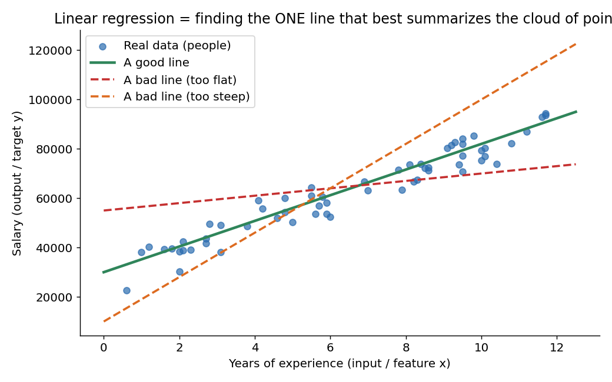
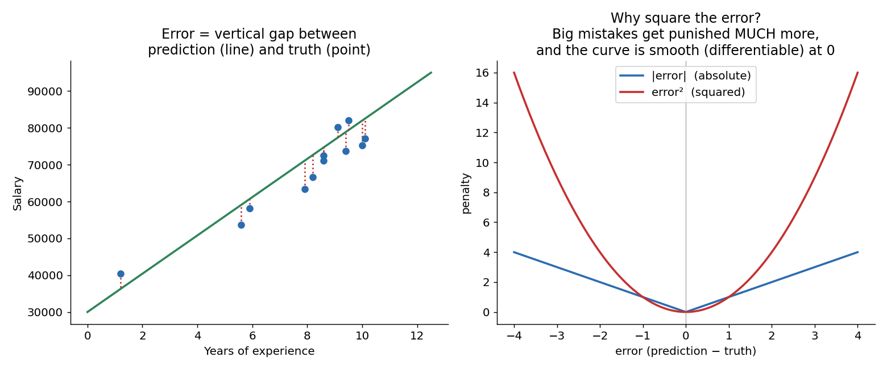
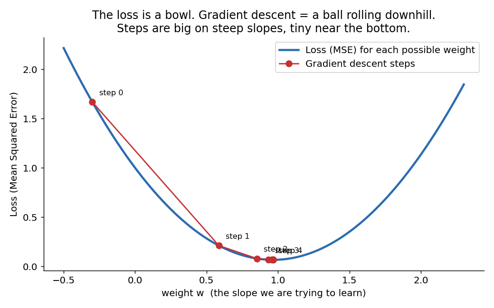
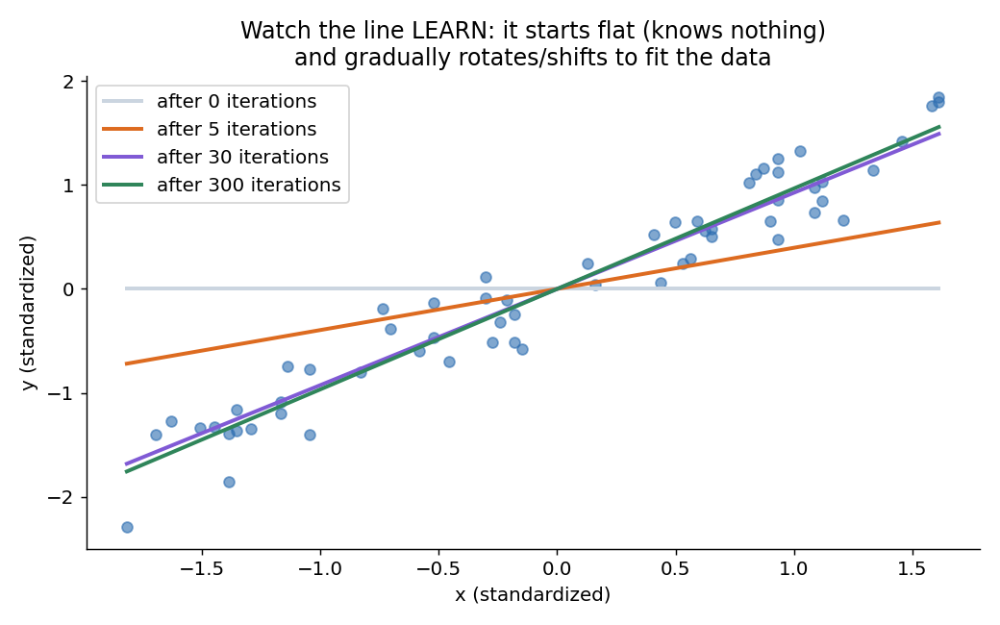
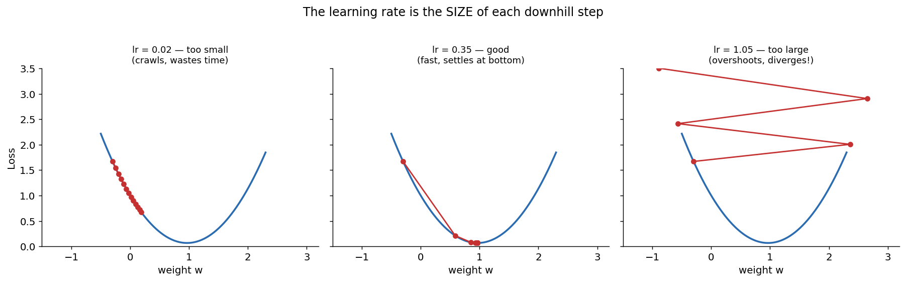

# 01 · Linear Regression — Explained From Scratch

## In one sentence

> Linear regression learns the best straight line through your data by repeatedly measuring its own error and nudging the line to shrink it.

## How to read this lesson (don't read it all at once)

| If you have… | Read | ~Time |
|---|---|---|
| 5 minutes | §0 glossary + §2 pictures | 5 min |
| 20 minutes | §0–§2, then **open the notebook** and run Blocks 1–7 | 20 min |
| The full sitting | Everything, notebook alongside | 45–60 min |
| An interview on Tuesday | §8 + §9, then §2 for the pictures | 10 min |

There are ⏸ **checkpoint** markers below — each one is a natural place to stop reading and go run code. You'll retain more by alternating than by reading straight through.

This folder contains:

| File | What it is |
|---|---|
| `README.md` | You are here — intuition first, then math, then how to read results |
| `assets/` | Visual explanations referenced throughout |
| `linear_regression_from_scratch.ipynb` | Pure NumPy implementation. Every code block references a section (§) of this README |
| `linear_regression_with_library.ipynb` | Same model in 5 lines of scikit-learn, to prove our scratch version matches |
| `data/salary_data.csv` | Sample dataset: years of experience → salary (60 people) |

---

## §0 · Words before formulas

No math yet. If you know these eight words in plain language, every formula below becomes readable. Come back here whenever a term surprises you.

| Term | Plain meaning | In our salary example |
|---|---|---|
| **Feature (x)** | The information you HAVE | Years of experience |
| **Target (y)** | The thing you want to PREDICT | Salary |
| **Weight (w)** | How much one unit of x changes y. It's just the **slope** of the line | "Each year of experience adds ~₹/$5,200" |
| **Bias (b)** | The starting value of y when x = 0. It's just the **intercept**. NOT unfairness — it "biases" (shifts) the line up or down so it doesn't have to pass through origin | "A fresher with 0 years still earns ~30,000" |
| **Prediction (ŷ)** | The model's guess: `ŷ = w·x + b`. The hat (^) means "estimate, not truth" | "For 5 years, the line says 56,000" |
| **Loss / Error** | A single number measuring how WRONG the model is right now. Lower = better | Average of (guess − actual salary)² across everyone |
| **Gradient** | The direction and steepness of "uphill" on the loss. Since we want DOWNHILL (less error), we move **opposite** to the gradient | "Increasing w right now would raise the error → so decrease w" |
| **Learning rate (lr / α)** | The SIZE of each downhill step | Tiny step = slow learning; huge step = overshooting the valley |

---

## §1 · What does this model assume about the world?

Every ML model is a **belief about how the world works**. Linear regression believes:

> "The output is roughly a **constant rate × input, plus a starting value**, plus some random noise."

That's it. Salary grows at a roughly fixed rate per year of experience. House price grows at a roughly fixed rate per square foot.

**When this belief fits:** pricing/estimation problems, trends, any "more of x → proportionally more of y" relationship.
**When this belief breaks:** if the true relationship curves (e.g., population growth), saturates (e.g., studying 20h/day doesn't keep helping), or has thresholds — a straight line will be confidently wrong. §6 shows how to detect this.

**Real-world examples:**
- Salary prediction from experience (this lesson's dataset)
- House price from square footage / location features
- Sales forecasting from ad spend
- Medical dose–response estimation
- Any "baseline first" situation — before trying anything fancy, fit a line; if a line already explains 90%, you may be done

And the real reason it's lesson 01: linear regression is the **atom of deep learning**. A neural network is millions of tiny linear regressions stacked with bends between them. Understand `w·x + b` deeply and you've understood a neuron.

---

## §2 · The intuition, in three pictures

### 2.1 The problem: many possible lines, which one is "best"?

You could draw infinite lines through this cloud. The green one *feels* right and the dashed ones *feel* wrong — but "feels" isn't something a computer can compute. We need to turn "how good is this line?" into a **number**.

### 2.2 Defining "wrong": the error

**Left:** for each person, the error is the vertical gap between what the line predicts and what's actually true. A good line makes all these red gaps small *on average*.

**Right:** why do we **square** each gap instead of just taking its size?
1. Squaring kills the sign — being 5,000 too high is as bad as 5,000 too low (otherwise + and − errors cancel and a terrible line could score zero).
2. Squaring punishes big mistakes disproportionately: one error of 10 costs 100, while ten errors of 1 cost only 10 total. The model is pushed to avoid *large* blunders.
3. The squared curve is **smooth at the bottom** — no kink like |error| has. Smooth means we can take a derivative everywhere, which §3 needs.

Averaging the squared gaps over all points gives the **Mean Squared Error (MSE)** — our loss.

### 2.3 Finding the best line: rolling downhill

Here's the beautiful part. Plot the loss for *every possible weight* and you get a **bowl**. The best weight sits at the bottom. Learning = **rolling a ball down this bowl**:

1. Start anywhere (random w).
2. Feel the slope under your feet (the **gradient**).
3. Take a step downhill (opposite the gradient), sized by the **learning rate**.
4. Repeat. Near the bottom the slope flattens, so steps naturally shrink — the ball settles.

Notice in the figure: early steps are large (steep slope), late steps are tiny (flat bottom). Nobody programmed "slow down at the end" — it falls out of the math for free.

And this is what that rolling looks like from the data's point of view: the line starts flat (knows nothing), and each downhill step rotates and shifts it toward the data.

---

> ⏸ **Checkpoint 1** — You now have the full intuition. If formulas make you tense, this is a great moment to open `linear_regression_from_scratch.ipynb` and run Blocks 1–3 (load data, look at it, scale it). Then come back — the math below will feel like labeling things you've already seen.

## §3 · Now the math — every symbol already introduced

### 3.1 The model (hypothesis)

$$\hat{y} = w \cdot x + b$$

Read aloud: "our guess ŷ is the slope w times the input x, shifted by the bias b." (§0 covered every symbol. With many features it becomes ŷ = w₁x₁ + w₂x₂ + … + b — same idea, more slopes.)

### 3.2 The loss (Mean Squared Error)

$$L(w, b) = \frac{1}{n}\sum_{i=1}^{n}\left(\hat{y}_i - y_i\right)^2$$

Read aloud: "for each of the n data points, take (guess − truth), square it (§2.2 explained why), then average." Note that L is a function **of w and b** — the data is fixed; the knobs we can turn are the weight and bias. That's why the bowl in §2.3 has w on its x-axis.

### 3.3 The gradients — "which way is downhill?"

Take the derivative of L with respect to each knob (chain rule: derivative of the square × derivative of the inside):

$$\frac{\partial L}{\partial w} = \frac{2}{n}\sum_{i=1}^{n}\left(\hat{y}_i - y_i\right)\cdot x_i \qquad \frac{\partial L}{\partial b} = \frac{2}{n}\sum_{i=1}^{n}\left(\hat{y}_i - y_i\right)$$

Read them intuitively, don't memorize them:
- Both are driven by **(guess − truth)** — the error. If your guesses are perfect, both gradients are zero and nothing moves. **The model only learns from its mistakes.**
- The w-gradient multiplies the error by **x**: points with bigger inputs have more leverage on the slope (a wrong prediction at x=12 twists the line harder than one at x=1).
- The b-gradient is just the **average error**: if guesses are too high overall, shift the whole line down.

### 3.4 The update rule (gradient descent)

$$w \leftarrow w - \alpha \frac{\partial L}{\partial w} \qquad b \leftarrow b - \alpha \frac{\partial L}{\partial b}$$

Read aloud: "new w = old w, minus a small step (α = learning rate) in the uphill direction." The **minus sign is the entire algorithm** — gradient points uphill, we go down. Loop this a few hundred times and the ball reaches the bottom of the bowl.

> **This loop — predict → measure error → compute gradient → nudge weights — is *exactly* forward pass and backpropagation.** In a deep network the gradient formulas get longer (chain rule through many layers), but the loop never changes. Master it here, on one weight and one bias, and transformers stop being magic.

*(Footnote: for plain linear regression a closed-form shortcut exists — the Normal Equation — that jumps straight to the bottom of the bowl with algebra. We deliberately use gradient descent because it's the method that scales to every model in this course; the shortcut works for this model only.)*

---

> ⏸ **Checkpoint 2** — That's ALL the math this model has. Go run Blocks 4–7 in the notebook now: you'll watch these four formulas train a real model in ~15 lines of NumPy. §4 and §5 below are best read *after* you've seen the training loop run.

## §4 · Every knob, and what happens if you turn it wrong

| Knob | What it controls | Too low | Too high |
|---|---|---|---|
| **Learning rate (α)** | Step size downhill | Crawls; needs thousands of iterations | Overshoots the valley, bounces out, loss **explodes** (right panel above — the single most common beginner failure) |
| **Iterations (epochs)** | How many downhill steps | Stops before reaching the bottom (underfit) | Wastes compute; loss curve goes flat — you're done, more steps don't help |
| **Initialization of w, b** | Where the ball starts | For this model it barely matters — the bowl has ONE bottom (convex), so any start rolls to the same place. Starting at 0 is fine. (In deep nets this becomes critical.) | — |
| **Feature scaling** | Standardizing x to mean 0, std 1 | Without it, features on huge scales (salary in thousands vs years in units) make the bowl a stretched canyon — descent zigzags painfully. **Always scale.** The notebook demonstrates the failure live. | — |

---

## §5 · Reading the results — what do the numbers mean?

Training prints a loss. Then what? Four numbers, each answering a different question:

| Metric | Formula idea | Question it answers | Gotcha |
|---|---|---|---|
| **MSE** | average of squared errors | "Is training working?" (should fall every iteration) | Units are squared (salary²!) — not human-readable |
| **RMSE** | √MSE | "Typically how far off am I, in real units?" | RMSE ≈ 4,500 here means guesses are typically off by about 4,500 in salary. This is the number to tell a stakeholder |
| **MAE** | average of \|error\| | Same, but ignoring outlier drama | If RMSE ≫ MAE, a few points are being missed *badly* — go look at them |
| **R²** | 1 − (our errors ÷ errors of just guessing the mean) | "What fraction of the variation did we explain?" | 1.0 = perfect, 0 = no better than always guessing the average, negative = *worse* than that. Our run gets 0.93: experience explains ~93% of salary variation; the rest is noise/other factors |

**The habit to build:** never report one number. MSE tells you training converged, RMSE tells you real-world accuracy, R² tells you how much of the story your features capture.

---

## §6 · When NOT to use it (and how to notice)

- **The relationship isn't a line.** Symptom: residuals (errors) show a *pattern* — e.g., curve up at both ends — instead of random scatter. Fix: transform features (x², log x) or use a nonlinear model (trees, lesson 05).
- **Outliers.** Squared error means one wild point can drag the whole line. Symptom: RMSE ≫ MAE. Fix: inspect, and consider robust losses.
- **Extrapolation.** The line happily predicts salary for 50 years of experience — it has never seen anything past 12. Predictions outside your data's range are guesses, not inferences.
- **Correlation ≠ causation.** The line says experience and salary move together; it cannot say one *causes* the other.

---

## §7 · Map: README → notebook

| Notebook block | Implements |
|---|---|
| Block 2 — load + plot data | §1 (checking the linear belief visually before anything else) |
| Block 3 — feature scaling | §4 (the canyon problem) |
| Block 4 — `predict()` | §3.1 |
| Block 5 — `mse_loss()` | §3.2 |
| Block 6 — `gradients()` | §3.3 |
| Block 7 — training loop | §3.4 (watch the ball roll) |
| Block 8 — learning-rate experiment | §4 (break it on purpose) |
| Block 9 — metrics | §5 |
| Block 10 — residual check | §6 |

---

## §8 · Interview prep

### The 30-second answer: "What is linear regression?"

> "Linear regression models the relationship between inputs and a continuous output as a straight line: prediction = weights × inputs + bias. It learns the weights by minimizing mean squared error — usually with gradient descent, though a closed-form solution exists. It's fast, interpretable (each weight tells you a feature's effect), and the standard baseline for regression problems. Its limits: it assumes the relationship is actually linear, and it's sensitive to outliers because errors are squared."

Practice saying it out loud. Every phrase in it maps to a section above.

### Questions you should be able to answer

<b>Q1. Why squared error instead of absolute error?</b>

Three reasons (§2.2): squaring removes the sign so errors can't cancel; it punishes large mistakes disproportionately; and it's smooth (differentiable) everywhere, which gradient descent needs. Absolute error (MAE) is more robust to outliers but has a kink at zero.

<b>Q2. What does the bias term do? What happens without it?</b>

Bias is the intercept — the prediction when all features are zero (§0). Without it the line is forced through the origin: a fresher would be predicted salary 0, and the model would tilt the slope wrongly to compensate. One parameter buys the freedom to shift the line anywhere.

<b>Q3. What happens if the learning rate is too high? Too low?</b>

Too high: each step overshoots the valley, loss oscillates or explodes — divergence (§4, and Block 8 of the notebook shows it live). Too low: convergence is correct but painfully slow. The loss bowl picture (§2.3) makes both obvious.

<b>Q4. Gradient descent vs the Normal Equation — when would you use which?</b>

The Normal Equation solves for the optimal weights in one algebraic step — great for small feature counts, no learning rate to tune. But it requires inverting a matrix (expensive beyond ~10⁴ features) and doesn't generalize to other models. Gradient descent scales to millions of parameters and is the same engine used by neural networks (§3.4).

<b>Q5. Your model has R² = 0.95 on training data. Are you done?</b>

No. R² on *training* data says nothing about new data (overfitting risk — evaluate on a held-out set), residuals might still show a pattern meaning the linear assumption failed (§6), and high R² still doesn't imply causation. Check residuals, check test performance, then celebrate.

<b>Q6. Why do we scale features before gradient descent?</b>

Features on wildly different scales stretch the loss bowl into a narrow canyon; the gradient zigzags across it instead of heading to the bottom, so training is slow or unstable (§4, Block 3). Standardizing makes the bowl round. Note: the Normal Equation doesn't need scaling — this is specifically a gradient-descent problem.

---

## §9 · Common mistakes (the learner's failure modes, not the model's)

1. **Forgetting to scale features**, then blaming the learning rate when training explodes. Scale first (§4).
2. **Reporting MSE to humans.** MSE is in squared units — meaningless to stakeholders. Convert to RMSE (§5).
3. **Judging the model on training data only.** Always keep a held-out test set; training error only proves you memorized.
4. **Trusting predictions outside the data's range.** The model has never seen 50 years of experience; extrapolation is a guess (§6).
5. **Reading feature weights as causation.** "Each year adds 5,200" is a pattern in this data, not a law of the universe.
6. **Skipping the residual plot.** It's the 5-second check that catches a broken linear assumption (§6, Block 10). Make it a reflex.

---

**Next:** `02-logistic-regression/` — same skeleton, one new idea: bending the line's output into a probability.
