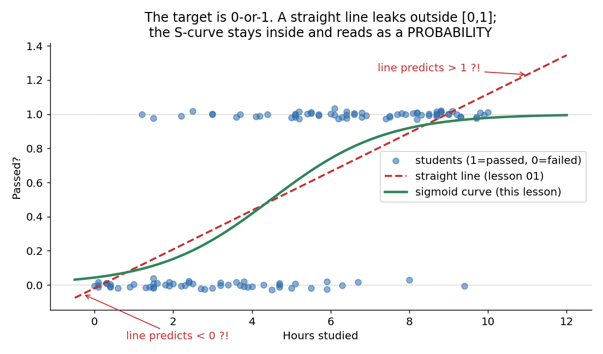
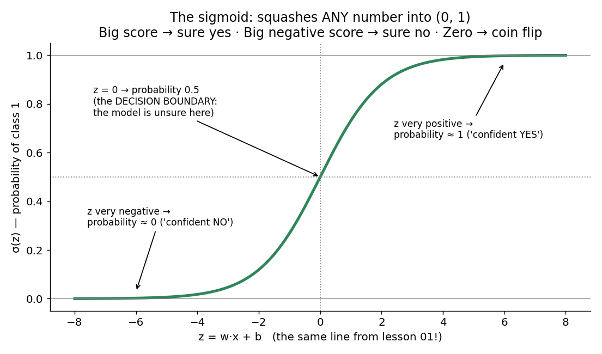
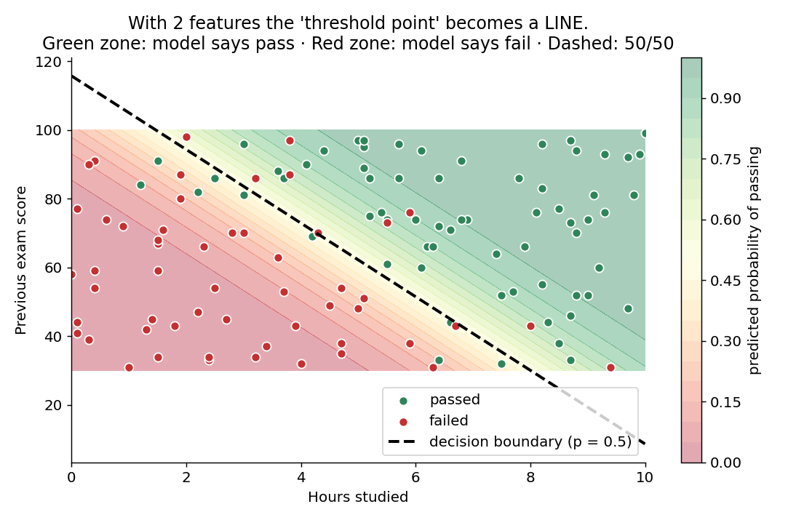
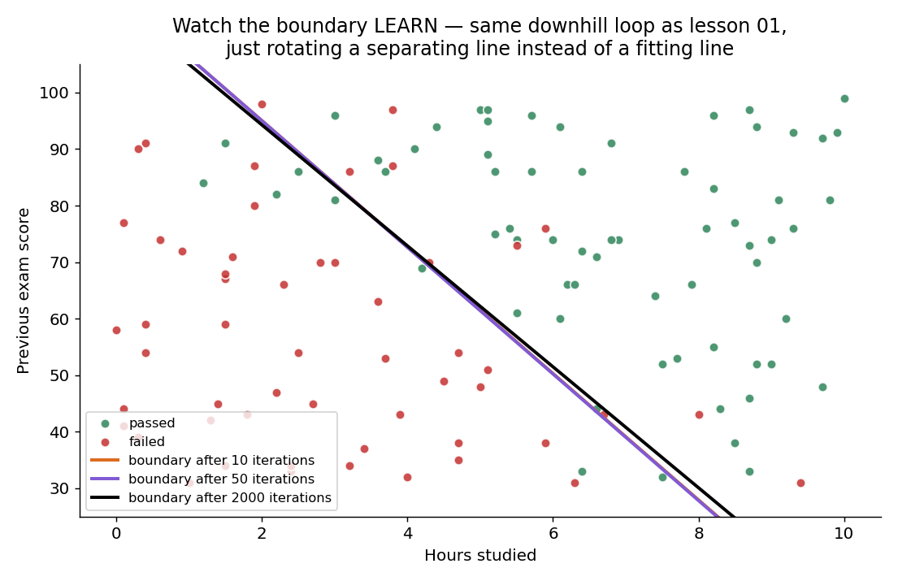
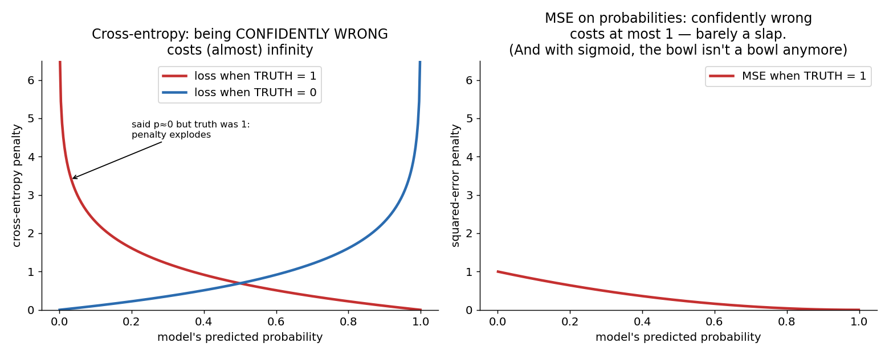

# 02 · Logistic Regression — Explained From Scratch

## In one sentence

> Logistic regression takes lesson 01's line, squashes its output through an S-curve into a probability between 0 and 1, and learns by punishing confident wrong answers — turning "predict a number" into "predict a yes/no".

## How to read this lesson (don't read it all at once)

| If you have… | Read | ~Time |
|---|---|---|
| 5 minutes | §0 glossary + §2 pictures | 5 min |
| 20 minutes | §0–§2, then **open the notebook** and run Blocks 1–7 | 20 min |
| The full sitting | Everything, notebook alongside | 45–60 min |
| An interview on Tuesday | §8 + §9, then §2 for the pictures | 10 min |

⏸ **Checkpoint** markers below mark natural places to stop reading and run code.

**Prerequisite:** lesson `01-linear-regression`. This lesson reuses its entire engine — line, loss, gradient, downhill loop — and adds exactly **one new idea**.

This folder contains:

| File | What it is |
|---|---|
| `README.md` | You are here |
| `assets/` | Visual explanations referenced throughout |
| `logistic_regression_from_scratch.ipynb` | Pure NumPy build; every block cites a § here |
| `logistic_regression_with_library.ipynb` | Same model in scikit-learn, verifying the scratch build |
| `data/exam_data.csv` | Sample dataset: hours studied + previous score → passed/failed (120 students) |

---

## §0 · Words before formulas

Inherited from lesson 01 (§0 there): **feature, weight, bias, loss, gradient, learning rate**. All still mean exactly the same thing. The new vocabulary:

| Term | Plain meaning | In our exam example |
|---|---|---|
| **Classification** | Predicting a *category*, not a number | "Will this student pass?" — yes/no, not "score = 73.4" |
| **Label (y)** | The true category, written as a number | passed = 1, failed = 0 |
| **Score / logit (z)** | The raw output of lesson 01's line: `z = w·x + b`. Any number from −∞ to +∞ | "This student's evidence adds up to +3.2" |
| **Sigmoid (σ)** | The S-shaped squashing function that converts any score into a number between 0 and 1 | z = +3.2 → probability 0.96 |
| **Probability (ŷ)** | The model's belief that the label is 1 | "96% sure this student passes" |
| **Decision boundary** | The place where the model is exactly 50/50 (z = 0). On one side it says yes, on the other no | A line across the hours-vs-score plane |
| **Threshold** | The probability cutoff for saying "yes". Default 0.5, but it's a *choice* | Say "will pass" only if p > 0.5 (or 0.8, if being wrong is costly) |
| **Cross-entropy (log loss)** | The loss for probabilities: tiny when confident-and-right, **enormous** when confident-and-wrong | Saying "1% chance of passing" about someone who passed costs a fortune |

---

## §1 · What does this model assume about the world?

> "The **evidence** for a yes-answer adds up linearly — and the probability of yes rises smoothly as that evidence grows."

Each hour studied adds a fixed amount of evidence; each point of previous score adds another fixed amount. The evidence total is lesson 01's line. What's new is only the last step: evidence → probability.

**When this belief fits:** any yes/no question where factors push independently in one direction — spam/not-spam, churn/stay, disease/healthy, click/ignore.
**When this belief breaks:** if the boundary between classes is genuinely curved or island-shaped (e.g., "medium values are class 1, extremes are class 0"), a single straight boundary can't cut it. §6 shows how to notice.

**Real-world examples:**
- Exam pass prediction (this lesson's dataset)
- Email spam filtering
- Medical screening: disease present / absent
- Credit default: will this loan be repaid?
- Click-through prediction in ads — logistic regression at planetary scale

And the reason it's lesson 02: **sigmoid-of-a-line is literally a one-neuron neural network.** Lesson 10 will stack thousands of these. Master this neuron and deep learning becomes repetition.

---

## §2 · The intuition, in three pictures

### 2.1 Why not just reuse lesson 01?

The target is 0-or-1. A straight line happily predicts 1.3 ("130% passed"?) and −0.2 ("negative pass"?). Worse, one very diligent student far to the right *drags the whole line*, moving predictions for everyone. We need something that (a) stays inside [0, 1] and (b) flattens out once the answer is obvious — the green S-curve.

### 2.2 The one new idea: the sigmoid

Keep lesson 01's line exactly as it was — but treat its output z as **evidence**, then squash it:

- huge positive evidence → probability ≈ 1 (confident yes)
- huge negative evidence → probability ≈ 0 (confident no)
- zero evidence → probability 0.5 (genuinely unsure)

That's the entire difference between lessons 01 and 02. One function.

### 2.3 The decision boundary — where the model shrugs

With two features, "z = 0" is a **line across the feature plane**: the model's fence between yes-territory and no-territory. Students deep in the green zone are safe; the interesting ones live near the dashed fence, where probability hovers around 0.5. Classification isn't drawing dots — it's **learning where to build the fence**.

And learning is the same movie as lesson 01: the fence starts nowhere, and each downhill step rotates it toward the correct split.

> ⏸ **Checkpoint 1** — You have the full intuition. Open `logistic_regression_from_scratch.ipynb` and run Blocks 1–3 (load, look, scale). The math below just names what you've seen.

---

## §3 · Now the math — every symbol already introduced

### 3.1 The score: lesson 01's line, unchanged

$$z = w \cdot x + b$$

Nothing new. With our two features: z = w₁·hours + w₂·prev_score + b.

### 3.2 The sigmoid: score → probability

$$\hat{y} = \sigma(z) = \frac{1}{1 + e^{-z}}$$

Read aloud: "e^(−z) is huge when z is very negative (→ ŷ ≈ 0) and vanishes when z is very positive (→ ŷ ≈ 1); at z = 0 it equals 1, giving exactly ½." Check those three cases mentally and you own the formula — that's all it does.

### 3.3 The loss: why MSE gets fired

Two reasons MSE is the wrong tool for probabilities:

1. **It barely punishes catastrophe.** If the truth is 1 and the model says 0.01, MSE charges (1−0.01)² ≈ 0.98 — capped at 1. But "99% sure of the wrong answer" should be a five-alarm fire.
2. **It bends the bowl.** Pipe a sigmoid into a squared error and the loss surface is no longer a clean bowl (non-convex) — gradient descent can stall on flat plateaus exactly where the model is confidently wrong.

Cross-entropy fixes both by charging **−log(probability assigned to the truth)**:

$$L = -\frac{1}{n}\sum_{i=1}^{n}\Big[\, y_i \log \hat{y}_i + (1 - y_i)\log(1 - \hat{y}_i)\,\Big]$$

Read aloud: "for each student, only one of the two terms is alive (y is 0 or 1, so the other term multiplies to zero); the living term charges −log of the probability you gave the true outcome." Give the truth probability 0.99 → cost ≈ 0.01. Give it 0.01 → cost ≈ 4.6, and → ∞ as you approach total confidence in the wrong answer. **The model is trained to fear confident wrongness above all.**

### 3.4 The gradients — a small miracle

Chain-rule the loss through the sigmoid (the sigmoid's derivative σ′ = σ(1−σ) cancels perfectly against the loss's denominator) and out falls:

$$\frac{\partial L}{\partial w} = \frac{1}{n}\sum_{i=1}^{n}\left(\hat{y}_i - y_i\right)\cdot x_i \qquad \frac{\partial L}{\partial b} = \frac{1}{n}\sum_{i=1}^{n}\left(\hat{y}_i - y_i\right)$$

**Look familiar?** It is *character-for-character the same form* as lesson 01 §3.3 — (guess − truth) × input. New model, new loss, new squashing function… same learning signal. This is not a coincidence; it's a designed pairing (sigmoid + cross-entropy) and it's the pattern that scales all the way to modern networks: **the error at the output, flowing backward.**

### 3.5 The update rule: unchanged

$$w \leftarrow w - \alpha \frac{\partial L}{\partial w} \qquad b \leftarrow b - \alpha \frac{\partial L}{\partial b}$$

The downhill loop from lesson 01 §3.4, verbatim. Predict → measure error → gradient → nudge. You already know how to train this model.

> ⏸ **Checkpoint 2** — That's all the math. Run Blocks 4–7: you'll see the loop from lesson 01 train a classifier with a three-line change. §4–§5 are best read after.

---

## §4 · Every knob, and what happens if you turn it wrong

| Knob | What it controls | Too low / wrong | Too high / wrong |
|---|---|---|---|
| **Learning rate (α)** | Step size downhill — inherited from lesson 01 §4, same failure modes | Crawls | Overshoots, diverges |
| **Iterations** | Downhill steps | Boundary stops mid-rotation (underfit) | Wasted compute; watch the loss curve flatten |
| **Threshold** | **The new star knob.** Where you cut probability into yes/no | Threshold 0.2: says "pass" liberally — catches every passer but cries wolf (many false alarms) | Threshold 0.9: says "pass" only when certain — precise but misses many real passers. **This knob is a business decision, not a math one** (§5) |
| **Feature scaling** | Same canyon problem as lesson 01 §4 | Slow/zigzag descent. Always scale | — |
| **Regularization (preview)** | Penalty on huge weights | — | Relevant when data is perfectly separable: weights grow to infinity chasing p = 1.0 exactly. Libraries regularize by default (that's the `C` in sklearn). Full treatment when we hit overfitting properly |

---

## §5 · Reading the results — accuracy is not enough

Lesson 01 had one kind of error (how far off). Classification has **two different ways to be wrong**, and they usually matter differently:

- **False positive:** said "pass", student failed. (Cried wolf.)
- **False negative:** said "fail", student passed. (Missed it.)

| Metric | Question it answers | Gotcha |
|---|---|---|
| **Accuracy** | "What fraction did I label correctly?" | **The famous trap:** if 95% of emails are not-spam, a model that always says "not spam" scores 95% accuracy while catching zero spam. Never trust accuracy alone on imbalanced data |
| **Confusion matrix** | The full 2×2 story: TP, FP, TN, FN counts | Not a score — a table you *read*. Always look at it first |
| **Precision** | "When I say YES, how often am I right?" = TP / (TP + FP) | The cost of crying wolf. Prioritize when false alarms are expensive (spam filter flagging real mail) |
| **Recall** | "Of all the real YESes, how many did I catch?" = TP / (TP + FN) | The cost of missing. Prioritize when misses are expensive (disease screening) |
| **F1** | One number balancing precision and recall | Convenient, but hides *which* one is weak — report all three |

**The habit to build:** precision and recall trade off against each other **through the threshold knob** (§4). Screening for a dangerous disease? Lower the threshold — accept false alarms to miss nobody. Filtering spam? Raise it — better to let some spam through than bury real mail. The model gives you probabilities; *where to cut them is your call, and it depends on which mistake hurts more.*

---

## §6 · When NOT to use it (and how to notice)

- **The true boundary is curved or disconnected.** A single straight fence can't separate "class 1 lives in the middle, class 0 at the extremes." Symptom: training accuracy is stuck low no matter the iterations, and misclassified points form a *shape* (a cluster, a band) rather than scattering along the boundary. Fix: engineered features (x², interactions) or nonlinear models (trees, lesson 05; networks, lesson 10).
- **Perfectly separable data.** Ironically, *too easy* breaks it: weights inflate forever chasing probability exactly 1.0. Symptom: weights grow without bound as loss creeps toward 0. Fix: regularization (§4).
- **Heavy class imbalance handled naively.** With 99:1 classes, the loss is dominated by the majority; the model learns "always say no." Symptom: great accuracy, recall ≈ 0. Fix: class weights, resampling, and judging by precision/recall (§5).
- **You need calibrated probabilities for high-stakes decisions.** Logistic regression's probabilities are often decently calibrated, but verify (reliability curves) before betting money or lives on "the model said 0.73."

---

## §7 · Map: README → notebook

| Notebook block | Implements |
|---|---|
| Block 2 — load + plot data | §1 (belief check: can a straight fence roughly split the classes?) |
| Block 3 — feature scaling | §4 (inherited canyon problem) |
| Block 4 — `predict_proba()` | §3.1 + §3.2 (line, then squash) |
| Block 5 — `cross_entropy()` | §3.3 |
| Block 6 — `gradients()` | §3.4 (the same-form miracle) |
| Block 7 — training loop + boundary | §3.5 (watch the fence rotate) |
| Block 8 — threshold experiment | §4 + §5 (precision ↔ recall trade, live) |
| Block 9 — confusion matrix + metrics | §5 |
| Block 10 — where does it fail? | §6 (inspect the misclassified points) |

---

## §8 · Interview prep

### The 30-second answer: "What is logistic regression?"

> "Logistic regression is a linear classifier: it computes a weighted sum of the features — exactly like linear regression — then passes it through a sigmoid to get a probability between 0 and 1. It's trained by minimizing cross-entropy loss with gradient descent, which heavily penalizes confident wrong predictions. You classify by thresholding the probability, typically at 0.5. It's fast, interpretable, gives you probabilities rather than bare labels, and its decision boundary is a straight line — which is both its simplicity and its limit."

### Questions you should be able to answer

<b>Q1. It's called regression but used for classification — why?</b>

Because internally it IS regression: it fits a linear model to the *log-odds* of the positive class (the score z). The classification step — thresholding the probability — happens after the regression. Historical name, honest description of the internals (§3.1–3.2).

<b>Q2. Why cross-entropy instead of MSE?</b>

Two reasons (§3.3): MSE caps the penalty for confident-wrong predictions at 1, while cross-entropy sends it toward infinity — the right incentive for probabilities; and MSE composed with a sigmoid gives a non-convex loss with flat plateaus where learning stalls, while cross-entropy keeps the optimization clean. Bonus: the gradient simplifies to (ŷ − y)·x, identical in form to linear regression's (§3.4).

<b>Q3. What exactly is the decision boundary, and why is it a straight line?</b>

It's the set of points where the model outputs probability 0.5, which happens exactly where the score z = w·x + b = 0 (§2.3). That equation is linear in the features, so the boundary is a line (2D), plane (3D), or hyperplane. The sigmoid bends *probabilities*, not the *boundary*.

<b>Q4. Your classifier has 97% accuracy. Is it good?</b>

Cannot say without the class balance (§5). If 97% of samples are one class, that accuracy is achievable by a model that learned nothing. Ask for the confusion matrix, precision, and recall — and for the base rate.

<b>Q5. When would you move the threshold away from 0.5?</b>

When the two error types have different costs (§5). Disease screening: lower it — false alarms are cheaper than missed cases (recall first). Spam filtering: raise it — losing a real email is worse than seeing spam (precision first). The threshold is a business decision applied on top of the model's probabilities.

<b>Q6. What happens if the classes are perfectly separable?</b>

The weights diverge: pushing the sigmoid to output exactly 1.0/0.0 requires infinite z, so every gradient step keeps inflating the weights (§6). Regularization caps them — one reason sklearn regularizes by default.

---

## §9 · Common mistakes (the learner's failure modes, not the model's)

1. **Reporting accuracy on imbalanced data** and concluding the model is great. Check the confusion matrix first, always (§5).
2. **Treating 0.5 as a law of nature.** The threshold is a knob — tune it to the cost of each error type (§4, §5).
3. **Forgetting to scale features** — inherited from lesson 01, still the #1 cause of "gradient descent isn't working."
4. **Reading probabilities as guarantees.** "p = 0.9" means strong evidence under the model's assumptions, not a 90% physical certainty. Verify calibration if decisions ride on it (§6).
5. **Using MSE out of habit** because it worked in lesson 01. Wrong loss for probabilities (§3.3).
6. **Judging the model only at one threshold.** Two models can tie at 0.5 and differ wildly elsewhere — sweep the threshold (Block 8) before choosing.

---

**Next:** `03-k-nearest-neighbors/` — a total change of philosophy: no line, no loss, no gradient. What if we just... remembered everything?
