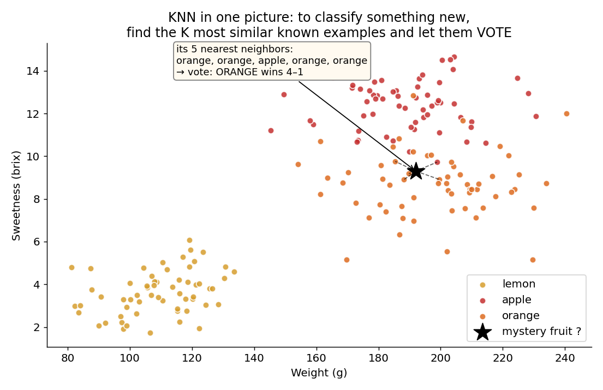
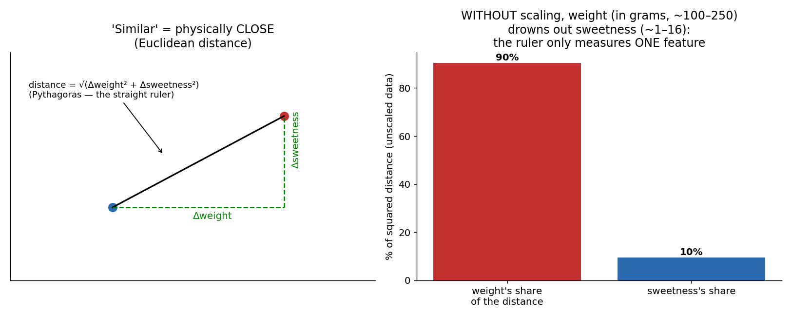
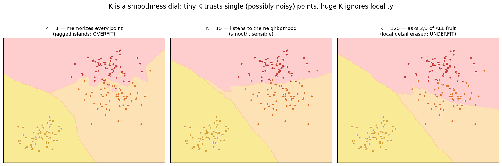
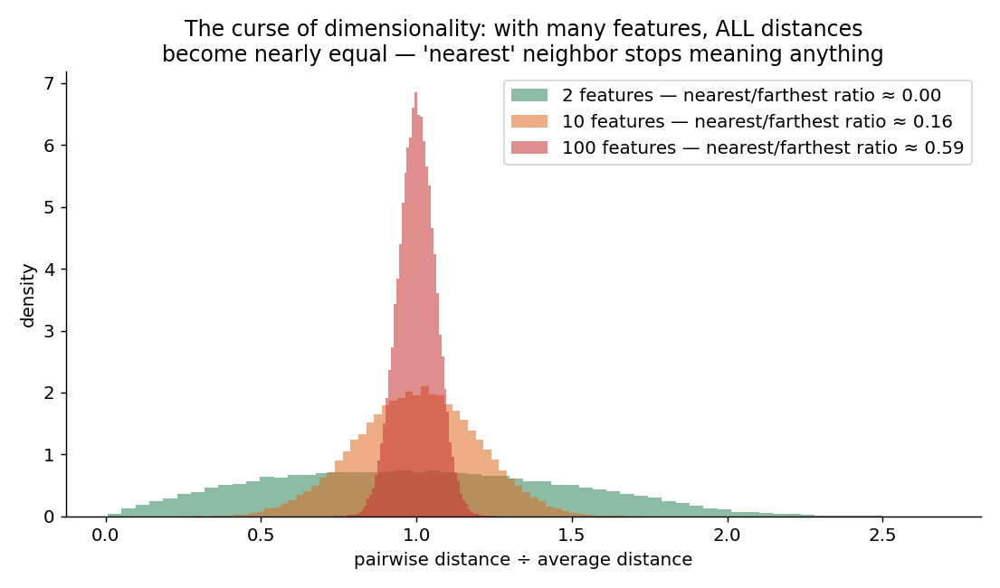

# 03 · K-Nearest Neighbors — Explained From Scratch

## In one sentence

> KNN classifies a new example by finding the K most similar examples it has memorized and letting them vote — no line, no loss, no gradient: learning as pure memory plus a ruler.

## How to read this lesson (don't read it all at once)

| If you have… | Read | ~Time |
|---|---|---|
| 5 minutes | §0 glossary + §2 pictures | 5 min |
| 20 minutes | §0–§2, then **open the notebook** and run Blocks 1–6 | 20 min |
| The full sitting | Everything, notebook alongside | 40–50 min |
| An interview on Tuesday | §8 + §9, then §2 for the pictures | 10 min |

⏸ **Checkpoint** markers below mark natural places to stop reading and run code.

**Prerequisite:** lessons 01–02 for contrast — this lesson exists partly to show you that gradient descent is *a* way to learn, not *the* way. It also introduces something we'll never drop again: the **train/test split**.

This folder contains:

| File | What it is |
|---|---|
| `README.md` | You are here |
| `assets/` | Visual explanations referenced throughout |
| `knn_from_scratch.ipynb` | Pure NumPy build; every block cites a § here |
| `knn_with_library.ipynb` | Same model in scikit-learn, verifying the scratch build |
| `data/fruit_data.csv` | Sample dataset: weight + sweetness → lemon/apple/orange (180 fruits, 3 classes) |

---

## §0 · Words before formulas

Inherited: **feature, label, classification, scaling** (lessons 01–02). Notice what's *absent* from this lesson: weight, bias, loss, gradient, learning rate. KNN needs none of them. The new vocabulary:

| Term | Plain meaning | In our fruit example |
|---|---|---|
| **Instance-based / lazy learning** | The model doesn't learn a formula — it just **stores the data**. All work happens at prediction time | "Training" = putting 180 fruits in memory. That's it |
| **Distance** | A number measuring how DIFFERENT two examples are. Small distance = similar | An unknown fruit weighing 185 g at sweetness 10 is "close to" the oranges |
| **Euclidean distance** | The straight-ruler distance: √(sum of squared feature differences). Pythagoras, generalized | √(Δweight² + Δsweetness²) |
| **K** | How many nearest neighbors get a vote | K = 5: ask the 5 most similar fruits |
| **Majority vote** | The predicted class = the most common class among those K neighbors | 3 oranges, 2 apples → "orange" |
| **Training set** | The data the model is allowed to memorize | 144 of our fruits (80%) |
| **Test set** | Data **hidden** from the model, used only to grade it | The other 36 fruits — a fair exam |
| **Overfitting** | Scoring great on memorized data but poorly on new data | K = 1 gets 100% on the training set… by definition. Meaningless |
| **Underfitting** | Model too crude to capture the pattern at all | K = 120 asks two-thirds of all fruit — everything becomes the majority class |

---

## §1 · What does this model assume about the world?

> "**Similar things belong to the same class.** If it looks like the oranges I've seen, it's probably an orange."

No line, no evidence adding up — just the assumption that the feature space is *meaningful*: closeness in features implies closeness in category.

**When this belief fits:** whenever similarity in your measured features genuinely captures similarity in reality — recommendation ("users like you also bought…"), image matching, anomaly detection ("this looks like nothing I've seen"), filling in missing values.
**When this belief breaks:** when features contain irrelevant dimensions (distance gets polluted), when you have many features (§2.4 — the curse), or when the dataset is huge (every prediction searches all of it).

**Real-world examples:**
- Recommendation engines — "people similar to you"
- Handwriting/digit recognition (a classic early success)
- Anomaly & fraud detection: "far from every known normal example"
- Imputing missing data from the most similar complete records
- Multiclass problems out of the box — note our dataset has **three** fruits; logistic regression (lesson 02) needed tricks for that, KNN doesn't care

And the reason it's lesson 03: it's the **contrast lesson**. Lessons 01–02 taught learning as *optimization* (roll downhill on a loss). KNN is learning as *memory*. Both are legitimate; knowing both stops you from thinking everything must be gradient descent.

---

## §2 · The intuition, in three pictures

### 2.1 Ask the neighbors

A mystery fruit arrives. KNN's entire algorithm: measure its distance to every memorized fruit, take the K closest, count their labels. Here the 5 nearest are 3 oranges and 2 apples → orange. Done. There is nothing else — no training loop happened, ever.

### 2.2 "Similar" needs a ruler — and the ruler needs fair units

**Left:** distance is just Pythagoras across the features.
**Right:** the trap. Weight lives in grams (100–250); sweetness lives in brix (1–16). Unscaled, weight's differences are numerically ~99% of every distance — the ruler goes *blind to sweetness*, and lemons get confused with small apples. In lessons 01–02 skipping scaling made training *slow*; **in KNN it silently changes the answers.** Scaling isn't a performance tip here — it defines what "similar" means.

### 2.3 K is a smoothness dial

- **K = 1:** every single memorized fruit — including mislabeled or weird ones — gets its own little island of influence. The map is jagged: the model has *memorized noise*. This is **overfitting**, met for the first time in its purest form.
- **K = 15:** individual oddballs get outvoted by their neighborhood. Smooth, sensible borders.
- **K = 120:** with 180 fruits total, every vote polls most of the dataset — local structure is erased and predictions collapse toward the overall majority. **Underfitting.**

One knob, and you can watch it slide a model from memorizing-everything to learning-nothing.

### 2.4 The curse of dimensionality — why KNN fears many features

With 2 features, some points are near and some far — "nearest" is informative. Pile on features and a strange thing happens: **all pairwise distances converge toward the same value** (the histograms narrow; nearest/farthest ratio approaches 1). When everything is equally far away, "nearest neighbor" is picked by noise. This isn't a KNN bug — it's geometry — but KNN suffers it worst because distance is *all it has*.

> ⏸ **Checkpoint 1** — That's the whole idea. Open `knn_from_scratch.ipynb`, run Blocks 1–5, and classify a mystery fruit by hand. The "math" section below is the shortest in this course.

---

## §3 · Now the math — the shortest §3 we'll ever have

### 3.1 The distance

$$d(a, b) = \sqrt{\sum_{j=1}^{m}\left(a_j - b_j\right)^2}$$

Read aloud: "for each of the m features, take the difference, square it (kills the sign — same trick as lesson 01 §2.2), add them up, square-root back to original units." Pythagoras with as many legs as you have features.

### 3.2 The prediction

$$\hat{y} = \text{most common label among the } K \text{ smallest } d(x_{\text{new}}, x_i)$$

Read aloud: "sort the memorized examples by distance to the new point, keep K, count votes." That's the complete model.

### 3.3 What's missing — on purpose

No loss function. No gradient. No update rule. **There are no parameters to learn** — the "model" is the dataset itself plus a ruler. The price of skipping training: prediction must touch **all n stored examples every single time** (compare lessons 01–02: expensive training, then near-instant predictions). Lazy now, busy later.

> ⏸ **Checkpoint 2** — Run Blocks 6–8 now: the train/test split and the K-sweep. The U-shaped curve you're about to plot is one of the most important pictures in all of machine learning.

---

## §4 · Every knob, and what happens if you turn it wrong

| Knob | What it controls | Too low / wrong | Too high / wrong |
|---|---|---|---|
| **K** | **The star knob.** How local vs global the vote is | K = 1: memorizes noise, jagged islands, perfect training score that means nothing (overfit) | K ≈ n: everything predicted as the majority class (underfit). Rule of thumb: try odd values around √n, then let the *test set* decide (Block 8) |
| **Feature scaling** | What "similar" even means | Unscaled: large-unit features silently dominate the ruler (§2.2). Not slower — **wrong** | — |
| **Distance metric** | The shape of the ruler | Euclidean (default) treats all directions equally; Manhattan (sum of \|diffs\|) is gentler to outliers; cosine compares direction not magnitude (text!) | Exotic metrics without reason = harder to debug |
| **Vote weighting** | Do closer neighbors count more? | `uniform`: all K votes equal — fine default | `distance`-weighted: closer neighbors dominate — helps when classes crowd each other, but K = 1-like behavior can sneak back in |
| **Tie-breaking** | Even votes (2 vs 2) | Use odd K for 2 classes. With 3+ classes ties still happen — libraries pick the nearest class; know that it's a choice | — |

---

## §5 · Reading the results — and the new rule of the course

Metrics themselves are inherited from lesson 02 (accuracy, confusion matrix, precision/recall — all still apply, now with a 3×3 confusion matrix). The new idea is *where* you're allowed to measure them:

> **From this lesson on, no score counts unless it's measured on data the model never saw.**

KNN makes the reason unforgettable: at K = 1, training accuracy is **100% by construction** — every point's nearest neighbor is itself. A perfect score that carries zero information. So:

| Practice | What it is | Why |
|---|---|---|
| **Train/test split** | Hide ~20% of data before "training"; grade only on the hidden part | The test set is the exam; the training set is the textbook. Grading on the textbook proves only that you can copy |
| **The K-sweep picture** (Block 8) | Plot train accuracy AND test accuracy for K = 1…60 | Train accuracy starts perfect and falls; test accuracy rises, peaks, then falls. The gap between the curves **is** overfitting, made visible. You will draw this same picture for every model from now on — only the knob's name changes |
| **Choosing K honestly** | Pick the K where *test* accuracy peaks | Choosing by training accuracy would always scream "K = 1!" — the exam, not the textbook, decides |

---

## §6 · When NOT to use it (and how to notice)

- **Big datasets.** Prediction cost grows with every stored example (§3.3). Symptom: predictions taking seconds while training took none. Fix: approximate neighbor search (KD-trees, LSH) — or an eager model (back to lessons 01–02 style).
- **Many features.** The curse (§2.4): distances concentrate, neighbors become arbitrary. Symptom: test accuracy near the majority-class baseline despite reasonable K. Fix: feature selection or dimensionality reduction (PCA, lesson 09).
- **Irrelevant features.** Ten junk columns pollute the ruler as much as ten good ones — KNN has no weights with which to ignore anything (lessons 01–02 could learn w ≈ 0; KNN can't). Symptom: adding features *lowers* accuracy.
- **Imbalanced classes.** A 95:5 mix means large-K votes drown the minority. Symptom: minority recall ≈ 0 (the lesson 02 trap, returning). Fix: distance weighting, resampling.
- **You need an explanation or a formula.** KNN can say "these 5 look similar," but there's no equation to hand to a regulator, and the full training data must ship with the model (memory + privacy cost).

---

## §7 · Map: README → notebook

| Notebook block | Implements |
|---|---|
| Block 2 — load + plot data | §1 (belief check: do same-class fruits cluster?) |
| Block 3 — feature scaling | §2.2 (the ruler's fair units — mandatory here) |
| Block 4 — `distance()` | §3.1 |
| Block 5 — `knn_predict_one()` | §3.2 (the whole model, by hand, for one fruit) |
| Block 6 — train/test split | §5 (the new rule of the course) |
| Block 7 — evaluate + 3×3 confusion matrix | §5 (lesson 02's metrics, multiclass) |
| Block 8 — the K-sweep | §4 + §5 (overfitting made visible — THE picture) |
| Block 9 — break it: skip scaling | §2.2 (watch accuracy fall with no code errors) |
| Block 10 — where does it fail? | §6 (inspect the misclassified fruits) |

---

## §8 · Interview prep

### The 30-second answer: "What is KNN?"

> "K-nearest neighbors is an instance-based classifier: there's no training phase — it memorizes the dataset, and to classify a new point it computes distances to every stored example, takes the K closest, and returns their majority label. K controls the bias-variance trade-off: small K overfits to noise, large K over-smooths. It needs scaled features, since distance is its only tool, it struggles in high dimensions, and prediction cost grows with dataset size — the opposite cost profile of parametric models like logistic regression."

### Questions you should be able to answer

<b>Q1. Why is KNN called a "lazy" learner? What's the trade-off?</b>

It defers all computation to prediction time — "training" is just storing data (§3.3). Trade-off vs eager models (lessons 01–02): zero training cost but O(n·m) work per prediction, and the entire dataset must be kept. Eager models pay upfront to train, then predict from a small learned formula.

<b>Q2. How do you choose K?</b>

Sweep K and pick where *held-out* accuracy peaks (§5, Block 8) — never training accuracy, which is maximized at K = 1 by construction. Heuristics: odd K to avoid binary ties, around √n as a starting range. Small K → low bias, high variance; large K → the reverse.

<b>Q3. Why does feature scaling matter more for KNN than for linear models?</b>

In gradient-descent models unscaled features slow convergence but the optimum is the same. In KNN, distance IS the model — a large-unit feature dominates the ruler and effectively deletes the others from consideration (§2.2). Unscaled KNN isn't slower; it's answering a different question.

<b>Q4. Explain the curse of dimensionality in one minute.</b>

As dimensions grow, volume concentrates far from any point and pairwise distances converge to a common value — the ratio of nearest to farthest neighbor approaches 1 (§2.4). "Nearest" then reflects noise, not similarity. Distance-based methods degrade first; remedies are feature selection and dimensionality reduction.

<b>Q5. Your KNN gets 100% training accuracy. Impressed?</b>

Not with K = 1 — each point's nearest neighbor is itself, so 100% is guaranteed and information-free (§5). This is the cleanest illustration of why models are graded on held-out data only.

<b>Q6. How does KNN handle 3+ classes compared to logistic regression?</b>

Natively — the vote just counts more labels (our dataset has 3 fruits). Logistic regression is inherently binary and needs one-vs-rest or a softmax generalization. This "multiclass for free" property is shared by trees (lesson 05).

---

## §9 · Common mistakes (the learner's failure modes, not the model's)

1. **Skipping scaling** — the #1 KNN killer, and it fails *silently*: code runs, accuracy quietly drops (Block 9 demonstrates).
2. **Tuning K on training accuracy.** It will always tell you K = 1. Only the test set gets a vote (§5).
3. **Leaking the test set:** scaling with statistics computed on *all* data before splitting. Compute mean/std on the training set only, then apply to the test set — the exam questions must stay sealed.
4. **Even K on binary problems** — coin-flip ties for no reason.
5. **Throwing in every available feature** "because more data is better." For KNN, irrelevant features actively poison the ruler (§6).
6. **Ignoring prediction cost** until deployment, then discovering each prediction scans a million rows. Know the lazy trade-off before you ship (§3.3).

---

**Next:** `04-naive-bayes/` — a third philosophy of learning: no line, no memory — prediction as *counting evidence and flipping probabilities* with a 260-year-old theorem.
