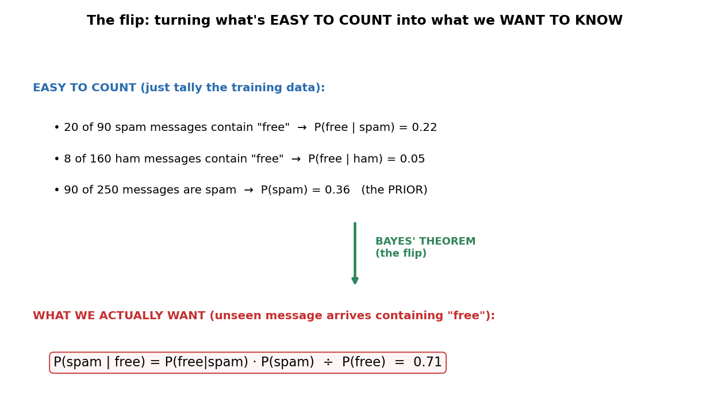
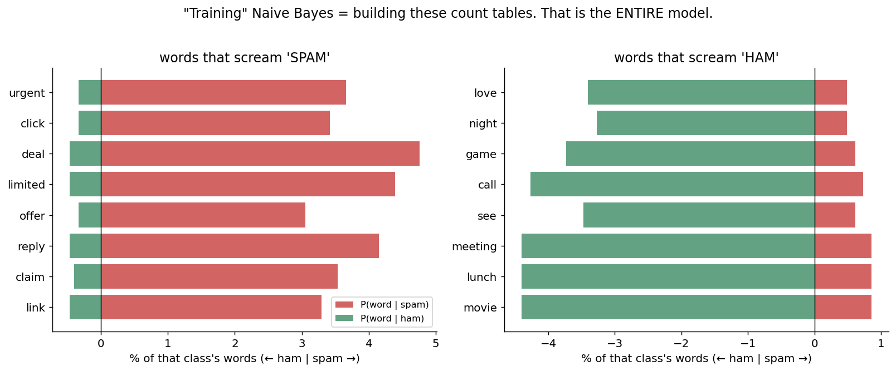
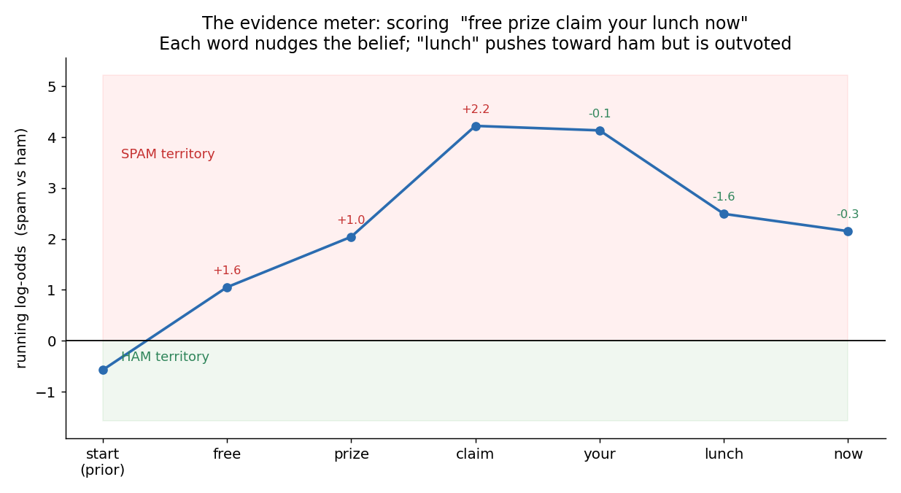
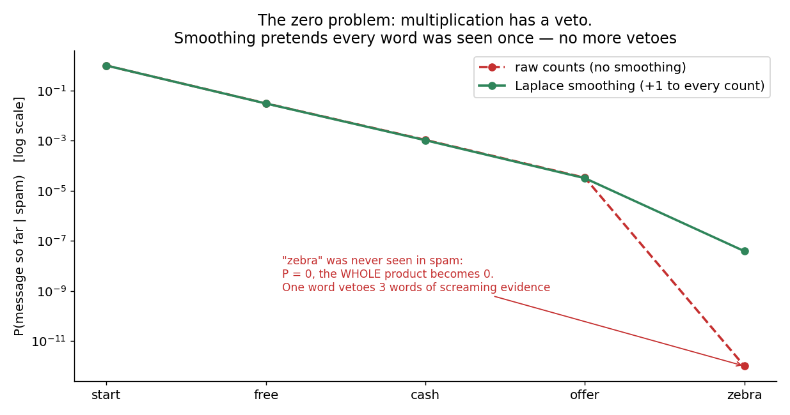

# 04 · Naive Bayes — Explained From Scratch

## In one sentence

> Naive Bayes classifies by counting: it tallies how often each word (or feature value) appears in each class, then uses Bayes' theorem to flip those easy-to-count frequencies into the probability you actually want — assuming, naively, that every feature gives independent evidence.

## How to read this lesson (don't read it all at once)

| If you have… | Read | ~Time |
|---|---|---|
| 5 minutes | §0 glossary + §2 pictures | 5 min |
| 20 minutes | §0–§2, then **open the notebook** and run Blocks 1–6 | 20 min |
| The full sitting | Everything, notebook alongside | 45–55 min |
| An interview on Tuesday | §8 + §9, then §2 for the pictures | 10 min |

⏸ **Checkpoint** markers below mark natural places to stop reading and run code.

**Prerequisite:** lessons 02 (probability as a prediction, precision/recall) and 03 (train/test split). This is the course's **third philosophy of learning**: 01–02 learned by optimization, 03 learned by memory — 04 learns by **counting**. It's also our first **text** dataset: the features are words.

This folder contains:

| File | What it is |
|---|---|
| `README.md` | You are here |
| `assets/` | Visual explanations referenced throughout |
| `naive_bayes_from_scratch.ipynb` | Pure NumPy build; every block cites a § here |
| `naive_bayes_with_library.ipynb` | Same model in scikit-learn, verifying the scratch build |
| `data/sms_data.csv` | Sample dataset: 250 SMS messages labeled spam/ham (ham = legitimate mail; 64% ham — imbalanced on purpose) |

---

## §0 · Words before formulas

Inherited: **label, classification, probability, threshold, train/test split** (lessons 02–03). The new vocabulary — mostly 260-year-old probability words, in plain language:

| Term | Plain meaning | In our spam example |
|---|---|---|
| **Prior — P(spam)** | Your belief BEFORE seeing any evidence: just the base rate | 36% of training messages are spam → a random incoming message starts life 36% suspicious |
| **Likelihood — P(word \| spam)** | How often a clue appears WITHIN a class. Easy to count | "Of all words in spam messages, 6% are 'free'" |
| **Posterior — P(spam \| words)** | Your updated belief AFTER seeing the evidence. **The thing we actually want** | "Given this message says 'free prize claim', it's 99% spam" |
| **Bayes' theorem** | The rule that flips likelihood into posterior: want = (easy-to-count × prior) ÷ normalizer | The entire §3 |
| **Conditional probability — P(A \| B)** | Probability of A *in the world where B is true*. The "\|" reads as "given" | P(free \| spam): among spam only, how common is "free"? |
| **The "naive" assumption** | Pretend every feature gives evidence INDEPENDENTLY — word 2 doesn't care what word 1 was | "free" and "prize" each testify separately, even though in reality they travel together |
| **Bag of words** | Representing text as word counts, ignoring order | "claim your prize" = "prize your claim" to this model |
| **Laplace smoothing** | Add 1 to every count, so nothing has probability exactly zero | A word never seen in spam gets a tiny probability instead of a lethal 0 (§2.4) |
| **Log probabilities** | Work with log(p) and ADD instead of multiplying tiny numbers | 30 words × probabilities ≈ 10⁻⁴⁰ — computers fumble that; logs stay comfortable |

---

## §1 · What does this model assume about the world?

> "Each class generates its evidence with **characteristic frequencies** — and each piece of evidence appears **independently** of the others."

Spam has a vocabulary; ham has a vocabulary. A new message is graded by asking: *which class's word-frequency table explains this message better?* — weighted by how common each class is to begin with (the prior).

**When this belief fits:** whenever per-feature frequencies genuinely differ between classes and features are at least *roughly* independent — text classification above all, where it's a decades-strong baseline.
**When this belief breaks:** when features are strongly correlated (the naive assumption double-counts their shared evidence — §6), or when *order* carries the meaning ("good, not bad" vs "bad, not good" count identically in a bag of words).

**Real-world examples:**
- Spam filtering — the application that made it famous
- Sentiment analysis (positive/negative reviews)
- News topic tagging (sports vs politics vs tech)
- Medical triage from symptom checklists
- Real-time systems needing instant training: the whole "fit" is one pass of counting

And the reason it's lesson 04: it's your first **generative** model — it models how each class *produces* data, rather than drawing a boundary between classes (lessons 01–02 were *discriminative*; interview favorite, §8 Q5). It also introduces priors, likelihoods, and posteriors — vocabulary that returns everywhere from A/B testing to how people reason about LLMs.

---

## §2 · The intuition, in four pictures

### 2.1 The flip: count what's easy, infer what you want

You cannot directly count "the probability this new message is spam" — the message is new. But you CAN count, in your training pile: how often "free" appears inside spam, inside ham, and how common spam is overall. Bayes' theorem is the machine that **flips those countable facts into the uncountable one you want.** That flip is the entire lesson.

### 2.2 "Training" is literally counting

No gradients, no iterations, no rolling downhill. One pass over the data, tallying: how often does each word appear in each class? These two frequency tables (plus the prior) **are the model** — nothing else is stored. That's why Naive Bayes trains in milliseconds on data that would occupy lesson 02 for minutes.

### 2.3 Prediction is an evidence meter

To score a message, start the meter at the prior (spam is a minority, so it starts slightly in ham territory) and let each word push it: spam-flavored words push up, ham-flavored words push down, neutral words barely move it. Note the word **"lunch" pushes toward ham and is simply outvoted** — evidence combines, no single word dictates. This picture is also why Naive Bayes is beautifully *explainable*: every prediction can show its per-word receipts.

### 2.4 The zero problem — multiplication has a veto

Combining evidence means multiplying probabilities — and multiplication has a brutal property: **one zero destroys everything**. A message screaming "free cash offer" plus one innocent word never seen in training spam ("zebra") gets P(message | spam) = 0. One unseen word out-vetoes three words of screaming evidence. The fix is almost embarrassing: **pretend every word was seen once more than it was** (add 1 to all counts). No more zeros, no more vetoes, barely any distortion.

> ⏸ **Checkpoint 1** — That's the full mechanism: flip, count, meter, smooth. Open `naive_bayes_from_scratch.ipynb` and run Blocks 1–5 — you'll build the count tables yourself. The math below just writes the meter as formulas.

---

## §3 · Now the math — every symbol already introduced

### 3.1 Bayes' theorem: the flip, as a formula

$$P(\text{spam} \mid \text{message}) = \frac{P(\text{message} \mid \text{spam}) \cdot P(\text{spam})}{P(\text{message})}$$

Read aloud: "the posterior we want equals the likelihood we can count, times the prior we can count, divided by a normalizer." And here's the practical trick: since we only ask *which class scores higher*, and P(message) is the same for both classes, **we never compute the denominator at all** — compare numerators, done.

### 3.2 The naive step: evidence multiplies

P(message | spam) — the probability of this *exact combination* of words — is impossible to count (you'd need to have seen this exact message before). The naive assumption saves us:

$$P(w_1, w_2, \ldots, w_m \mid \text{spam}) \;\approx\; \prod_{j=1}^{m} P(w_j \mid \text{spam})$$

Read aloud: "pretend each word testifies independently, so the message's probability is just the product of the individual words' probabilities." This is *factually wrong* — "claim" and "prize" obviously travel together — but it converts an impossible count into m easy ones. §6 and §8 Q2 cover why being wrong here still classifies well.

### 3.3 Learning: the likelihoods are counts (plus one)

$$P(w \mid \text{spam}) = \frac{\text{count}(w \text{ in spam}) + 1}{\text{total words in spam} + V}$$

Read aloud: "how often w appears in spam, over all spam words — with 1 added on top (Laplace smoothing, §2.4) and the vocabulary size V added below so everything still sums to 1." The prior is even simpler: P(spam) = spam messages ÷ all messages. **That's all of training.** No loop, no epochs, no learning rate — compare §3.4 of lessons 01–02 and appreciate the silence.

### 3.4 Prediction: add logs, pick the winner

Multiplying 30 numbers of size ~0.01 gives ~10⁻⁶⁰ — real computers round that to 0 (underflow). So take logarithms: log turns products into sums and keeps numbers tame, without changing which class wins (log is order-preserving):

$$\text{score}(\text{spam}) = \log P(\text{spam}) + \sum_{j=1}^{m} \log P(w_j \mid \text{spam})$$

$$\hat{y} = \arg\max_{c \in \{\text{spam}, \text{ham}\}} \; \text{score}(c)$$

Read aloud: "start the meter at the log-prior, add each word's log-likelihood, do it for both classes, pick the higher score." This IS the evidence meter of §2.3 — the figure plotted score(spam) − score(ham) word by word.

> ⏸ **Checkpoint 2** — Run Blocks 6–7 now: prediction and evaluation. Then come back for the knobs — there are refreshingly few.

---

## §4 · Every knob, and what happens if you turn it wrong

| Knob | What it controls | Too low / wrong | Too high / wrong |
|---|---|---|---|
| **Smoothing strength (α)** | How many phantom sightings each word gets (we used α = 1; it's tunable) | α = 0: the zero-veto returns — one unseen word nukes a class (§2.4, Block 8 shows it live) | Huge α: phantom counts drown real counts, every word looks equally likely in both classes → predictions collapse toward the prior (underfit, by flooding) |
| **The prior** | The starting position of the evidence meter | Ignoring it (assuming 50/50) on imbalanced data systematically over-predicts the minority class | Priors from unrepresentative data bake yesterday's imbalance into tomorrow's predictions — if spam rates shift, retallying one number fixes it |
| **Vocabulary choices** | What counts as a feature | Keeping every rare typo → huge V, heavier smoothing dilution | Aggressive filtering (dropping rare/common words) can delete exactly the discriminative ones — check fig 2's top words survive your filter |
| **Variant choice** | Which counting model | Multinomial (word counts — this lesson) for text; Bernoulli (word present/absent) for short texts; **Gaussian** (bell curves per feature) for continuous features like lesson 03's fruit | Multinomial NB on continuous features is a type error — nothing to count |

Notice what's *not* here: no learning rate, no iterations, no initialization. Counting has no hyperparameters of motion.

---

## §5 · Reading the results

Metrics are inherited from lessons 02–03 (accuracy, confusion matrix, precision, recall — measured on the test set only). Spam makes the precision/recall trade-off *visceral*:

| Mistake | In spam terms | Cost |
|---|---|---|
| **False positive** | Real message (ham) thrown in the spam folder | Your friend's "dinner tonight?" vanishes — **users lose trust instantly** |
| **False negative** | Spam reaches the inbox | Annoying, but survivable |

So spam filters run **precision-first**: when the model says spam, it had better be right. (Contrast disease screening from lesson 02 §5 — recall-first. Same math, opposite priorities, because the costs flipped.)

**One honest warning specific to Naive Bayes:** its *rankings* are good, but its *probabilities* are overconfident — the naive assumption counts correlated words as independent witnesses, like interviewing the same eyewitness five times and calling it five testimonies. A posterior of 0.999 means "spam-ish", not literally 999-in-1000 odds. Use the argmax and the ranking; don't bet the farm on the calibration (§6).

---

## §6 · When NOT to use it (and how to notice)

- **Strongly correlated features.** "New" and "York" are one piece of evidence, not two — Naive Bayes double-counts. Symptom: absurdly extreme posteriors (0.99999…) on ordinary examples. It often still *classifies* fine (both classes get inflated equally); it's the probabilities that break.
- **Order carries the meaning.** Bag of words scores "good, not bad" and "bad, not good" identically. Symptom: systematic misreads of negation and sarcasm. Fix: n-gram features help a little; sequence models (lessons 12–14) are the real answer.
- **Continuous features with the wrong variant.** Word-count math on salary-like numbers is meaningless — switch to Gaussian NB (§4).
- **You need calibrated probabilities.** §5's warning: downstream systems consuming the posterior as a real probability (bidding, risk pricing) will be misled. Calibrate (Platt/isotonic) or use a discriminative model (lesson 02).
- **The independence lie is too big AND the data is plentiful.** With little data, naive-but-stable counting beats flexible-but-hungry models; with lots of data, logistic regression usually pulls ahead on the same features. NB's sweet spot is small data, fast training, streaming updates.

---

## §7 · Map: README → notebook

| Notebook block | Implements |
|---|---|
| Block 2 — load + look at messages | §1 (belief check: do the vocabularies actually differ?) |
| Block 3 — vocabulary + bag of words | §0 (bag of words replaces scaling as this lesson's preprocessing) |
| Block 4 — the prior | §3.3 (count messages) |
| Block 5 — likelihood tables + smoothing | §3.3 (count words, add 1 — training complete) |
| Block 6 — `predict()` in log-space | §3.4 (the evidence meter as code) |
| Block 7 — evaluate: confusion, precision, recall | §5 (precision-first, spam edition) |
| Block 8 — break it: remove smoothing | §2.4 (watch one word veto everything) |
| Block 9 — explain one prediction | §2.3 (per-word receipts — interpretability) |
| Block 10 — where does it fail? | §6 (inspect misclassified messages) |

---

## §8 · Interview prep

### The 30-second answer: "What is Naive Bayes?"

> "Naive Bayes is a generative classifier built on Bayes' theorem: it learns the frequency of each feature within each class — for text, word frequencies — plus class priors, all by simple counting. To classify, it combines the prior with each feature's likelihood, assuming features are conditionally independent — that's the 'naive' part — and picks the class with the highest posterior, computed in log-space with Laplace smoothing to avoid zero probabilities. It trains in one pass, handles high-dimensional data like text well, and is a strong baseline — though its probability estimates are overconfident when features correlate."

### Questions you should be able to answer

<b>Q1. What exactly is "naive" about it?</b>

The conditional-independence assumption (§3.2): given the class, every feature is treated as independent evidence — P(message|class) factorizes into a product of per-word probabilities. It's naive because real features correlate ("free" and "prize" co-occur), but it turns an uncountable joint probability into countable individual ones.

<b>Q2. The independence assumption is false. Why does it still work?</b>

Classification only needs the *right class to score highest*, not correct probabilities (§5). Correlated evidence gets double-counted for *both* classes, inflating scores roughly in tandem, so the argmax often survives even when the posteriors are badly miscalibrated. The ranking is robust; the calibration is not.

<b>Q3. What is Laplace smoothing and what breaks without it?</b>

Add α (typically 1) to every word count, and αV to the denominator (§3.3). Without it, any word never seen in a class gives P = 0, and the product — which has a veto — zeroes the entire class regardless of other evidence (§2.4). Block 8 demonstrates a screaming-spam message rescued/broken by this single knob.

<b>Q4. Why compute in log-space?</b>

A 30-word message multiplies 30 small probabilities into ~10⁻⁶⁰ — below floating-point range (underflow → 0 for every class). Logs turn the product into a sum of manageable negatives, and since log is monotonic, the argmax is unchanged (§3.4).

<b>Q5. Generative vs discriminative — where does NB sit vs logistic regression?</b>

NB is generative: it models how each class produces data, P(features|class), plus P(class), and flips via Bayes. Logistic regression is discriminative: it models P(class|features) directly, learning only the boundary (lesson 02). Classic result: on the same features, NB reaches its (worse) ceiling faster with little data; logistic regression wins with more data. NB also gets a per-word explanation for free (§2.3).

<b>Q6. Your NB spam filter outputs P(spam) = 0.9999 constantly. Bug?</b>

Probably not a bug — it's the signature of double-counted correlated evidence (§6). The model interviews the same eyewitness repeatedly. Rankings remain useful; the calibration doesn't. If calibrated probabilities are needed, apply Platt scaling / isotonic regression, or switch to a discriminative model.

---

## §9 · Common mistakes (the learner's failure modes, not the model's)

1. **Forgetting smoothing** — works in the demo, then the first real-world unseen word zeroes a class in production (§2.4).
2. **Multiplying raw probabilities** instead of summing logs — silent underflow; every message scores 0 for every class and ties break arbitrarily (§3.4).
3. **Building the vocabulary on ALL data before splitting** — the test set's words leak into training. Fit vocabulary on the training set only (lesson 03 §9's sealed-exam rule, text edition).
4. **Trusting the posterior as a calibrated probability** (§5's warning) — fine for ranking, dangerous for downstream math.
5. **Using accuracy on imbalanced spam data** — the lesson 02 trap; our dataset is 64% ham, so "always ham" scores 64%. Confusion matrix first.
6. **Wrong variant for the feature type** — Multinomial for counts, Bernoulli for presence/absence, Gaussian for continuous (§4). Mixing them isn't an error message; it's just quietly wrong.

---

**Next:** `05-decision-trees/` — a fourth philosophy: learning as asking the best questions, one split at a time — and the foundation of the models that still win most tabular-data competitions.
