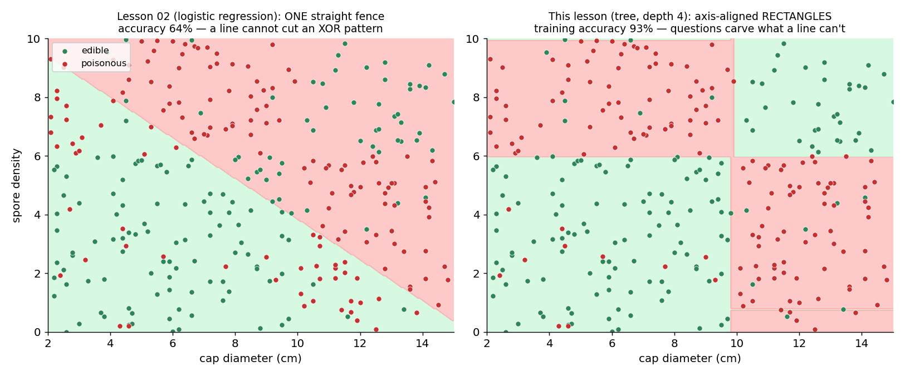
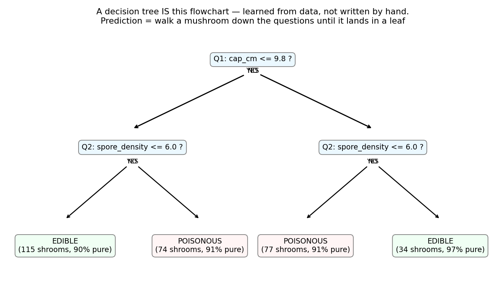
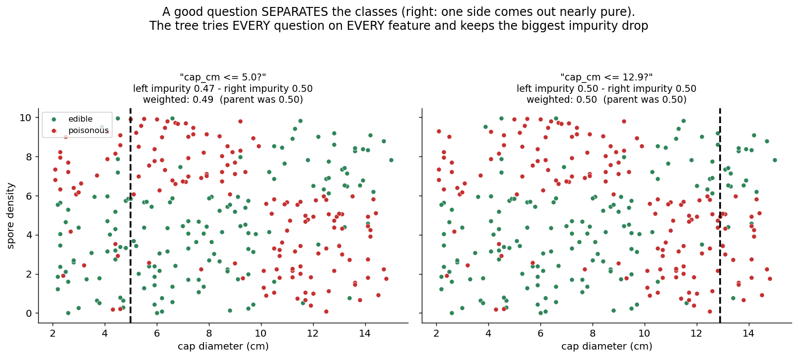
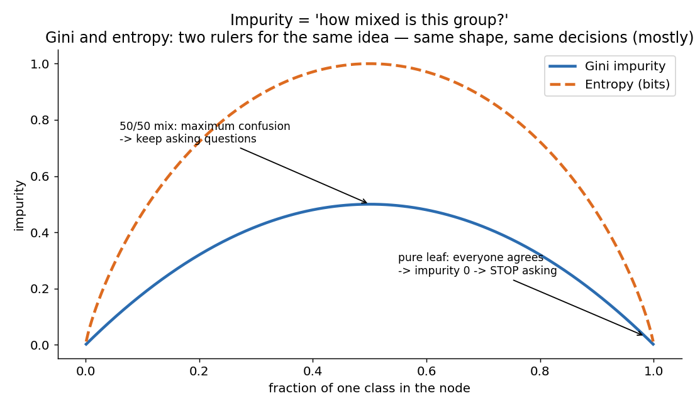
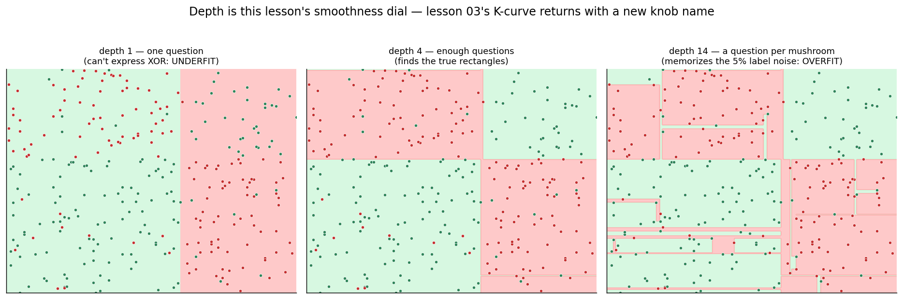

# 05 · Decision Trees — Explained From Scratch

## In one sentence

> A decision tree learns a flowchart of yes/no questions — each question chosen because it best un-mixes the classes — and classifies by walking a new example down the questions until it lands in a leaf.

## How to read this lesson (don't read it all at once)

| If you have… | Read | ~Time |
|---|---|---|
| 5 minutes | §0 glossary + §2 pictures | 5 min |
| 20 minutes | §0–§2, then **open the notebook** and run Blocks 1–6 | 20 min |
| The full sitting | Everything, notebook alongside | 45–60 min |
| An interview on Tuesday | §8 + §9, then §2 for the pictures | 10 min |

⏸ **Checkpoint** markers below mark natural places to stop reading and run code.

**Prerequisite:** lesson 02 (this dataset is designed to *defeat* it — you'll see why that matters) and lesson 03 (the overfitting U-curve returns with a new knob name). Fourth philosophy of the course: 01–02 optimized, 03 memorized, 04 counted — **05 asks questions**.

This folder contains:

| File | What it is |
|---|---|
| `README.md` | You are here |
| `assets/` | Visual explanations referenced throughout |
| `decision_tree_from_scratch.ipynb` | Pure NumPy build; every block cites a § here |
| `decision_tree_with_library.ipynb` | Same model in scikit-learn (plus its tree-drawing), verifying the scratch build |
| `data/mushroom_data.csv` | Sample dataset: cap diameter + spore density → edible/poisonous (300 mushrooms, XOR-style pattern, 5% label noise) |

---

## §0 · Words before formulas

Inherited: **feature, label, classification, train/test split, overfitting/underfitting** (lessons 01–03). The new vocabulary:

| Term | Plain meaning | In our mushroom example |
|---|---|---|
| **Node / question** | A yes/no test on ONE feature at ONE threshold | "Is cap_cm ≤ 10.0?" |
| **Split** | The act of dividing a group by a question's answer | The 300 mushrooms become a small-cap pile and a large-cap pile |
| **Leaf** | A node with no more questions — it just declares a verdict | "Everything landing here: POISONOUS" |
| **Depth** | How many questions from the top to the deepest leaf | Depth 4 = at most 4 questions per mushroom |
| **Impurity** | How MIXED a group is. 0 = everyone agrees; max = 50/50 chaos | A leaf that's 96% edible has low impurity |
| **Gini impurity** | The default mixing ruler: the chance two random members of the group disagree | 50/50 group → 0.5; pure group → 0 |
| **Entropy** | An alternative mixing ruler from information theory, measured in bits. Same shape, same decisions (mostly) | — |
| **Information gain** | How much a question REDUCES impurity: parent's mix minus children's average mix | The question worth asking is the one with the biggest gain |
| **Greedy** | Choosing the best question RIGHT NOW, never reconsidering | The tree never asks "would a worse question now enable a better one later?" |
| **Recursive** | The same procedure applied to each child pile, then their children… | Split, then split the pieces, then split those pieces |

---

## §1 · What does this model assume about the world?

> "The classes live in **boxes**: you can separate them by a sequence of single-feature thresholds."

No line through everything (01–02), no distance ruler (03), no vocabulary frequencies (04) — just: *is this value above or below a cutoff?*, repeated.

**When this belief fits:** rule-like domains — eligibility criteria, medical triage protocols, fraud flags, anywhere a human expert would also reason in thresholds ("if income below X and debt above Y…"). And crucially: patterns a line can't cut (§2.1).
**When this belief breaks:** truly diagonal or smooth boundaries — a tree must approximate a 45° line with a staircase of many tiny boxes (§6).

**Real-world examples:**
- Credit approval and eligibility rules (banks love that the model IS its explanation)
- Medical decision protocols (readable by doctors, auditable by regulators)
- Fraud detection first-pass rules
- Churn prediction on tabular business data
- The **foundation species**: random forests (lesson 06) and gradient boosting (lesson 08) — the models that still win most tabular-data competitions — are built out of these trees

And a quiet superpower revealed in Block 3: trees need **no feature scaling** — the first model in this course that doesn't. "Is cap ≤ 10cm?" doesn't care whether you measure in cm or km.

---

## §2 · The intuition, in four pictures

### 2.1 The motivation: our dataset defeats lesson 02



Look at the data: poisonous mushrooms are big-cap-low-spore OR small-cap-high-spore — an XOR pattern. **No single straight fence can cut it**: logistic regression tops out near coin-flip (left panel, 64%). The tree (right panel) carves the space into rectangles with four levels of questions and reaches 93%. This is why the course doesn't end at lesson 02.

### 2.2 The model is a flowchart — a learned one



This flowchart wasn't written by a human; it's what the algorithm *learned* from the CSV (these are its real splits). Predicting = dropping a mushroom in at the top and following the answers to a leaf. The model is fully readable — you could pin it to the wall of a mushroom-picker's cabin.

### 2.3 What makes a question good?



Two candidate questions on the same data. The left one splits the mushrooms into two piles that are each still ~50/50 mixed — you learned nothing. The right one produces a nearly-pure pile — real progress. "Good question" = **the children are less mixed than the parent.** The algorithm simply tries *every threshold on every feature* and keeps the biggest un-mixing.

### 2.4 Measuring "mixed": impurity



To compare questions we need mixing as a *number*. Gini impurity reads beautifully: **the probability that two randomly drawn members of the group disagree.** Pure group → they never disagree → 0. Coin-flip group → they disagree half the time → 0.5. (Entropy is a second ruler with the same shape; §4 covers when the choice matters — rarely.)

> ⏸ **Checkpoint 1** — You have the full mechanism: try every question, keep the best un-mixer, recurse. Open `decision_tree_from_scratch.ipynb`, run Blocks 1–5, and watch `best_split` pick its first question. The math below is bookkeeping for what you just saw.

---

## §3 · Now the math — every symbol already introduced

### 3.1 Gini impurity

$$G = 1 - \sum_{c} p_c^2$$

Read aloud: "for each class, square its share of the group, add them up, subtract from 1." Why that measures disagreement: Σp_c² is the chance two random draws *match*, so 1 minus it is the chance they *differ*. Pure leaf: p = 1 → G = 0. Coin flip: G = 1 − (0.25 + 0.25) = 0.5.

### 3.2 The quality of a question

$$\text{Gain}(f, t) = G_{\text{parent}} - \left(\frac{n_L}{n} G_L + \frac{n_R}{n} G_R\right)$$

Read aloud: "the parent's impurity, minus the children's impurities averaged by how many samples each child got." The weighting matters: a question producing one perfectly pure child with 2 mushrooms and one giant messy child hasn't achieved much — the big messy child drags the weighted average.

### 3.3 The whole training algorithm, in words

```
grow(pile):
    if the pile is pure, tiny, or we're at max depth → make a LEAF (verdict = majority)
    else:
        try EVERY feature f and EVERY threshold t; compute Gain(f, t)     ← §3.2
        ask the winning question; split the pile in two
        grow(left pile); grow(right pile)                                  ← recursion
```

That's it — no loss surface, no gradients, no update rule. Two properties worth naming:
- **Greedy** (§0): each question is the best *right now*. On our XOR-style data the first question earns only modest gain (no single split can crack XOR) — the tree still recovers at the second level. Greedy usually works; it isn't guaranteed optimal, and a perfectly *symmetric* XOR can genuinely stall it (Block 9 stages exactly this).
- **Recursive**: the same tiny procedure builds arbitrarily complex trees, each child solving a smaller version of the same problem.

### 3.4 Prediction

$$\hat{y}(x) = \text{the verdict of the leaf that } x \text{ falls into}$$

Follow the answers down; the leaf's majority class is the answer. Cost: one comparison per level — predicting is O(depth), absurdly fast (contrast lesson 03, which scanned everything).

> ⏸ **Checkpoint 2** — Run Blocks 6–8 now: grow the full tree, read its questions in plain text, and grade it on the sealed test set. Then come back for the knobs.

---

## §4 · Every knob, and what happens if you turn it wrong



| Knob | What it controls | Too low / wrong | Too high / wrong |
|---|---|---|---|
| **max_depth** | **The star knob.** How many questions may be chained | Depth 1 can't express XOR at all — underfit (left panel) | Unlimited depth grows a question for every mushroom and memorizes the 5% label noise — jagged islands, the K=1 of trees (right panel). Block 8 redraws lesson 03's U-curve with this knob |
| **min_samples_leaf** | Smallest pile allowed to become a leaf | 1: leaves that "learned" from a single (possibly mislabeled) mushroom | Huge: forces crude verdicts on genuinely mixed regions |
| **min_samples_split** | Smallest pile still worth questioning | Same overfit direction as above | Same underfit direction |
| **Criterion (gini vs entropy)** | Which mixing ruler | Nearly identical trees in practice (§2.4's figure shows why — same shape). Gini is marginally cheaper (no log). Don't agonize | — |
| **Feature scaling** | — | **Not needed. At all.** A threshold question is unchanged by units (cm vs km). First model in the course where Block 3 is a celebration instead of a chore | — |

---

## §5 · Reading the results

Metrics inherited (accuracy, confusion matrix — on the test set only, lesson 03's rule). Two new readable artifacts, both unique strengths of trees:

| Artifact | What it is | Gotcha |
|---|---|---|
| **The tree itself** | The learned flowchart, printable as text (Block 6). The model *is* its explanation — no other model in this course so far can be read aloud to a domain expert for a sanity check | Readability decays fast with depth; a depth-15 tree is technically readable, practically not |
| **Feature importance** | For each feature: the total impurity reduction it delivered across all its splits — "which questions did the heavy lifting?" | It measures *usefulness to this tree*, not causation — and correlated features split the credit arbitrarily (one may look important, its twin useless). Shown in the library notebook |
| **The depth U-curve** | Train vs test accuracy across max_depth (Block 8) | The exact picture from lesson 03 Block 8 with K renamed — the promise ("only the knob's name changes") kept |

---

## §6 · When NOT to use it (and how to notice)

- **Smooth or diagonal boundaries.** A tree approximates a 45° line with a staircase of boxes — many splits spent badly. Symptom: required depth keeps climbing while test accuracy crawls. Fix: linear models for linear worlds (lesson 02), or ensembles (06, 08).
- **Instability — the tree's defining weakness.** Remove 10 mushrooms and the root question can change, cascading into a *completely different tree*. Symptom: retraining on resampled data yields wildly different flowcharts. A single tree is a **high-variance** model — remember that phrase; lesson 06 exists because of it.
- **Extrapolation (regression trees).** A tree's answer is always some leaf's training average — ask it about inputs beyond the data and it flatlines at the edge leaf's value. Lesson 01's line at least extended its trend; a tree can't even do that.
- **Very few, very weak features.** Questions need something to ask about; trees can't invent interactions from nothing.
- **When you need calibrated probabilities from a single tree.** Leaf frequencies from small leaves are noisy anecdotes; ensembles average this problem away.

---

## §7 · Map: README → notebook

| Notebook block | Implements |
|---|---|
| Block 2 — load + plot data | §1 + §2.1 (belief check: boxes — and a line's funeral) |
| Block 3 — NO scaling needed | §4 (the celebration block) |
| Block 4 — `gini()` | §3.1 |
| Block 5 — `best_split()` | §3.2 (try everything, keep the best un-mixing) |
| Block 6 — `grow()` recursion + print the flowchart | §3.3 + §5 (read your model aloud) |
| Block 7 — predict + evaluate on test | §3.4 + §5 |
| Block 8 — the depth U-curve | §4 (lesson 03's picture, new knob name) |
| Block 9 — break it: the greedy trap | §3.3 (symmetric XOR stalls the greedy first split) |
| Block 10 — where does it fail? | §6 (boundary + misread mushrooms) |

---

## §8 · Interview prep

### The 30-second answer: "What is a decision tree?"

> "A decision tree classifies by learning a hierarchy of yes/no threshold questions on individual features. Training is greedy and recursive: at each node it tries every feature-threshold pair, keeps the split that most reduces impurity — usually Gini — and recurses on the children until leaves are pure or a depth limit stops it. Prediction walks the tree in O(depth). Strengths: handles non-linear patterns, needs no feature scaling, and is fully interpretable — the model is a readable flowchart. Weaknesses: it overfits if grown deep, and it's unstable — small data changes can produce a completely different tree — which is exactly what random forests fix by averaging many of them."

### Questions you should be able to answer

<details><summary><b>Q1. How does a tree decide which question to ask?</b></summary>

It exhaustively tries every feature and every candidate threshold, computes the impurity reduction (parent Gini minus the sample-weighted average of the children's Ginis — §3.2), and keeps the maximum. Greedy: best now, never reconsidered.
</details>

<details><summary><b>Q2. Gini vs entropy — does the choice matter?</b></summary>

Rarely. Both are zero at purity, maximal at 50/50, and nearly proportional in between (§2.4's figure) — they choose the same split almost always. Gini skips the logarithm so it's marginally faster; that's the usual reason it's the default.
</details>

<details><summary><b>Q3. Why don't trees need feature scaling?</b></summary>

Splits are threshold comparisons on one feature at a time — "x ≤ t" is invariant to any monotonic rescaling of x (the threshold rescales with it). Contrast lesson 03, where distance mixed features into one number and scaling *defined* the answer.
</details>

<details><summary><b>Q4. Why are single trees called high-variance, and what's the fix?</b></summary>

Because the greedy structure compounds: perturb the data slightly, the root split can flip, and everything below it changes — a completely different model from nearly the same data (§6). The fix is averaging many decorrelated trees: bagging / random forests (lesson 06), which keep the low bias and cancel the variance.
</details>

<details><summary><b>Q5. Your depth-20 tree has 100% training accuracy. Diagnose.</b></summary>

Almost certainly memorization: enough depth gives every training example its own leaf — the tree equivalent of lesson 03's K=1, a guaranteed and meaningless score. Check test accuracy, expect a large gap, then constrain depth / min_samples_leaf using the U-curve (Block 8).
</details>

<details><summary><b>Q6. What's the greedy limitation? Give a concrete example.</b></summary>

Greedy optimizes one split at a time, so patterns where no *single* split helps can stall it. Perfectly symmetric XOR is the classic case: every first question yields ~zero gain, so the algorithm may stop before the second-level questions that would crack the problem (Block 9 stages it). Real datasets are rarely that adversarial — asymmetry gives greedy a foothold — but it's why trees are "usually good", not "optimal".
</details>

---

## §9 · Common mistakes (the learner's failure modes, not the model's)

1. **Growing unlimited depth** because training accuracy keeps rising. It always rises — that's memorization, not learning (§4, Block 8).
2. **Scaling features out of habit.** Harmless here, but it signals not understanding *why* lesson 03 needed it — know your model's actual requirements (§4).
3. **Reading feature importance as causation** — it's usefulness-to-this-tree, and correlated features split credit arbitrarily (§5).
4. **Trusting one tree's structure as "the" explanation.** Retrain on slightly different data first; if the flowchart survives, believe it more (§6).
5. **Judging leaf probabilities from tiny leaves** — a 3-sample leaf saying "100% poisonous" is three anecdotes, not a probability (§6).
6. **Tuning depth on training accuracy** — the same mistake as tuning K on training data in lesson 03 (§5).

---

**Next:** `06-random-forest/` — the fix for the tree's instability, and the course's fifth big idea: **the wisdom of crowds**. Train many deliberately-different trees, let them vote, and watch the variance cancel.
