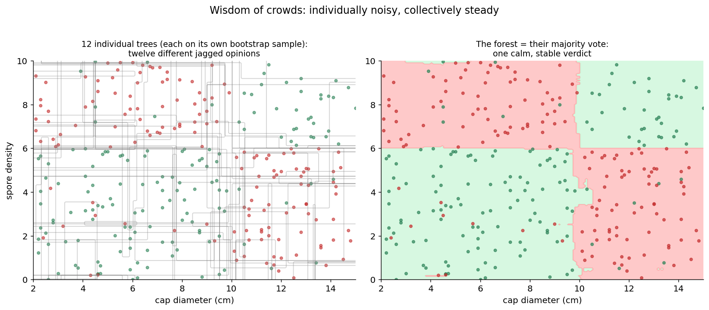
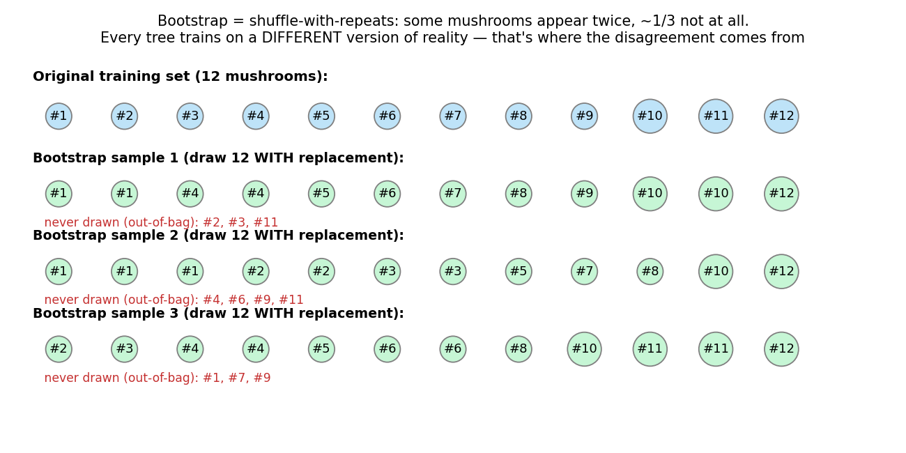
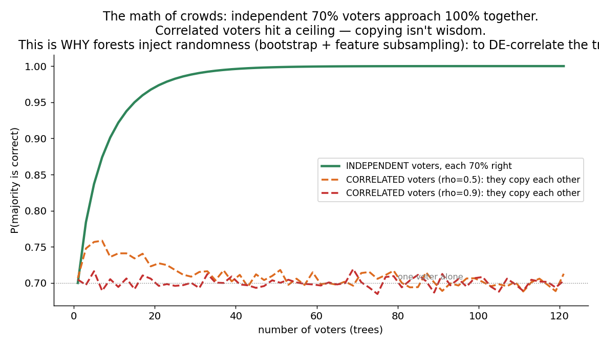
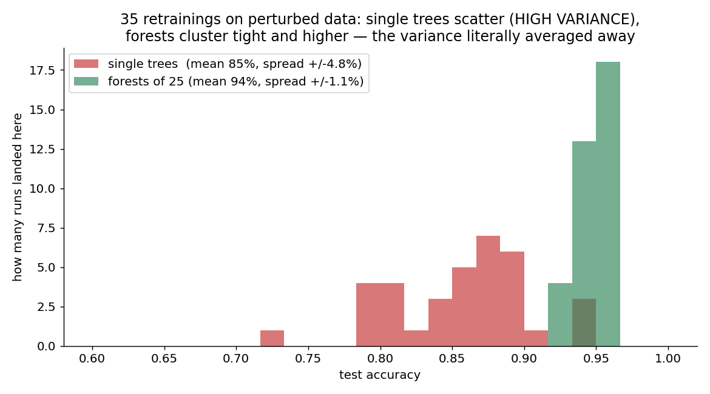

# 06 · Random Forest — Explained From Scratch

## In one sentence

> A random forest trains many decision trees — each on a randomly reshuffled version of the data, each restricted to random subsets of features — and lets them vote: individually noisy opinions, averaged into one calm, accurate verdict.

## How to read this lesson (don't read it all at once)

| If you have… | Read | ~Time |
|---|---|---|
| 5 minutes | §0 glossary + §2 pictures | 5 min |
| 20 minutes | §0–§2, then **open the notebook** and run Blocks 1–6 | 20 min |
| The full sitting | Everything, notebook alongside | 40–55 min |
| An interview on Tuesday | §8 + §9, then §2 for the pictures | 10 min |

⏸ **Checkpoint** markers below mark natural places to stop reading and run code.

**Prerequisite:** lesson 05 — the forest is built out of its trees, and this lesson resolves its cliffhanger: the tree's *instability*. We even reuse the **exact same mushroom dataset**, so every comparison is a controlled experiment. Fifth big idea of the course: **the wisdom of crowds**.

This folder contains:

| File | What it is |
|---|---|
| `README.md` | You are here |
| `assets/` | Visual explanations referenced throughout |
| `random_forest_from_scratch.ipynb` | Pure NumPy build (importing nothing from sklearn); every block cites a § here |
| `random_forest_with_library.ipynb` | Same model in scikit-learn, verifying the scratch build |
| `data/mushroom_data.csv` | The lesson 05 dataset, deliberately unchanged (300 mushrooms, XOR pattern, 5% noise) |

---

## §0 · Words before formulas

Inherited: everything from lesson 05 (node, split, leaf, depth, gini, greedy) plus **train/test, overfitting** (lesson 03). The new vocabulary:

| Term | Plain meaning | In our mushroom example |
|---|---|---|
| **Ensemble** | Many models combined into one | 50 trees acting as a single classifier |
| **Bootstrap sample** | A new dataset made by drawing from the original *with replacement* — same size, but some rows repeat and some are left out | Tree #7 trains on a version of reality where mushroom #12 appears twice and #40 doesn't exist |
| **Bagging** | **B**ootstrap **agg**regat**ing**: train one model per bootstrap sample, combine by voting/averaging | The forest's first randomness source |
| **Feature subsampling** | At every split, the tree may only consider a random subset of features | "This question must be about spore_density — cap_cm is off-limits right now" |
| **Decorrelation** | Making the trees *disagree in different ways*, so their errors cancel instead of piling up | The entire point of both randomness sources (§2.3) |
| **Out-of-bag (OOB)** | The ~1/3 of rows a given tree never saw — a built-in mini test set per tree | Free honest evaluation without touching the real test set (§3.4) |
| **Bias** | Error from a model being too *crude* — systematically wrong no matter the data | Lesson 02's line on XOR: 64% forever. No amount of data fixes it |
| **Variance** | Error from a model being too *jumpy* — its answers change wildly when the data wiggles | Lesson 05's tree: resample 10% of the data and the whole flowchart changes |

**Bias and variance** finally get their formal introduction here, because the forest is the cleanest demonstration in all of ML: trees have low bias (flexible boxes) but high variance (unstable) — and **averaging attacks variance while leaving bias alone**.

---

## §1 · What does this model assume about the world?

> "Everything the single tree assumed (classes live in boxes) — plus: **my trees' mistakes are mostly disagreements, not shared delusions.**"

Averaging only helps when the voters err *differently*. If every tree makes the same mistake, fifty of them repeat it in chorus (§2.3). The forest's design — bootstrap + feature subsampling — exists purely to manufacture productive disagreement.

**When this belief fits:** almost any tabular data. The random forest is arguably the best "throw it at the problem first" model in existence: little tuning, no scaling, handles nonlinearity, resists overfitting.
**When this belief breaks:** when the *individual trees* share a systematic blind spot (bias) — diagonal boundaries, extrapolation — because voting can't fix what every voter gets wrong (§6).

**Real-world examples:**
- Credit scoring and churn models in production at countless companies
- Medical risk prediction on structured records
- Kaggle-style tabular competitions (the pre-boosting default champion; lesson 08 meets its rival)
- Feature-importance triage: "which of my 200 columns matter at all?"
- Anywhere you want lesson 05's flexibility without lesson 05's fragility

---

## §2 · The intuition, in four pictures

### 2.1 Many jagged opinions, one calm verdict

Left: twelve trees, each trained on its own bootstrap sample of the *same* mushrooms — twelve different jagged boundaries (lesson 05's instability, live). Right: their majority vote. The individual quirks — each tree's little noise-chasing islands — appear in *one* voter and get outvoted; the real XOR structure appears in *all* voters and survives. **Noise is private; signal is shared. Voting keeps what's shared.**

### 2.2 Where the disagreement comes from: bootstrap

Each tree gets a *forgery* of the dataset: n rows drawn with replacement. Some mushrooms appear twice, and — a number worth memorizing — **about one third don't appear at all** (§3.1). Different forgeries → different greedy split choices → different trees. And those left-out rows aren't wasted: they become each tree's private exam (§3.4).

### 2.3 Why copying isn't wisdom: the math of crowds

Voters who are each 70% right and **independent**: their majority approaches 100% as the crowd grows. Voters who **copy each other**: the crowd is barely better than one voter, no matter its size. Trees trained on the same data naturally correlate — one dominant feature grabs every root split, and fifty trees become fifty echoes. That's why the forest adds a *second* randomness source: at every split, only a random subset of features may be considered. Sometimes the loud feature is silenced and trees are forced to find *other* routes to the answer. **Randomness here isn't sloppiness — it's engineered disagreement.**

### 2.4 Variance, literally cancelling

The receipts: retrain 35 times on perturbed data. Single trees scatter from ~75% to ~95% test accuracy (spread ±4.8%) — you don't know which tree you'll get. Forests of 25 cluster at ~94% ± 1.1%. Same data, same tree algorithm inside — the averaging alone bought both *stability* and *accuracy*. This picture is bias–variance made visible: the tree family's bias stayed (it was already low), the variance got voted away.

> ⏸ **Checkpoint 1** — That's the whole idea: forge datasets, grow disagreeing trees, vote. Open `random_forest_from_scratch.ipynb` and run Blocks 1–5 — the forest is a 10-line loop around lesson 05's `grow()`. The math below is one formula and two counting facts.

---

## §3 · Now the math — one formula and two counting facts

### 3.1 Counting fact #1: the missing third

Each bootstrap draw misses a given row with probability (1 − 1/n); after n draws:

$$P(\text{row never drawn}) = \left(1 - \frac{1}{n}\right)^{n} \;\xrightarrow{\;n\ \text{large}\;}\; \frac{1}{e} \approx 0.37$$

Read aloud: "every tree trains on roughly 63% of the distinct rows and never meets the other 37%." Those 37% are the tree's out-of-bag rows.

### 3.2 The vote

$$\hat{y}(x) = \text{majority}\Big(\hat{y}_1(x), \ldots, \hat{y}_B(x)\Big) \qquad \text{or} \qquad \hat{p}(x) = \frac{1}{B}\sum_{b=1}^{B} \hat{y}_b(x)$$

Read aloud: "B trees each vote; take the majority — or report the *fraction* voting poisonous as a probability." That fraction is a genuinely useful confidence: 26-vs-24 split screams "borderline mushroom" in a way lesson 05's single verdict never could.

### 3.3 THE formula: why averaging works, and what limits it

For B voters with individual variance σ² and pairwise correlation ρ, the variance of their average is:

$$\text{Var}(\bar{y}) = \rho\,\sigma^2 + \frac{1-\rho}{B}\,\sigma^2$$

Read aloud, term by term: "the second term is the beautiful one — divide by B, so more trees crush it toward zero, which is why **more trees never overfit** (Block 8). The first term is the warning: the *shared* part of the error, ρσ², survives no matter how many trees you add." Everything about forest design falls out of this one line:

- **Bootstrap** and **feature subsampling** exist to push ρ down (attack term 1).
- **More trees** exist to push the second term down (free, safe, just slower).
- What remains at the end — the floor — is correlation plus the trees' shared **bias**. Voting can't fix a shared delusion (§2.3, §6).

### 3.4 Counting fact #2: the free exam (OOB)

For each training row, collect votes only from the trees that never saw it (~37% of the forest, by §3.1) — that's an honest prediction for every training row, no test set spent:

$$\text{OOB score} = \text{accuracy of these "strangers-only" predictions}$$

Read aloud: "every row is graded exclusively by trees it's a stranger to." Block 9 shows OOB landing within a point or two of the true test accuracy — validation for free.

> ⏸ **Checkpoint 2** — Run Blocks 6–9: the head-to-head vs the single tree, the more-trees curve, and OOB. Then the knobs — including the course's first knob that *can't* be turned too high.

---

## §4 · Every knob, and what happens if you turn it wrong

| Knob | What it controls | Too low / wrong | Too high / wrong |
|---|---|---|---|
| **n_estimators (B)** | How many trees vote | Few trees = the vote is noisy; you're back toward lesson 05 | **The anti-knob: there is no "too high."** §3.3's second term only shrinks with B. Accuracy plateaus (Block 8) and you pay only compute. First knob in this course with a one-sided failure mode |
| **max_features** | **The decorrelation dial** (§2.3). How many features each split may consider | 1 (of few): trees can be forced into silly splits — diversity at the cost of individual quality | All features: trees correlate, ρ rises, the §3.3 floor rises — you built fifty echoes. Defaults: √p for classification |
| **max_depth / min_samples_leaf** | Individual tree size | Shallow trees = biased voters; the crowd averages crude opinions into a crude verdict | **Surprise: deep is fine here.** Fully-grown trees are high-variance — exactly what averaging fixes. Forests routinely run depth-unlimited; the overfitting panic from lesson 05 §4 doesn't transfer |
| **bootstrap on/off** | Randomness source #1 | Off: only feature subsampling differentiates trees — ρ rises, and OOB (which needs left-out rows) disappears | — |
| **Feature scaling** | — | Still not needed — inherited from lesson 05 | — |

---

## §5 · Reading the results

Inherited: accuracy, confusion matrix, on the sealed test set. New and forest-specific:

| Artifact | What it is | Gotcha |
|---|---|---|
| **OOB score** | Free validation from the missing third (§3.4) | Slightly pessimistic on small datasets (each row graded by only ~37% of the forest); with tiny data, the OOB jury per row is small and noisy |
| **Vote fraction as confidence** | 48 of 50 trees say poisonous → high confidence; 26 of 50 → shrug | Better than a single tree's leaf frequency, but still not a calibrated probability — treat as a ranking (the lesson 04 §5 caution, again) |
| **Stabilized feature importance** | Average impurity-reduction credit across all trees — much steadier than lesson 05's single-tree version | Still usefulness-not-causation, and still splits credit arbitrarily between correlated features |
| **What you LOSE** | Lesson 05's superpower — reading the model aloud. Fifty flowcharts is zero flowcharts | Don't present one tree from the forest as "the explanation"; it's one voter, not the verdict (§9) |

---

## §6 · When NOT to use it (and how to notice)

- **Shared delusions — the bias floor.** Diagonal/smooth boundaries: every tree staircases the same way, so the vote staircases too (§3.3's ρσ² term in action). Symptom: forest barely beats a single tuned tree. Fix: model families with different bias (lesson 02 for linear worlds; boosting in lesson 08 attacks bias directly — the philosophical opposite of this lesson).
- **Extrapolation.** Fifty trees that all flatline beyond the data average to… a flatline. Inherited from lesson 05, un-fixed by voting.
- **Interpretability requirements.** A regulator who accepted lesson 05's flowchart will not accept fifty of them. Symptom: "walk me through this specific decision" meetings. Fix: single constrained tree, linear models, or post-hoc explanation tools — with their caveats.
- **Latency/memory budgets.** Fifty trees cost fifty lookups per prediction and fifty models in memory. Trivial for most apps, real for embedded/high-frequency systems.
- **Very high-dimensional sparse data (text).** Distance from lesson 04: counting-based and linear models often match forests there at a fraction of the cost.

---

## §7 · Map: README → notebook

| Notebook block | Implements |
|---|---|
| Block 2 — load the SAME data + split | §1 (controlled experiment: same mushrooms as lesson 05) |
| Block 3 — lesson 05's tree, imported by rebuild | (the forest's building block, with one new argument: `feats`) |
| Block 4 — `bootstrap()` + the missing third | §3.1 (verify ~63/37 empirically) |
| Block 5 — `build_forest()` | §2.2 + §2.3 (both randomness sources, ~10 lines) |
| Block 6 — vote + head-to-head vs single tree | §3.2 + §2.4 |
| Block 7 — stability: individual boundaries vs the vote | §2.1 (the figure, live) |
| Block 8 — the more-trees curve | §4 (the anti-knob: no U-shape for once) |
| Block 9 — OOB score vs test score | §3.4 (the free exam, verified) |
| Block 10 — what voting can't fix | §6 (the bias floor, demonstrated on a diagonal boundary) |

---

## §8 · Interview prep

### The 30-second answer: "What is a random forest?"

> "A random forest is an ensemble of decision trees designed to cancel the single tree's variance. Each tree trains on a bootstrap sample of the data, and each split considers only a random subset of features — two randomness sources that decorrelate the trees, so their individual errors average away while the shared signal survives. Prediction is a majority vote, or the vote fraction as a probability. It keeps the tree's strengths — nonlinearity, no scaling, mixed feature types — while being far more stable and accurate; more trees never overfit, and the out-of-bag rows give free validation. The cost: you lose the single tree's interpretability, and voting can't fix bias the trees share."

### Questions you should be able to answer

<b>Q1. Why does averaging many trees help at all?</b>

Trees are low-bias, high-variance (§0): flexible, but their structure swings with small data changes. Averaging B voters shrinks the independent part of the variance by 1/B while leaving bias untouched (§3.3) — so you keep the flexibility and vote away the instability. Fig 04 shows it empirically: ±4.8% spread collapsing to ±1.1%.

<b>Q2. Why TWO randomness sources? Isn't bootstrap enough?</b>

The variance formula has a floor: ρσ² (§3.3). Bootstrap alone leaves trees correlated — a dominant feature wins every root split and the trees become echoes (§2.3). Feature subsampling forcibly silences the loud feature at random splits, pushing ρ down further. Both knobs attack the same enemy: correlation.

<b>Q3. Can adding more trees overfit?</b>

No — the course's first one-sided knob. More trees only shrink the (1−ρ)/B variance term; test accuracy rises and plateaus (Block 8). The cost of more trees is compute, not generalization. (Contrast: deeper *individual* trees, more boosting rounds — those can overfit.)

<b>Q4. Explain out-of-bag evaluation and why it's valid.</b>

Each bootstrap sample misses ~37% of rows ((1−1/n)ⁿ → 1/e, §3.1). For any training row, the trees that never drew it are honest strangers — their vote on that row is a legitimate held-out prediction. Aggregating over all rows gives the OOB score, typically within a point or two of test accuracy (Block 9), without spending any test data.

<b>Q5. Random forest vs gradient boosting — one sentence each on philosophy?</b>

Forest: train many INDEPENDENT deep trees in parallel and average — attacks **variance**. Boosting: train shallow trees in SEQUENCE, each correcting the previous ones' residual errors — attacks **bias**. (Lesson 08 builds the second from scratch.)

<b>Q6. Your forest barely beats a single tree. What do you suspect?</b>

The §3.3 floor: either the trees are highly correlated (try smaller max_features; check whether one feature dominates every root) — or the errors are shared bias, not variance (boundary is smooth/diagonal, or the features simply lack signal), which no amount of voting fixes (§6). Diagnose by measuring tree-to-tree agreement on errors.

---

## §9 · Common mistakes (the learner's failure modes, not the model's)

1. **Tuning n_estimators against overfitting.** It's not that kind of knob (§4) — set it high enough to plateau and spend your tuning budget on max_features and tree size.
2. **Presenting one tree from the forest as "the explanation."** It's one voter of fifty, trained on a forged dataset — nobody's verdict (§5).
3. **Constraining depth out of lesson 05 reflex.** Forests usually want DEEP trees — averaging handles the variance that scared you last lesson (§4).
4. **Ignoring OOB and burning validation data** to tune, when a free honest estimate ships with the model (§3.4).
5. **Expecting the forest to fix bias:** bad features, diagonal boundaries, extrapolation — voting amplifies consensus, including a consensus of blindness (§6).
6. **Treating the vote fraction as a calibrated probability** — it's a good ranking and a decent confidence signal, not odds you can bet on (§5, and lesson 04 §5's lesson again).

---

**Next:** `07-svm/` — back to a single decisive boundary, but with a new obsession: not just *any* separating line, but the one with the **widest street** between the classes — and a trick (kernels) that lets a line curve without ever computing the curve.
