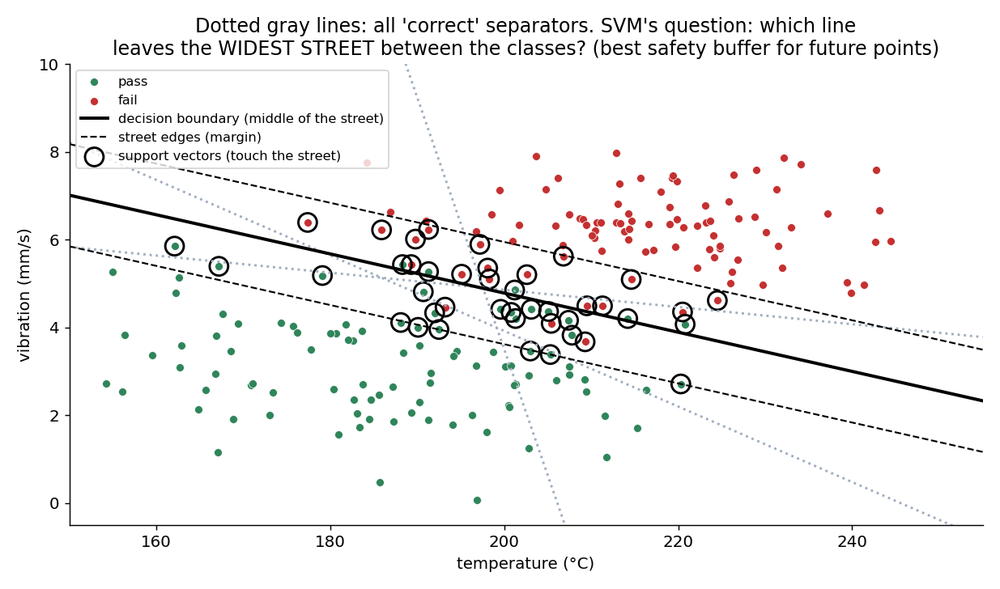
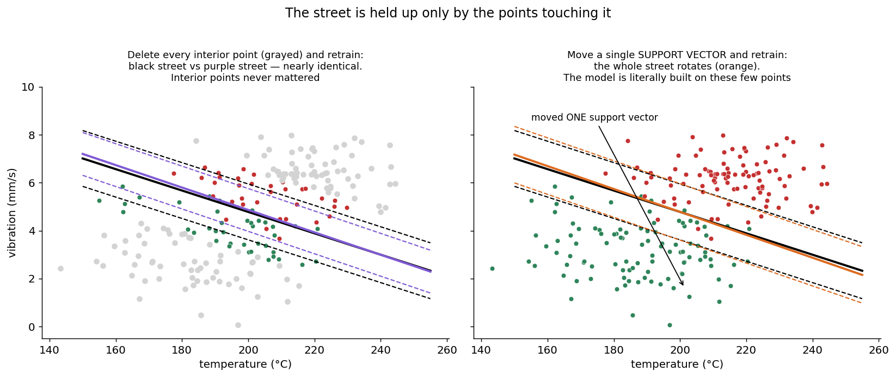
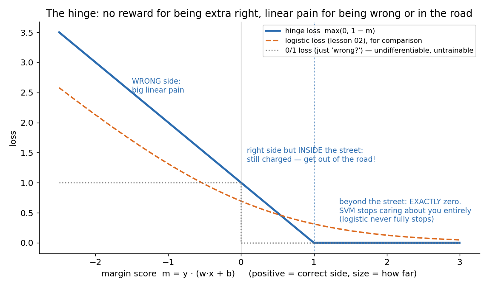
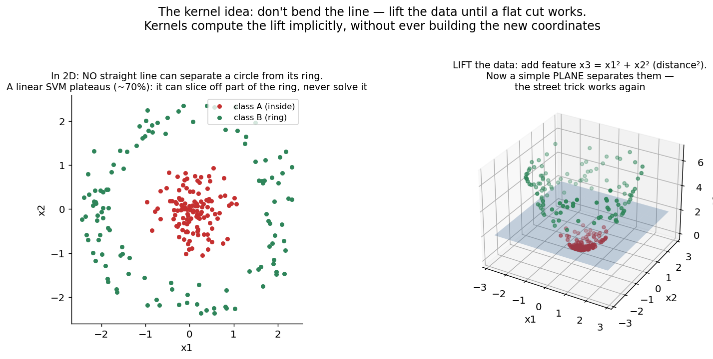
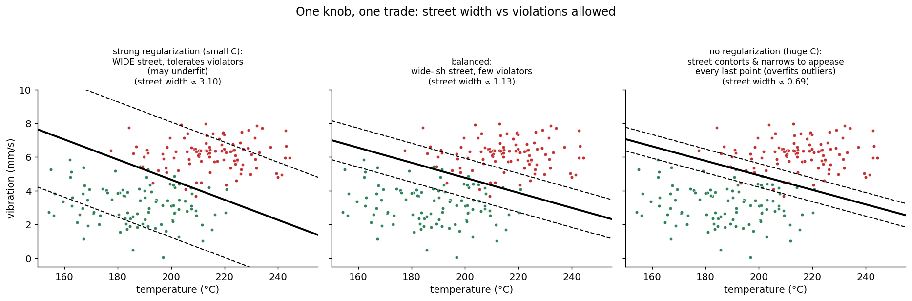

# 07 · Support Vector Machine — Explained From Scratch

## In one sentence

> An SVM doesn't just find *a* line separating the classes — it finds the line with the **widest street** between them, holds that street up using only the handful of points touching it (the support vectors), and, when a straight street is impossible, lifts the data into higher dimensions where one becomes possible (the kernel trick).

## How to read this lesson (don't read it all at once)

| If you have… | Read | ~Time |
|---|---|---|
| 5 minutes | §0 glossary + §2 pictures | 5 min |
| 20 minutes | §0–§2, then **open the notebook** and run Blocks 1–7 | 20 min |
| The full sitting | Everything, notebook alongside | 50–65 min |
| An interview on Tuesday | §8 + §9, then §2 for the pictures | 10 min |

⏸ **Checkpoint** markers below mark natural places to stop reading and run code.

**Prerequisite:** lessons 01–02 — the SVM trains with the *exact same downhill loop*, just a new loss and a new obsession. Also a callback: the diagonal boundary that embarrassed lesson 06's forest is SVM's home turf.

This folder contains:

| File | What it is |
|---|---|
| `README.md` | You are here |
| `assets/` | Visual explanations referenced throughout |
| `svm_from_scratch.ipynb` | Pure NumPy build (hinge loss + gradient descent, plus a hand-made kernel lift); every block cites a § here |
| `svm_with_library.ipynb` | Same model in scikit-learn, verifying the scratch build + the real RBF kernel |
| `data/qc_data.csv` | Sample dataset: machine temperature + vibration → pass/fail QC (200 machines, mostly separable, a few overlaps) |

---

## §0 · Words before formulas

Inherited: **feature, weight, bias, loss, gradient, learning rate, decision boundary, train/test** (lessons 01–03). The new vocabulary:

| Term | Plain meaning | In our QC example |
|---|---|---|
| **±1 labels** | This lesson writes classes as −1 and +1 instead of 0 and 1 — so that y · score becomes a single "correctness number" | pass = −1, fail = +1 |
| **Margin score (m)** | m = y · (w·x + b): positive = correct side, and its SIZE = how far from the boundary | m = 2.3: correct and comfortably deep in home territory |
| **The street** | The empty corridor between the boundary and the nearest points of each class | The no-man's-land between clear passes and clear fails |
| **Margin** | The street's width. SVM's whole objective: make it as wide as possible | A wide street = a safety buffer for future, slightly-different machines |
| **Support vectors** | The few points touching (or violating) the street — the only points the model is built on | ~40 of our 200 machines; delete the rest and nothing changes (§2.2) |
| **Hinge loss** | Zero if you're correct AND beyond the street; linear pain otherwise | "No reward for showing off, no mercy for standing in the road" |
| **Soft margin** | Allowing some points to violate the street, at a price — reality has overlaps | Our few weird machines that pass despite high vibration |
| **C (or λ)** | The knob trading street width against violations. Large C: appease every point (narrow, contorted street). Small C: keep the street wide, tolerate violators | §4's star |
| **Kernel** | A similarity function that lets the SVM act as if the data were lifted into higher dimensions — without ever building those dimensions | Turning a circle-shaped problem into a plane-cuttable one (§2.4) |

---

## §1 · What does this model assume about the world?

> "The classes are separated by a corridor of empty space — and the **widest** such corridor is the safest bet for future data."

That second clause is the philosophy. Lessons 01–02 accepted any boundary that minimized loss; the SVM insists that *among all correct boundaries, the one keeping maximum distance from both classes generalizes best* — new points wobble around old ones, and a wide buffer absorbs the wobble.

**When this belief fits:** clean-ish boundaries with a visible gap; medium-sized datasets; high-dimensional data (text, bioinformatics — where wide streets exist surprisingly often); and diagonal/oblique boundaries, where trees staircase (lesson 06 §6) but a tilted street is natural.
**When this belief breaks:** heavy class overlap (no street exists to widen — §6), massive datasets (training cost), and when you need probabilities (the SVM outputs distances, not beliefs — §5).

**Real-world examples:**
- Text classification (high-dimensional, margin-friendly — a classic SVM stronghold)
- Bioinformatics: gene-expression classification (few samples, thousands of features)
- Image classification before deep learning (HOG + SVM detected most of the world's faces for a decade)
- Outlier/novelty detection (one-class SVM)
- Any tabular problem with an oblique boundary — SVM cuts diagonally in one stroke

---

## §2 · The intuition, in four pictures

### 2.1 Many correct lines — one widest street

Every dotted gray line classifies the training data perfectly. Lessons 01–02 would be *equally happy with any of them* — their loss can't tell these apart. The SVM can: it asks which line leaves the **widest empty street** between the classes, because a fat safety buffer is what protects you when tomorrow's machine runs half a degree hotter. Maximum margin isn't decoration; it's a theory of generalization.

### 2.2 The street is held up by a handful of points

**Left:** delete every point *not* touching the street and retrain — the street barely moves. Those interior points were never load-bearing. **Right:** move ONE street-touching point and the entire street rotates. The model is literally supported by these few points — hence *support vectors*. Consequences: the solution is sparse (store ~40 points, not 200), and it's also why one bad outlier near the boundary can bully the whole model (§4, §6).

### 2.3 The hinge: a loss with a "good enough" switch

Read it by zones, right to left: beyond the street → **exactly zero loss** — the SVM completely stops caring about you (lesson 02's logistic loss never fully stops; it keeps nudging even 99.9%-confident points). Inside the street or on the wrong side → linear pain. That flat zero is the entire personality of the SVM: it ignores the comfortable majority and obsesses over the borderline cases — which is *why* only support vectors end up mattering (§2.2 is a consequence of this shape).

### 2.4 When no street exists: lift, don't bend

A circle-in-a-ring: no straight line works, in 2D. But add one manufactured coordinate — x₃ = x₁² + x₂² (distance from center, squared) — and in 3D the classes sit at different *heights*, cleanly separated by a flat plane. **The kernel trick is this move, industrialized:** kernels let the SVM compute as if the data were lifted into enormous (even infinite) spaces, while only ever evaluating a similarity function between pairs of points — the lift is never built, only its consequences. Block 9 performs the lift by hand; the library notebook shows the real thing (RBF).

> ⏸ **Checkpoint 1** — That's the philosophy: widest street, held by few points, charged by the hinge, lifted when necessary. Open `svm_from_scratch.ipynb`, run Blocks 1–3. The math below reuses the lesson 01 loop — you already know how this model trains.

---

## §3 · Now the math — every symbol already introduced

### 3.1 Street width, as algebra

The score is lesson 01's line: f(x) = w·x + b. The boundary is f(x) = 0; the street edges are f(x) = ±1. A point's distance to the boundary is |f(x)|/‖w‖, so the street's total width is:

$$\text{width} = \frac{2}{\lVert w \rVert}$$

Read aloud: "the street is wide when the weights are SMALL." So *maximize the margin* becomes *minimize ‖w‖* while keeping every point off the street: y·f(x) ≥ 1. One elegant inversion — a geometry problem became a minimization problem, and we know how to minimize (lesson 01).

### 3.2 The loss: hinge + width, in one line

Real data has overlaps, so we charge violations instead of forbidding them (the *soft margin*):

$$L(w, b) = \underbrace{\frac{1}{n}\sum_{i=1}^{n} \max\!\big(0,\; 1 - y_i (w \cdot x_i + b)\big)}_{\text{hinge: stay out of the street}} \;+\; \underbrace{\lambda \lVert w \rVert^2}_{\text{keep the street wide}}$$

Read aloud: "for each point, charge how deep it stands inside the street (zero if it's clear of it) — then add a penalty on big weights, because big weights mean a narrow street (§3.1)." λ is the referee between the two demands; sklearn's C is the same knob upside-down (C ≈ 1/λ): big C = "appease every point", small C = "protect the street's width".

### 3.3 The gradient — and the loop you already own

The hinge has a corner at m = 1, so we use its *subgradient* (calculus's "pick a slope at the kink" — here: the flat side wins at the corner). For each point, only two cases:

$$\frac{\partial L}{\partial w} = 2\lambda w \;-\; \frac{1}{n}\sum_{i:\; m_i < 1} y_i\, x_i \qquad\qquad \frac{\partial L}{\partial b} = -\frac{1}{n}\sum_{i:\; m_i < 1} y_i$$

Read aloud: "points clear of the street contribute NOTHING (their hinge is flat zero); points in the road or on the wrong side each push the boundary away from themselves; and the 2λw term perpetually shrinks the weights — a constant pull toward a wider street." Then the update rule is lesson 01 §3.4, verbatim: w ← w − α·∇w. Same loop, fourth loss (MSE → cross-entropy → counting's nothing → hinge). Notice the sum runs only over street-violators: **the gradient itself tells you who the support vectors are.**

### 3.4 The kernel idea (intuition-level, honestly labeled)

The full kernelized SVM optimizes a transformed ("dual") problem where data appears *only inside dot products* — so replacing every dot product a·b with a kernel K(a, b) = φ(a)·φ(b) trains the SVM in the lifted space φ without ever computing φ. The RBF kernel K(a,b) = exp(−γ‖a−b‖²) reads as pure **similarity**: 1 for identical points, →0 for distant ones — an infinite-dimensional lift, bought for the price of one exponential. The dual derivation is beyond this course's scope (a rare admission — noted honestly); Block 9's hand-made lift gives you the *idea* with zero hand-waving, and the library notebook gives you the real tool.

> ⏸ **Checkpoint 2** — Run Blocks 4–7: hinge, subgradient, the familiar loop, and the street drawn with its support vectors circled. Then Block 9 for the by-hand kernel moment.

---

## §4 · Every knob, and what happens if you turn it wrong

| Knob | What it controls | Too low / wrong | Too high / wrong |
|---|---|---|---|
| **C (≈ 1/λ)** | **The star knob**: violations vs width | Small C: street stays wide but ignores real structure — underfit (left panel) | Huge C: the street narrows and contorts to appease every last outlier — overfit; one mislabeled machine bends the model (right panel). Same U-curve as ever; sweep it (Block 8) |
| **Kernel choice** | The shape of the lift | Linear when the world curves: ~coin-flip on circles (Block 9) | Fancy kernels on linear worlds: wasted capacity, slower, overfit risk |
| **γ (RBF only)** | The reach of "similarity" | Tiny γ: everyone is similar to everyone — boundary too smooth, underfit | Huge γ: only near-identical points are similar — islands around individual points, the K=1 of SVMs (library notebook shows it) |
| **Feature scaling** | — | **Mandatory again.** Margins and RBF similarity are distances — lesson 03's blind-ruler problem in full force. Unscaled temperature (150–250) would drown vibration (0–10) | — |
| **Learning rate / epochs** | The usual (lesson 01 §4) | — | — |

---

## §5 · Reading the results

Inherited: accuracy, confusion matrix, precision/recall on the sealed test set. SVM-specific readings:

| Artifact | What it is | Gotcha |
|---|---|---|
| **Support vector count** | How many points hold up the street (Block 7) | A *health meter*: few SVs = clean margin, confident model. SVs ≈ most of the dataset = no real street exists; the SVM is thrashing (§6) |
| **The margin score m** | Distance-flavored confidence per prediction: m = 3 is deep in home territory, m = 0.1 is on the curb | **Not a probability.** The SVM outputs geometry, not belief — no lesson 02-style "73% fail". (Libraries bolt probabilities on via Platt scaling — a calibration model trained after the fact) |
| **Street width 2/‖w‖** | The buffer size the model achieved | Only meaningful on scaled features; compare across C values, not across datasets |

---

## §6 · When NOT to use it (and how to notice)

- **No street exists.** Heavily overlapping classes: the margin objective has nothing to maximize. Symptom: support vectors ≈ the whole dataset, C-sweeps change little. Fix: probabilistic models (lesson 02) or ensembles (06/08) that don't premise on a corridor.
- **Big data.** Kernel SVM training scales roughly quadratically-plus with n (the kernel matrix is n×n); past ~50–100k points it gets painful. Symptom: training time, memory. Fix: linear SVM (scales fine), or other families.
- **You need probabilities.** §5's warning — geometry, not belief. Platt scaling is a patch, not a native ability.
- **Noisy labels near the boundary.** Support vectors are load-bearing (§2.2), and mislabeled points *become* support vectors under large C — a single bad label can rotate your street. Symptom: model changes drastically when one point is removed. Fix: lower C, audit the SVs (they're few — read them!).
- **Interpretability for non-geometers.** "These 40 machines define a maximal corridor in 2D scaled feature space" lands worse in a boardroom than lesson 05's flowchart.

---

## §7 · Map: README → notebook

| Notebook block | Implements |
|---|---|
| Block 2 — load + plot QC data | §1 (belief check: is there a street?) |
| Block 3 — scale + relabel to ±1 | §0 (why ±1 makes m = y·f one clean number) |
| Block 4 — `hinge_loss()` | §3.2 |
| Block 5 — `gradients()` (subgradient) | §3.3 (violators push, the λ term widens) |
| Block 6 — training loop | §3.3 (lesson 01's loop, fourth loss) |
| Block 7 — the street + support vectors + delete-the-interior test | §2.1 + §2.2 (live) |
| Block 8 — sweep λ (the C knob) | §4 (the U-curve, again) |
| Block 9 — the kernel lift, by hand | §2.4 + §3.4 (circles: 2D fails → lift → plane succeeds) |
| Block 10 — where does it fail? | §5 + §6 (SV count as health meter; misread machines) |

---

## §8 · Interview prep

### The 30-second answer: "What is an SVM?"

> "A support vector machine finds the separating boundary with the maximum margin — the widest empty street between the classes — on the theory that the biggest buffer generalizes best. It's trained by minimizing hinge loss plus a weight penalty: hinge charges points that are misclassified or inside the street and charges nothing beyond it, so the solution depends only on the boundary-hugging points — the support vectors. The C parameter trades margin width against violations. For non-linear boundaries, the kernel trick computes dot products in an implicitly lifted feature space — RBF being the workhorse — so a linear street in the lifted space becomes a curved boundary in the original. Needs scaled features; outputs margins, not probabilities."

### Questions you should be able to answer

<b>Q1. Why maximize the margin at all? Any separator has zero training error.</b>

Generalization: future points are perturbed versions of past ones, and the boundary farthest from both classes absorbs the most perturbation before erring (§2.1). It's also a form of capacity control — among all zero-error solutions, max-margin picks the "simplest," which is why SVMs resist overfitting in high dimensions.

<b>Q2. What exactly is a support vector, and why is the name apt?</b>

A training point with margin score ≤ 1 — touching or violating the street. In the solution, the boundary is a combination of these points alone; hinge-flat interior points have zero gradient and zero influence (§2.2, §3.3). Delete non-SVs: nothing changes. Move one SV: the street rotates. They literally support it.

<b>Q3. Hinge loss vs logistic loss — the practical difference?</b>

Both penalize wrongness; the difference is the flat zero (§2.3). Hinge fully ignores points beyond the margin → sparse solutions, boundary shaped only by hard cases, but no probabilities. Logistic never reaches zero → every point always matters a little, and you get calibrated-ish probabilities natively (lesson 02).

<b>Q4. Explain the kernel trick to a smart non-mathematician.</b>

When no straight cut works, manufacture new coordinates until one does — like adding "distance from center" to circle data so a flat plane separates it (§2.4). The trick: the SVM only ever needs *dot products* between points, and a kernel function returns the dot product **as if** the lift had happened — so you get boundaries from a huge lifted space while only ever computing pairwise similarities. RBF = "similarity that fades with distance," an infinite lift for one exp().

<b>Q5. What do C and γ do, and what do their extremes look like?</b>

C: violation tolerance. Small C = wide tolerant street (underfit risk); huge C = contorted street appeasing every point, hostage to outliers (overfit) (§4). γ (RBF): the reach of similarity. Small γ = everything similar = over-smooth; huge γ = islands around single points = the SVM's K=1. Tune jointly, on validation data.

<b>Q6. Your SVM's support vectors are 90% of the training set. Diagnosis?</b>

No street exists: heavy class overlap (or a wildly wrong kernel/γ), so nearly every point is inside or violating the margin (§5, §6). Expect mediocre accuracy and slow prediction (cost scales with SV count). Reconsider the model family, or fix features/kernel — don't just crank C.

---

## §9 · Common mistakes (the learner's failure modes, not the model's)

1. **Skipping feature scaling.** Margins and RBF are distance math — lesson 03's silent killer returns at full strength (§4).
2. **Cranking C to fix underfitting** when the boundary is genuinely nonlinear — you get a contorted linear street instead of the kernel you actually needed (§4).
3. **Reading the margin score as a probability.** m = 2.0 is geometry, not 88% confidence (§5).
4. **Ignoring the support-vector count** — the free health meter that distinguishes "clean margin" from "no street exists" (§5, §8 Q6).
5. **RBF with default γ on unscaled or junk features** — then blaming the SVM. γ's meaning depends entirely on distances being meaningful.
6. **Using kernel SVM on a million rows** and waiting forever — know the n×n kernel-matrix cost; go linear or go elsewhere (§6).

---

**Next:** `08-gradient-boosting/` — the philosophical opposite of lesson 06: instead of independent voters averaging away *variance*, a **sequence** of small trees, each trained on the previous ones' mistakes, grinding away *bias*. The other half of the ensemble universe — and the reigning champion of tabular ML.
