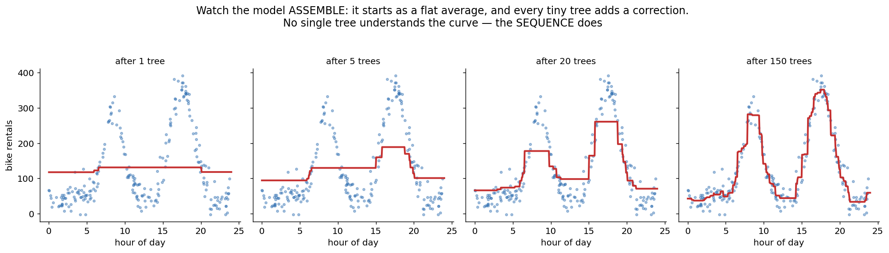
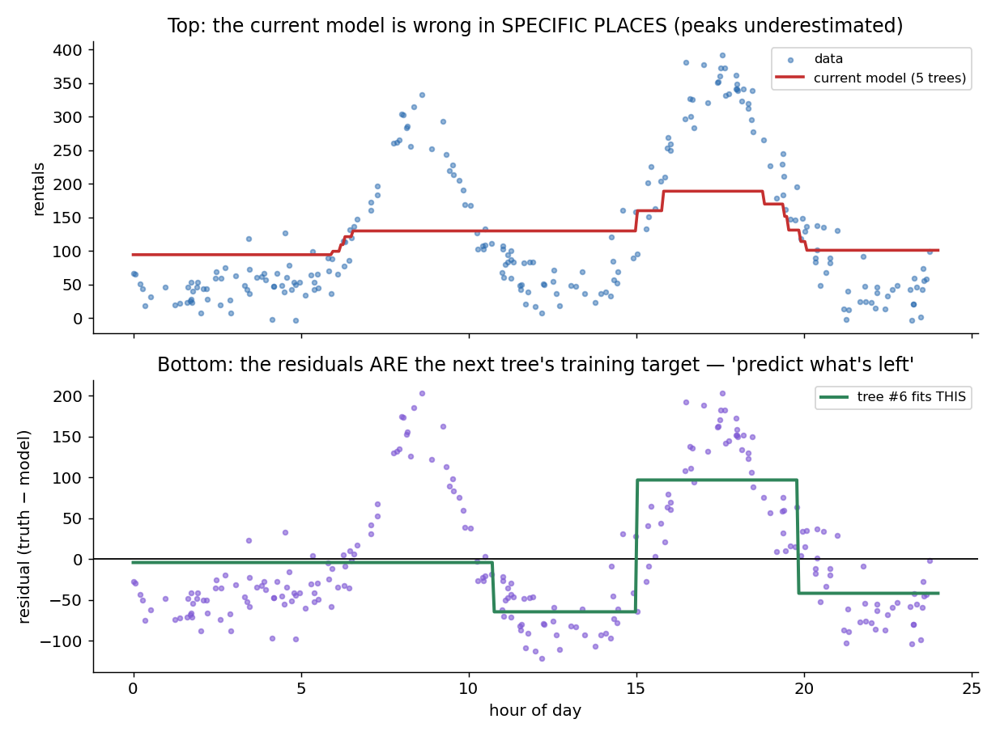
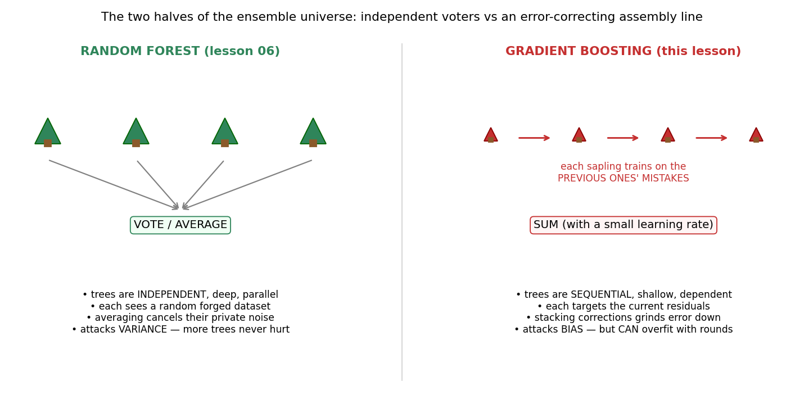
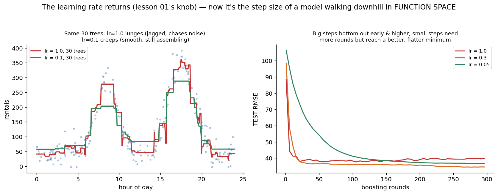
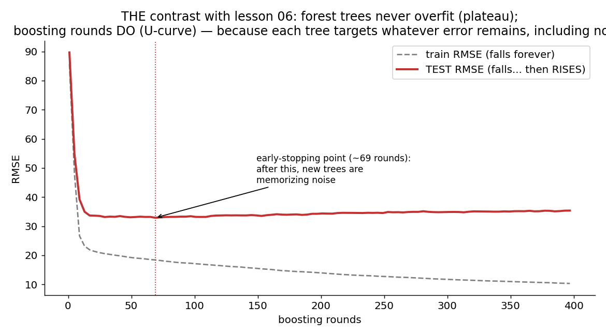

# 08 · Gradient Boosting — Explained From Scratch

## In one sentence

> Gradient boosting builds a model as a running sum of small trees, where each new tree is trained on one thing only — the current model's remaining mistakes — so the ensemble grinds its error down step by step, like gradient descent performed by the model itself.

## How to read this lesson (don't read it all at once)

| If you have… | Read | ~Time |
|---|---|---|
| 5 minutes | §0 glossary + §2 pictures | 5 min |
| 20 minutes | §0–§2, then **open the notebook** and run Blocks 1–6 | 20 min |
| The full sitting | Everything, notebook alongside | 45–60 min |
| An interview on Tuesday | §8 + §9, then §2 for the pictures | 10 min |

⏸ **Checkpoint** markers below mark natural places to stop reading and run code.

**Prerequisite:** lesson 05 (small trees are the building block), lesson 06 (this is its philosophical opposite — that contrast is half the lesson), and lesson 01 (the learning rate returns, and "residual" turns out to be a gradient in disguise). We also return to **regression** for the first time since lesson 01 — deliberately, because boosting is most transparent there.

This folder contains:

| File | What it is |
|---|---|
| `README.md` | You are here |
| `assets/` | Visual explanations referenced throughout |
| `gradient_boosting_from_scratch.ipynb` | Pure NumPy build; every block cites a § here |
| `gradient_boosting_with_library.ipynb` | Same model in scikit-learn (plus a word on XGBoost/LightGBM), verifying the scratch build |
| `data/bike_data.csv` | Sample dataset: hour of day → bike rentals (240 hours, two commute peaks — aggressively nonlinear) |

---

## §0 · Words before formulas

Inherited: **regression, RMSE/MAE/R² (lesson 01 §5), tree/leaf/depth (lesson 05), ensemble, bias, variance (lesson 06)**. The new vocabulary:

| Term | Plain meaning | In our bike example |
|---|---|---|
| **Residual** | What's LEFT of the error: truth − current prediction. The part of the pattern the model hasn't captured yet | Model says 180 rentals at 8am, truth is 290 → residual +110: "you're missing the morning rush" |
| **Weak learner** | A deliberately small, crude model — here a depth-2 tree ("a stump with one follow-up question") | Alone it draws 3–4 flat steps. Useless alone, perfect as a correction |
| **Additive model** | The prediction is a SUM of many small pieces | F(x) = mean + tree₁(x)·lr + tree₂(x)·lr + … |
| **Boosting round** | One iteration: compute residuals → fit a tree to them → add it | 150 rounds = 150 stacked corrections |
| **Shrinkage / learning rate** | Each tree's correction is added only *fractionally* (×0.1 or so) — small humble steps | Lesson 01's α, reborn: now it's the step size of a *model* walking downhill |
| **Early stopping** | Stop adding trees when *validation* error stops improving | The professional answer to "how many rounds?" |
| **Function space** | The mental leap: instead of nudging numbers (w, b), each round nudges the *entire prediction curve* | Every tree is one downhill step taken by the curve itself (§3.3) |

---

## §1 · What does this model assume about the world?

> "The pattern is too complex for any one simple model — but it can be **approached by accumulation**: a long sequence of small corrections, each targeting whatever error remains."

Compare the neighbors: lesson 06 assumed *my trees' errors are disagreements that cancel* (variance). Boosting assumes *my model's error is a leftover pattern that the next tree can learn* (bias). Forest voters work in parallel and never speak; boosting trees work in an assembly line and each one reads the previous ones' failure report.

**When this belief fits:** structured/tabular data with real signal — boosting (as XGBoost/LightGBM/CatBoost) has been the winningest family on tabular problems for a decade. Complex nonlinear patterns, mixed feature types, competitions, production ranking systems.
**When this belief breaks:** when the "remaining error" is mostly noise — boosting will diligently learn the noise too (§4, fig 05); when you need extrapolation (still trees inside — §6); and when a simple model already suffices (assembling 300 trees to rediscover a straight line).

**Real-world examples:**
- Kaggle and industry tabular ML (fraud, credit risk, churn, pricing) — the reigning champion family
- Search & recommendation ranking (LambdaMART is boosting)
- Insurance pricing and demand forecasting (our bike curve is a mini version)
- Anomaly scoring on structured logs
- Anywhere a random forest is good but you want the last few points of accuracy — at the price of more careful tuning

---

## §2 · The intuition, in four pictures

### 2.1 The assembly line

Round 0: the model is just the average — a flat line. Each round, one tiny depth-2 tree adds a correction where the model is most wrong. After 1 tree: a crude step. After 5: the rush hours exist. After 20: the shape is right. After 150: the curve fits. **No single tree understands the pattern — the sequence does.** This is the anti-forest: not fifty full opinions averaged, but one opinion built by 150 tiny edits.

### 2.2 Residuals: the next tree's homework

The mechanism in one picture. Top: the current model, wrong in *specific places* (peaks underestimated). Bottom: subtract — the residuals — and that leftover shape becomes **the literal training target for the next tree.** Where the model is fine, the residual is ≈0 and the new tree learns to add nothing. Where it's wrong, the residual screams and the new tree learns to patch exactly there. "Predict what's left" — the entire algorithm.

### 2.3 Forest vs boosting: the two halves of the ensemble universe

Same building block (trees), opposite philosophies. Forest: independent, deep, parallel, averaged — cancels **variance**; more trees never hurt (lesson 06's anti-knob). Boosting: dependent, shallow, sequential, summed — grinds down **bias**; and because each tree targets *whatever error remains*, rounds eventually start fitting noise, so this knob **can** be turned too far (§2.4's twin figure, and the U-curve's return in fig 05).

### 2.4 The learning rate returns — as humility

Left: same 30 trees. lr = 1.0 takes each tree's correction at full strength — big lunging steps, jagged, already chasing noise. lr = 0.1 takes 10% of each correction — smooth, still assembling, and it will end up *better*. Right: the trade across rounds — big steps bottom out early at a worse error; small steps need more rounds but reach a deeper, flatter minimum. Lesson 01's knob, one level up: there the learning rate scaled a *gradient*; here it scales a *tree* — because (§3.3) the tree IS a gradient.

> ⏸ **Checkpoint 1** — That's the machine: flat start, residuals as homework, humble steps, stop before you memorize noise. Open `gradient_boosting_from_scratch.ipynb`, run Blocks 1–5. The math below has one genuinely beautiful moment: why "gradient" is in the name.

---

## §3 · Now the math — every symbol already introduced

### 3.1 The model: a sum

$$F_M(x) = \bar{y} + \eta \sum_{m=1}^{M} T_m(x)$$

Read aloud: "start from the plain average, then add M small trees, each scaled down by the learning rate η." Prediction is literally addition — Block 6 is a for-loop with `F += lr * tree(x)`.

### 3.2 Each round's job

$$r_i = y_i - F_{m-1}(x_i) \qquad\qquad T_m \leftarrow \text{fit a small tree to } (x, r)$$

Read aloud: "compute what's left (the residuals), train the next tree to predict *that*, not y." The regression tree fits residuals by minimizing squared error within leaves — lesson 05's machinery with gini swapped for variance-reduction (Block 4 makes the swap explicit).

### 3.3 The beautiful part: why it's called GRADIENT boosting

Take lesson 01's squared loss for one point, viewed as a function of the *prediction itself*:

$$L = \tfrac{1}{2}\big(y - F(x)\big)^2 \qquad\Rightarrow\qquad -\frac{\partial L}{\partial F(x)} = y - F(x) = \text{the residual}$$

Read aloud: "the residual IS the negative gradient of the loss with respect to the prediction." So "fit a tree to the residuals, add a fraction of it" is *exactly* lesson 01's update rule — w ← w − α·∇ — except the thing being nudged is not a number but **the whole prediction function**. Gradient descent in function space: each tree is one downhill step, η is the step size, and the loss surface is the same bowl from lesson 01, just with curves as coordinates. This also explains the framework's power: swap the loss (absolute error, log-loss for classification, ranking losses...) and the recipe survives — only the residual's formula changes. That generality is what XGBoost and friends industrialize.

### 3.4 When to stop: early stopping

Training error falls forever (each round targets whatever remains — eventually, noise). So monitor a *validation* set and stop when its error turns upward:

$$M^* = \arg\min_M \; \text{RMSE}_{\text{val}}(F_M)$$

Read aloud: "the honest number of rounds is chosen by the exam, not the textbook" — lesson 03's rule, now applied to a knob that grows one unit per round of training itself.

> ⏸ **Checkpoint 2** — Run Blocks 6–8: the loop, the assembly-line replay, and the U-curve that lesson 06 didn't have. Then the knobs — this family has more than any model so far, which is its honest cost.

---

## §4 · Every knob, and what happens if you turn it wrong

| Knob | What it controls | Too low / wrong | Too high / wrong |
|---|---|---|---|
| **n_rounds (M)** | How many corrections stack | Underfit: the curve is still assembling | **Overfits — the pointed contrast with lesson 06.** Late trees fit noise (figure above). Cure: early stopping (§3.4), not guessing |
| **learning rate (η)** | Fraction of each correction taken | Tiny η with few rounds: never arrives | η ≈ 1: lunges, chases noise early, bottoms out worse (§2.4). Rule of thumb: lower η + more rounds + early stopping beats the reverse |
| **tree depth** | How complex each correction is | Depth 1 (stumps): can't capture interactions between features | Deep trees: each round memorizes chunks of noise, overfitting arrives in few rounds. Boosting wants WEAK learners (3–8 leaves) — the opposite of the forest's deep trees (lesson 06 §4) |
| **subsampling (stochastic GB)** | Train each tree on a random row/column fraction | — | (It's a regularizer — borrowing the forest's randomness trick to decorrelate the sequence; usually helps) |
| **Feature scaling** | — | Still not needed — trees inside (lesson 05's inheritance continues) | — |

The honest cost of the champion: η, M, depth, and subsampling all interact. Forests forgive sloppy tuning; boosting rewards careful tuning — that's the trade.

---

## §5 · Reading the results

Regression metrics return from lesson 01 §5 (RMSE for humans, MAE for outlier checks, R² for variance explained) — measured on held-out data (lesson 03's rule). Boosting-specific readings:

| Artifact | What it is | Gotcha |
|---|---|---|
| **The validation curve vs rounds** | THE picture for this model (fig 05): train falls forever, validation U-turns; the minimum names your M | Without it you're guessing; with it, "how many rounds" answers itself |
| **The staged replay** | Predictions after 1, 5, 20, … rounds (Block 7; libraries call it `staged_predict`) | The best debugging view in tabular ML: watch WHERE the model spends its corrections — real structure first, noise last |
| **Feature importance** | Summed across all trees, like lesson 06's — usually the steadiest version in the tree family | Same caveats as ever: usefulness, not causation; correlated features split credit |

---

## §6 · When NOT to use it (and how to notice)

- **Noisy targets + patience = memorized noise.** Boosting's defining risk: it cannot tell leftover *signal* from leftover *noise* — both look like residuals. Symptom: validation U-curve turns early and sharply. Fix: early stopping, lower η, shallower trees, subsampling — the whole regularization kit.
- **Extrapolation.** Still trees inside: beyond the training range the prediction flatlines at edge-leaf sums (Block 10 asks about hour 26 and gets a shrug). Lesson 05's limitation, inherited by every descendant.
- **A linear world.** If lesson 01/02 fits, 300 stacked trees are an expensive staircase around a straight line. Symptom: boosting barely beats the linear baseline you (should have) run first.
- **Latency-critical serving with huge M.** Prediction walks every tree; 2,000 trees × depth 6 is real work. (Distillation or fewer/deeper trees are the usual moves.)
- **No time to tune.** A forest at defaults often lands within a point or two of tuned boosting (lesson 06 §1) — sometimes the point or two isn't worth the engineering week.

---

## §7 · Map: README → notebook

| Notebook block | Implements |
|---|---|
| Block 2 — load + plot + the line's failure | §1 (belief check: aggressively nonlinear; lesson 01's model humiliated on purpose) |
| Block 3 — split; no scaling (trees inside) | §4 + lesson 03's rule |
| Block 4 — a regression tree (gini → variance) | §3.2 (lesson 05's machinery, one swap) |
| Block 5 — round zero + residuals plotted | §2.2 (the homework, visualized) |
| Block 6 — the boosting loop | §3.1–3.3 (F += lr·tree; ~8 lines) |
| Block 7 — the assembly-line replay + metrics | §2.1 + §5 (vs the line and vs one deep tree) |
| Block 8 — rounds U-curve + early stopping | §3.4 + §4 (THE contrast with lesson 06) |
| Block 9 — learning-rate trade | §2.4 (lunge vs creep, measured) |
| Block 10 — extrapolation shrug + residual check | §6 |

---

## §8 · Interview prep

### The 30-second answer: "What is gradient boosting?"

> "Gradient boosting builds an additive model: starting from a constant, it repeatedly fits a small tree to the current residuals and adds it, scaled by a learning rate. The insight behind the name: for squared loss, residuals are exactly the negative gradient of the loss with respect to the predictions — so each tree is one step of gradient descent in function space, and swapping the loss generalizes the same recipe to classification and ranking. It attacks bias, the opposite of a random forest's variance-attack: trees are shallow, sequential, and dependent. It's the strongest family on tabular data (XGBoost, LightGBM), but rounds can overfit — you control it with early stopping, a small learning rate, shallow trees, and subsampling."

### Questions you should be able to answer

<b>Q1. Boosting vs bagging — the fundamental difference?</b>

Bagging (forest): independent deep trees on bootstrap samples, averaged — reduces variance; errors must be *disagreements* to cancel (lesson 06 §3.3). Boosting: dependent shallow trees in sequence, each fit to the current residuals, summed — reduces bias; errors are treated as *leftover pattern* to learn. Parallel voters vs an assembly line.

<b>Q2. Why is "gradient" in the name?</b>

Because the residual y − F(x) is the negative gradient of the squared loss with respect to the prediction F(x) (§3.3). Fitting a tree to residuals and adding η times it = one gradient-descent step, taken in function space. Change the loss and you change what "residual" means — same algorithm, hence log-loss boosting for classification, etc.

<b>Q3. Why weak (shallow) learners? Forests wanted deep trees.</b>

The ensembles fix opposite problems (§2.3). Forest: averaging cancels variance, so give it low-bias/high-variance voters — deep trees. Boosting: the sequence supplies the complexity by stacking, so each unit should be a small low-variance correction — a deep tree per round would memorize noise chunks and overfit within a handful of rounds (§4).

<b>Q4. Can more boosting rounds overfit? More forest trees?</b>

Boosting: yes — each round targets whatever error remains, and past the signal that's noise; validation error U-turns (fig 05). Forest: no — more independent voters only shrink the (1−ρ)σ²/B variance term; accuracy plateaus (lesson 06 Block 8). Knowing WHY the same-named knob behaves oppositely in the two ensembles is the real interview answer.

<b>Q5. The learning rate is 0.05. Your colleague says 'just use 1.0 with fewer trees — same thing.' Respond.</b>

Not the same (§2.4, fig 04): η=1 takes each imperfect correction at full strength, lunging into noise early and bottoming out at a worse minimum. Small η averages many slightly-different corrections along the way — an implicit regularizer. Standard practice: small η + many rounds + early stopping strictly beats big η + few rounds on test error, at the price of training time.

<b>Q6. What do XGBoost/LightGBM add over vanilla gradient boosting?</b>

Engineering and regularization on the same skeleton: second-order (Newton-style) steps using the loss's curvature, explicit L1/L2 penalties on leaf values, smarter split-finding (histograms), leaf-wise growth (LightGBM), native missing-value handling, column/row subsampling, and serious parallelism. Same assembly line, industrial-grade.

---

## §9 · Common mistakes (the learner's failure modes, not the model's)

1. **Choosing rounds without a validation curve.** Train RMSE falls forever by design; only the exam can name M (§3.4).
2. **Cranking the learning rate to "save time."** You save minutes and lose test accuracy permanently (§2.4). Small η + early stopping is the adult move.
3. **Deep trees inside boosting** because "deep worked in the forest." Opposite ensembles, opposite units (§8 Q3).
4. **Skipping the linear baseline.** If lesson 01 gets R² = 0.9, three hundred trees are an expensive way to draw a line (§6).
5. **Trusting extrapolation** because the in-range fit is gorgeous. Still trees inside; hour 26 gets hour-24's answer (Block 10).
6. **Tuning all four knobs by vibes.** η, M, depth, subsample interact — fix η low, let early stopping set M, then search depth/subsample. Budget beats vibes.

---

**Next:** `09-kmeans-pca/` — the course's biggest rule change so far: we throw away the labels entirely. Learning *without* answers: finding groups (K-means) and finding the directions that matter (PCA).
