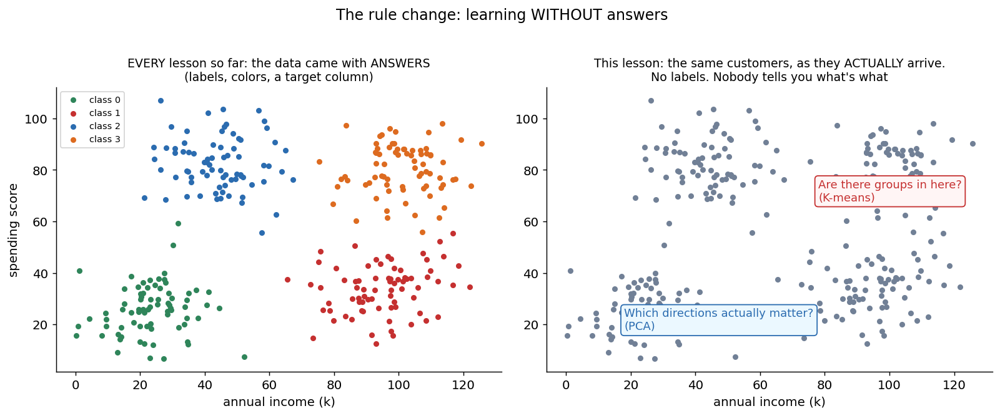
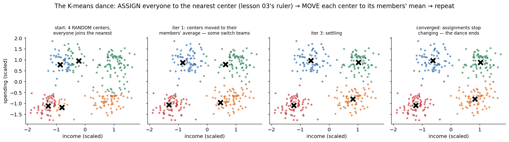
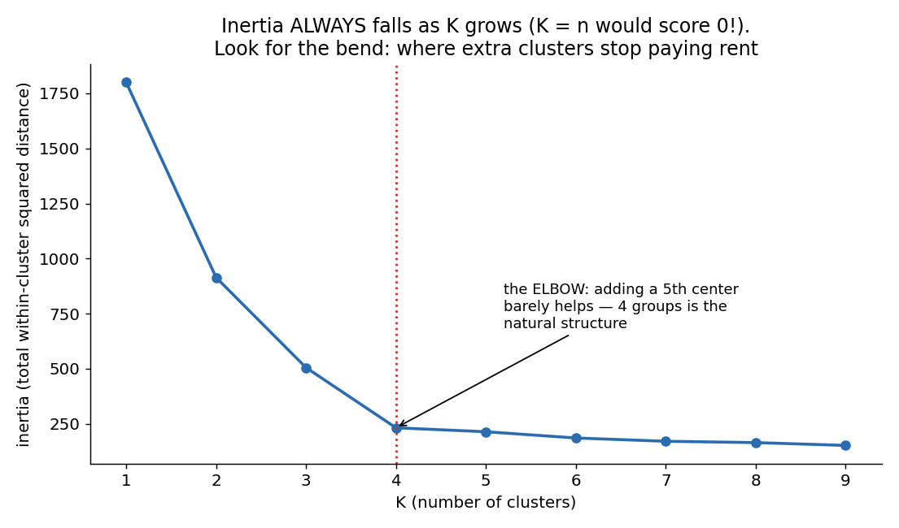
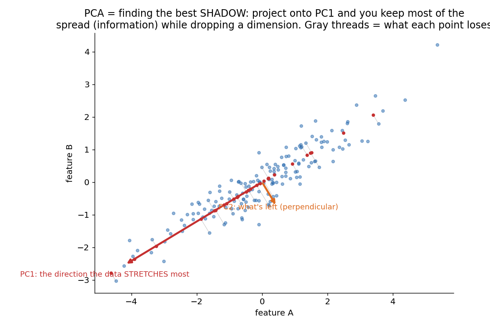
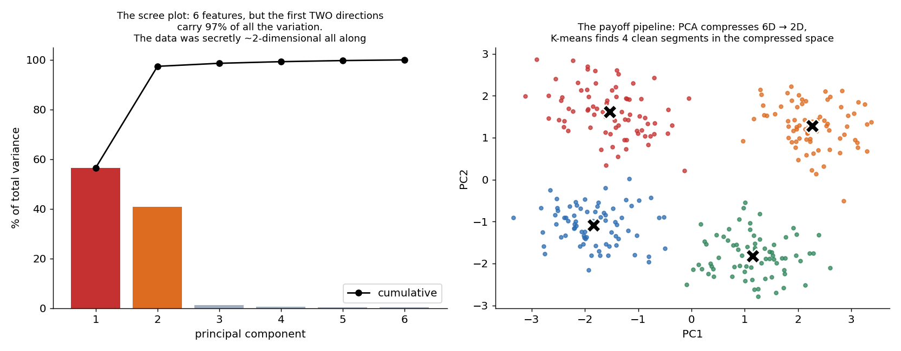

# 09 · K-Means & PCA — Learning Without Labels, Explained From Scratch

## In one sentence

> When data comes with no answers, two fundamental questions remain askable — "are there natural groups in here?" (K-means: alternate between assigning points to their nearest center and moving each center to its members' average) and "which directions actually matter?" (PCA: find the axes along which the data stretches most, and keep only those).

## How to read this lesson (don't read it all at once)

| If you have… | Read | ~Time |
|---|---|---|
| 5 minutes | §0 glossary + §2 pictures | 5 min |
| 20 minutes | §0–§2, then **open the notebook** and run Blocks 1–6 | 20 min |
| The full sitting | Everything, notebook alongside | 50–65 min |
| An interview on Tuesday | §8 + §9, then §2 for the pictures | 10 min |

⏸ **Checkpoint** markers below mark natural places to stop reading and run code.

**Prerequisite:** lesson 03 (K-means runs on its distance ruler — scaling is life-or-death again) and lesson 01's habit of asking what a model assumes. This is the course's **biggest rule change**: for eight lessons the data arrived with answers; today the label column is gone.

This folder contains:

| File | What it is |
|---|---|
| `README.md` | You are here — one lesson, two models, one shared philosophy |
| `assets/` | Visual explanations referenced throughout |
| `kmeans_pca_from_scratch.ipynb` | Both models in pure NumPy; every block cites a § here |
| `kmeans_pca_with_library.ipynb` | Both in scikit-learn, verifying the scratch builds, plus the PCA→K-means pipeline |
| `data/customer_data.csv` | Sample dataset: 300 customers × 6 behavioral features — and **deliberately no label column** |

---

## §0 · Words before formulas

Inherited: **feature, distance (lesson 03), scaling, variance (lesson 06)**. Notice what's *not* inherited: label, accuracy, confusion matrix, train/test as we knew it — most of our evaluation vocabulary needs answers to compare against. The new vocabulary:

| Term | Plain meaning | In our customer example |
|---|---|---|
| **Unsupervised learning** | Learning from data that has NO target column — only the features themselves | 300 customers, 6 numbers each, nobody says who's who |
| **Cluster** | A group of points that are close to each other and far from everyone else | "These 70 customers shop alike" |
| **Centroid** | A cluster's center of gravity — the average of its members | The "prototype customer" of a segment |
| **Inertia** | Total squared distance from every point to its own centroid. K-means' score: lower = tighter clusters | The number the K-means dance minimizes |
| **Elbow** | The bend in the inertia-vs-K curve, where extra clusters stop paying rent | Our data bends at K = 4 |
| **Principal component (PC)** | A direction in feature space along which the data stretches/varies a lot | "PC1 ≈ overall wealth" — a recipe mixing income, basket size, age |
| **Variance explained** | What fraction of the data's total spread a component carries | PC1 + PC2 carry 97% here — the 6 features were secretly ~2 numbers |
| **Projection** | Dropping each point's shadow onto the kept directions | Each customer compressed from 6 numbers to 2, losing almost nothing |
| **Eigenvector / eigenvalue** | (For PCA) the stretch-directions of the data's covariance, and how much stretch each carries | PCs *are* the covariance matrix's eigenvectors, sorted by eigenvalue |
| **Latent factor** | A hidden variable that *generated* the observed features | Our 6 features were manufactured from 2 hidden dials — PCA's job is to rediscover them |

---

## §1 · What do these models assume about the world?

**K-means:**
> "The data consists of **roughly round, similar-sized blobs**, and every point belongs to exactly one."

**PCA:**
> "The interesting structure lies along **straight directions of large variance** — the data is a low-dimensional pancake living inside a high-dimensional space."

Both are geometric beliefs, and both can be wrong in instructive ways (§6 and Block 9: crescent-moon clusters humiliate K-means; curved manifolds humiliate PCA).

**When they fit:** customer/user segmentation, compressing correlated sensor or survey features, visualization of high-dimensional data, de-noising, preprocessing before supervised models (fewer, cleaner features — the lesson 03 curse's antidote), image compression.
**When they break:** non-blob cluster shapes, clusters of very different sizes/densities, categorical features (means and variances of categories are meaningless), and signal hiding in *low*-variance directions (§6's sharpest warning).

**Real-world examples:**
- Marketing segments from behavior logs (this lesson's dataset)
- Anomaly triage: points far from every centroid
- Eigenfaces: PCA on face images (a few hundred components ≈ a face)
- Compressing 100 correlated financial indicators into 5 factors
- The dimensionality-reduction step before K-means, KNN, or visualization — the exact pipeline of §2.5

---

## §2 · The intuition, in five pictures

### 2.1 The rule change

Left: how every dataset in lessons 01–08 arrived — colored, answered, gradeable. Right: how data actually arrives in most of the world — gray. No target column, no accuracy to compute, no exam to seal. And yet two questions survive the loss of answers: *are there groups?* and *which directions matter?* This lesson is those two questions, made algorithms.

### 2.2 K-means is a dance with two steps

Drop K centers at random. Then alternate two moves you already own: **ASSIGN** — every point joins its nearest center (lesson 03's distance ruler, verbatim); **MOVE** — every center relocates to the average of its members (the humble mean, lesson 01's round zero). Assignments change → centers move → assignments change… until nobody switches teams. That's the whole algorithm. Each step can only lower the inertia, which is why the dance must end (§3.2) — though not necessarily at the best possible ending (§4: restarts).

### 2.3 Choosing K: the elbow

Inertia *always* falls as K grows — at K = n every point is its own centroid and inertia hits zero, a perfect score meaning nothing (lesson 03's K=1 ghost, returned in new clothes). So don't minimize it; look for the **bend**: the K after which new clusters stop paying rent. Ours bends unmistakably at 4. It's a judgment call formalized, not an oracle — and that honesty matters (§5).

### 2.4 PCA: the best shadow

A correlated 2D cloud is "really" a 1D stick with fuzz. PCA finds the stick: **PC1 is the direction of maximum stretch**, PC2 whatever's left (always perpendicular). Project every point onto PC1 — cast its shadow — and you keep most of the spread while dropping a dimension; the gray threads show exactly what each point loses. Now imagine the same move in 6D, 100D, 10,000D, where your eyes can't go: PCA is the shadow-finder that scales.

### 2.5 The payoff pipeline: 6D → 2D → 4 segments

Our 300 customers have 6 features each — unplottable, and lesson 03 taught what high dimensions do to distance. Left: the scree plot confesses that two directions carry **97%** of all the variation — the 6 features were secretly 2 numbers wearing 6 costumes. Right: project onto those 2 directions and run the K-means dance *there*: four clean segments. This pipeline — **PCA to compress, K-means to group** — is one of the most-used recipes in applied ML, and you'll build both halves by hand.

> ⏸ **Checkpoint 1** — Open `kmeans_pca_from_scratch.ipynb`, run Blocks 1–5: you'll see the label column genuinely absent, and dance the two steps yourself. The math below is gentler than it looks — mostly things you've met wearing new hats.

---

## §3 · Now the math — every symbol already introduced

### 3.1 K-means' objective: inertia

$$J = \sum_{i=1}^{n} \big\lVert x_i - c_{a(i)} \big\rVert^2$$

Read aloud: "for every point, the squared distance to its own centroid, summed." Squared distance — lesson 01's squaring trick and lesson 03's ruler, married. Lower J = tighter, more convincing blobs.

### 3.2 Why the dance works (and where it can stumble)

- **ASSIGN** (centers fixed): sending each point to its *nearest* center is, by definition, the assignment that minimizes J. J can only fall.
- **MOVE** (assignments fixed): the point minimizing summed squared distance to a set of points is their **mean** (the same fact that made the mean lesson 08's round zero). J can only fall.

Two steps, each guaranteed non-increasing, and finitely many possible assignments → the dance **must converge**. The honest asterisk: it converges to *a* valley, not necessarily the deepest one — a bad opening position can trap it (Block 9 stages this). Cure: several restarts, keep the lowest J; smarter openings (k-means++) spread the initial centers out.

### 3.3 PCA: variance, covariance, and the stretch-directions

Center the data (subtract each feature's mean). The **covariance matrix** C tabulates how features vary together: C[i,j] > 0 means "i and j rise together" (income and basket size do). PCA asks: *along which unit direction v does the projected data have maximum variance?* The answer — this is the one imported theorem of the lesson, stated honestly rather than derived — is:

$$C\,v = \lambda\,v$$

Read aloud: "the best directions are the covariance matrix's **eigenvectors** — the special directions the data's stretch doesn't rotate, only scales — and each one's **eigenvalue** λ is literally the variance along it." Sort by λ, biggest first: PC1, PC2, … The scree plot (§2.5) is just the λ's, shown as shares.

### 3.4 Projection, and how much survives

$$z_i = V_k^\top x_i \qquad\qquad \text{variance kept} = \frac{\lambda_1 + \cdots + \lambda_k}{\lambda_1 + \cdots + \lambda_d}$$

Read aloud: "stack the top-k eigenvectors into V_k; each point's compressed version z is its dot products with them (its shadow's coordinates); and the eigenvalue ratio tells you exactly what fraction of the spread survived." Reconstruction (Block 10) runs it backwards — V_k z — and the gap between original and reconstruction is precisely the discarded λ's.

> ⏸ **Checkpoint 2** — Run Blocks 6–8: the elbow, the eigen-decomposition (three lines of NumPy), and the payoff pipeline. Then Block 9, where both models get honestly broken.

---

## §4 · Every knob, and what happens if you turn it wrong

| Knob | What it controls | Too low / wrong | Too high / wrong |
|---|---|---|---|
| **K** | **K-means' star.** How many blobs to insist on | Real segments get merged into mush | Real segments get shattered; inertia looks great and means little (it ALWAYS falls with K — §2.3). Use the elbow + judgment, never raw inertia |
| **Initialization / restarts** | Where the dance starts | One unlucky start → a shallow valley: two centers sharing a blob while another blob goes unclaimed (Block 9) | — (more restarts only cost compute; keep the best J) |
| **n_components (k)** | **PCA's star.** How many directions to keep | Real structure discarded; reconstructions blur | Noise directions kept; compression pointless. Read the scree/cumulative curve (common thresholds: 90–95%) |
| **Feature scaling** | What "distance" and "variance" even mean | **Life-or-death for BOTH models.** Unscaled, income (~15–110) owns every distance (K-means becomes "cluster by income") and every variance (PC1 becomes "the income axis"). Lesson 03's blind ruler, now blinding two models at once | — |
| **Cluster shape assumptions** | (Not a dial — a belief) | K-means on moons/rings: confidently wrong partitions (Block 9). Know DBSCAN/GMM exist for non-blob worlds | — |

---

## §5 · Reading the results — the hardest part of unsupervised learning

Here is this lesson's uncomfortable truth: **without labels there is no accuracy, and every score below measures geometry, not meaning.**

| Artifact | What it says | Gotcha |
|---|---|---|
| **Inertia** | How tight the blobs are, for a *fixed* K | Never compare across different K (it always falls); never worship it (K = n scores 0) |
| **The elbow / scree** | Where structure stops and diminishing returns begin | Both are judgment calls formalized; real data often bends mushily. That's not failure — that's information ("no strong cluster count exists") |
| **Variance explained** | How much spread the kept PCs carry | Variance ≠ importance (§6): a quiet direction can carry the signal you care about |
| **Cluster meaning** | — | **Clusters are geometry until a human validates them.** "Segment 3" becomes "high-income low-engagement customers" only after you inspect centroids (Block 8 reads them feature by feature) and someone with domain knowledge nods. K-means will happily produce K confident groups on pure noise |
| **Component meaning** | Loadings: each PC is a *recipe* over original features | Read the recipe (Block 8: PC1 loads on income/basket/age → "wealth"), but resist over-storytelling — PCs are variance-greedy math, not concepts guaranteed to exist |

---

## §6 · When NOT to use them (and how to notice)

- **Non-blob clusters (K-means).** Crescents, rings, elongated or nested shapes: the nearest-centroid rule slices straight through them (Block 9's moons). Symptom: partitions that cut visually obvious structures. Fixes: DBSCAN (density), GMM (ellipses), spectral clustering.
- **Very different cluster sizes/densities (K-means).** Big sparse blob + small dense blob: the big one's edge gets annexed. Symptom: centroids drifting off-center of visible groups.
- **Variance ≠ importance (PCA).** PCA keeps loud directions; nothing says the signal is loud. Classic failure: two classes separated along a tiny-variance direction — PCA throws exactly that away. Symptom: downstream model got *worse* after PCA. Fix: supervised reduction (LDA) or just don't compress.
- **Nonlinear manifolds (PCA).** A swiss-roll or curved sheet has no straight shadow that preserves it. Symptom: scree with no elbow, reconstructions that smear. Fixes: kernel PCA, UMAP/t-SNE (visualization), autoencoders (lesson 10's world).
- **Categorical features (both).** The mean of {red, blue} and the variance of ZIP codes are meaningless. Encode thoughtfully or use methods built for categories (k-modes).
- **Clusters as truth (both, philosophically).** The algorithms answer "what geometry is here?", never "what is real?" — §5's warning is the one that saves careers.

---

## §7 · Map: README → notebook

| Notebook block | Implements |
|---|---|
| Block 2 — load + look: no label column | §2.1 (the rule change, verified in the CSV itself) |
| Block 3 — scaling (double life-or-death) | §4 |
| Block 4 — `assign()` + `move()` | §2.2 (the two dance steps) |
| Block 5 — the K-means loop + segments | §3.1–3.2 (watch inertia only ever fall) |
| Block 6 — the elbow sweep | §2.3 + §4 |
| Block 7 — PCA in ~5 lines: covariance → eigh → sort → project | §3.3–3.4 (+ the scree confession) |
| Block 8 — the payoff pipeline + reading centroids & loadings | §2.5 + §5 (geometry → meaning, done honestly) |
| Block 9 — break both: moons vs K-means; bad init vs restarts | §4 + §6 |
| Block 10 — reconstruction + the variance≠importance demo | §3.4 + §6 |

---

## §8 · Interview prep

### The 30-second answer: "Explain K-means and PCA"

> "Both are unsupervised — they work without labels. K-means partitions data into K clusters by alternating two steps: assign every point to its nearest centroid, then move each centroid to its members' mean; each step lowers the within-cluster squared distance, so it converges — though only to a local optimum, hence multiple restarts and k-means++ initialization, with K chosen by the elbow method. PCA reduces dimensionality by finding the orthogonal directions of maximum variance — the eigenvectors of the covariance matrix, ranked by eigenvalue — and projecting onto the top few, keeping a chosen fraction of total variance. Both are distance/variance machines, so feature scaling is mandatory, and both encode geometric assumptions: round blobs for K-means, linear structure for PCA."

### Questions you should be able to answer

<b>Q1. Why does K-means always converge? Why not necessarily to the best answer?</b>

Each half-step provably lowers (or keeps) inertia: nearest-center assignment is optimal given centers; the mean is optimal given assignments (§3.2). Monotone descent + finitely many assignments = guaranteed convergence. But it's coordinate-wise descent into whatever valley the initialization chose — a bad start traps it (two centers splitting one blob). Hence restarts and k-means++.

<b>Q2. How do you choose K?</b>

There is no oracle. The elbow (inertia's bend, §2.3), silhouette scores, and — most importantly — domain sense: do the centroids read as meaningful profiles (§5)? Raw inertia can't choose (it always falls with K). A mushy elbow is itself an answer: no strong cluster count exists.

<b>Q3. What exactly is a principal component?</b>

A unit direction in feature space; specifically an eigenvector of the data's covariance matrix, whose eigenvalue equals the variance of the data projected onto it (§3.3). Practically: a *recipe* mixing original features (the loadings), such that projecting onto the top-k recipes preserves the maximum possible variance for any k-dimensional linear shadow.

<b>Q4. Why must you scale before both algorithms?</b>

Both are built on magnitudes: K-means on squared distances, PCA on variances. An unscaled large-unit feature owns the ruler AND the variance budget — K-means clusters by it alone, PCA's PC1 becomes its axis (§4). Same root cause as lesson 03's blind ruler, doubled.

<b>Q5. When does PCA hurt a downstream model?</b>

When the label-relevant signal lives in a low-variance direction — PCA is variance-greedy and label-blind, so it discards exactly that direction (§6, Block 10 demonstrates). Diagnosis: performance drop after adding PCA. Alternatives: supervised reduction (LDA), feature selection, or no compression.

<b>Q6. K-means gave you 5 beautiful clusters. Your manager asks 'so these are our 5 customer types?' — respond.</b>

Carefully: K-means produces K geometric groups on ANY data, including noise (§5). Before they're "customer types": check the elbow supports K≈5, check restarts agree, read the centroids as profiles, and validate against outcomes the business already trusts. Clusters are hypotheses, not discoveries, until externally confirmed.

---

## §9 · Common mistakes (the learner's failure modes, not the model's)

1. **Skipping scaling** — now poisoning two models at once: distance-blind clustering AND a PC1 that's just the loudest feature (§4).
2. **Choosing K by minimizing inertia.** It always says "more" — the unsupervised cousin of tuning K=1 on training accuracy (lesson 03 §9).
3. **Running K-means once.** One random start = one valley. Restart several times, keep the best inertia (§3.2, Block 9).
4. **Narrating clusters into existence.** Geometry first, meaning only after centroid-reading and domain validation (§5, §8 Q6).
5. **Keeping components by habit ("2, for the plot").** Read the scree; and remember variance ≠ importance before compressing away your signal (§6).
6. **Using unsupervised results as ground truth downstream** — feeding cluster IDs into models as if they were labels somebody verified. They're hypotheses with error bars nobody computed.

---

**Next:** `10-neural-networks/` — the deep learning arc begins. Lesson 01's loop, lesson 02's neuron, stacked and bent: hidden layers, activations, and backpropagation — which you'll discover is the chain rule you've been using since lesson 02, wearing a cape.
