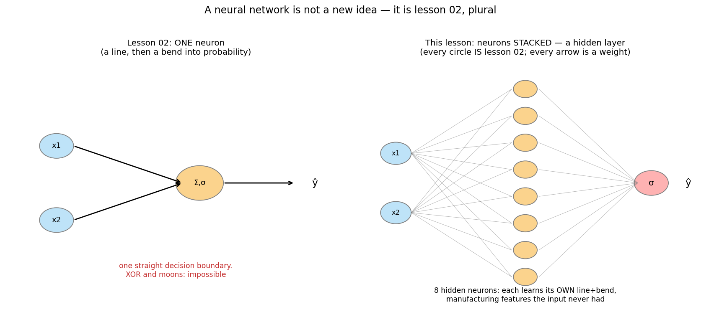
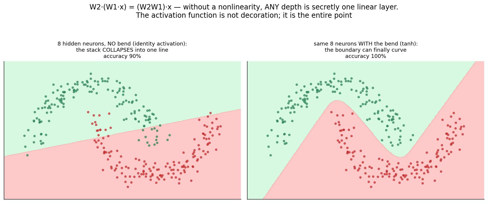
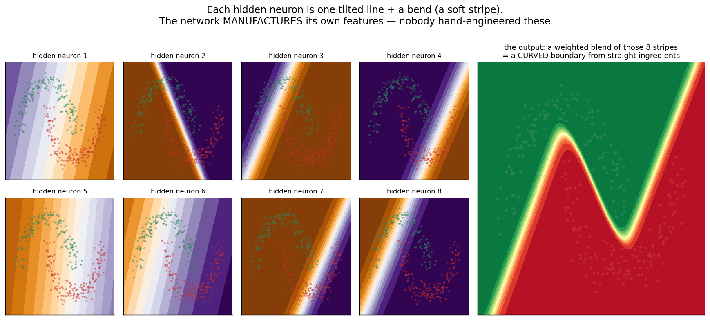
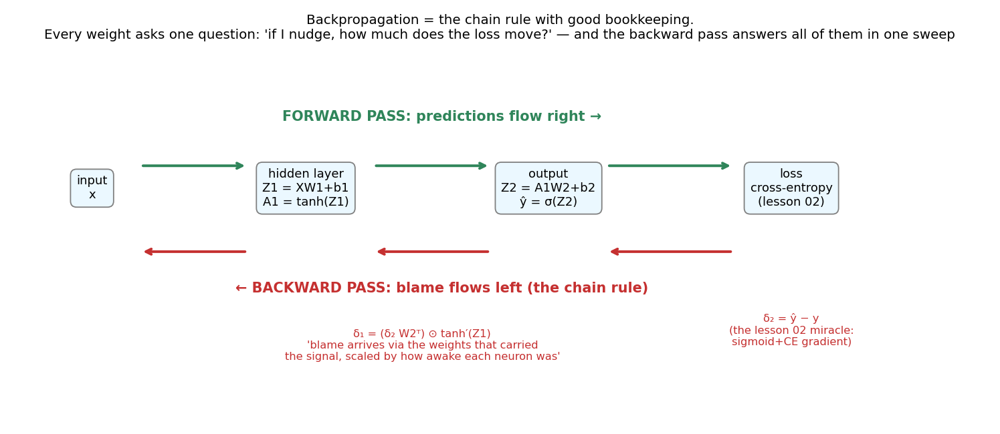
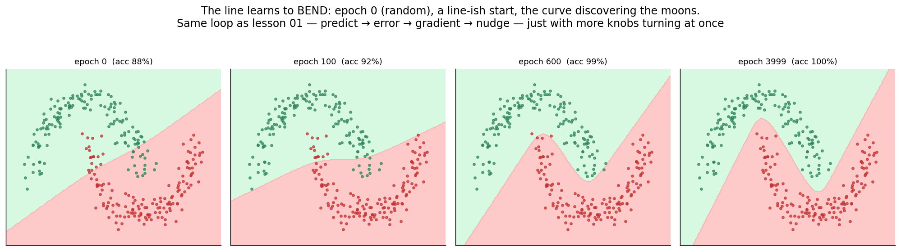

# 10 · Neural Networks — Explained From Scratch

## In one sentence

> A neural network is lesson 02's neuron, plural: layers of line-plus-bend units stacked so the model can manufacture its own features — trained by the exact predict → error → gradient → nudge loop from lesson 01, with the chain rule (backpropagation) delivering every weight's share of the blame in one backward sweep.

## How to read this lesson (don't read it all at once)

| If you have… | Read | ~Time |
|---|---|---|
| 5 minutes | §0 glossary + §2 pictures | 5 min |
| 20 minutes | §0–§2, then **open the notebook** and run Blocks 1–7 | 20 min |
| The full sitting | Everything, notebook alongside | 55–70 min |
| An interview on Tuesday | §8 + §9, then §2 for the pictures | 10 min |

⏸ **Checkpoint** markers below mark natural places to stop reading and run code.

**This is the milestone lesson.** Ten lessons of deliberate foreshadowing land here:
- Lesson 01 gave you *the loop* — it trains this model, unchanged.
- Lesson 02 gave you *the neuron* (line + sigmoid), cross-entropy, and the (ŷ − y) gradient miracle — all three return verbatim.
- Lesson 03 gave you scaling and the sealed exam — both mandatory here.
- Lesson 05 gave you XOR, the shape that ended the first neural-network era (the 1969 perceptron critique) — Block 10 avenges it.
- Lessons 05–08 showed models that carve, vote, and stack — this one *bends*.

This folder contains:

| File | What it is |
|---|---|
| `README.md` | You are here |
| `assets/` | Visual explanations referenced throughout |
| `neural_network_from_scratch.ipynb` | Full forward + backward passes in pure NumPy; every block cites a § here |
| `neural_network_with_library.ipynb` | Same architecture in scikit-learn's MLP (with the PyTorch/TF map), verifying the scratch build |
| `data/moons_data.csv` | Sample dataset: two interlocking crescent moons (300 points) — the curved shape that broke K-means in lesson 09, and that no straight line can finish |

---

## §0 · Words before formulas

Inherited: **weight, bias, loss, gradient, learning rate, sigmoid, cross-entropy, decision boundary, scaling, train/test, overfitting** — this lesson invents remarkably little vocabulary, which is itself the point. The genuinely new words:

| Term | Plain meaning | In our moons example |
|---|---|---|
| **Neuron / unit** | Lesson 02's whole model, demoted to a component: a line (w·x + b) followed by a bend | Each of our 8 hidden units draws one tilted soft stripe across the plane |
| **Hidden layer** | A team of neurons between input and output. "Hidden" = you never told them what to compute | The 8 stripes in fig 04 — invented by training, not by us |
| **Activation function** | The **bend** applied after each neuron's line: tanh, ReLU, sigmoid… | Without it, stacking layers is pointless (§2.2 — the one-line proof) |
| **Forward pass** | Data flows left→right through the layers, producing a prediction | x → hidden stripes → blended → probability |
| **Backward pass / backpropagation** | Blame flows right→left: the chain rule computes every weight's effect on the loss, reusing shared work | One sweep answers "how should each of the 33 parameters nudge?" |
| **Chain rule** | Calculus's relay race: the derivative through a pipeline = product of the per-stage derivatives | You've used it since lesson 02 §3.4 — backprop is it, organized |
| **δ (delta)** | A layer's "blame signal": how much the loss wishes that layer's pre-bend output were different | δ_output = ŷ − y — an old friend |
| **Epoch** | One full pass of the training data through the loop | We run a few thousand (tiny data; real training batches it — §4) |
| **Symmetry breaking** | Why weights start *random*, never zero: identical starts make identical neurons that receive identical blame and stay identical forever | Block 10 stages the trap: an 8-neuron net stuck acting like 1 |

---

## §1 · What does this model assume about the world?

> "The pattern may be curved, tangled, and beyond any formula I could name — but it can be **built from many simple line-plus-bend pieces**, and the right pieces can be *found by gradient descent* instead of designed by a human."

That second clause separates this lesson from everything before it. Lessons 01–08 each committed to a shape (a line, a street, boxes, stacked boxes); features were whatever you supplied. A network's hidden layer **manufactures its own features** (§2.3) — the belief is not about the world's shape but about *learnability*: that blame, flowing backward, is enough signal to sculpt useful internal parts. (The universal approximation theorem says one wide-enough hidden layer *can represent* essentially any continuous boundary — the honest asterisk: "can represent" ≠ "will find it from your data"; §6.)

**When this belief fits:** perception-like problems where features are unknown or unnameable — images, audio, text (lessons 11–17 are all this lesson, scaled); large datasets; problems where interactions matter more than individual features.
**When this belief breaks:** small tabular datasets (lesson 08's boosting usually wins — §6), tight interpretability requirements, and tiny compute budgets.

**Real-world examples:**
- Every image classifier, speech recognizer, and language model on earth (lessons 11–17 = this architecture + structural ideas)
- Tabular problems with heavy feature interactions, when data is plentiful
- Function approximation in control/physics/finance
- And historically: XOR — the tiny problem that a single neuron provably cannot solve, whose 1969 exposure froze the field for a decade, and which one hidden layer dispatches in milliseconds (Block 10)

---

## §2 · The intuition, in five pictures

### 2.1 Not a new idea — lesson 02, plural

Left: lesson 02's entire model — a line, bent into a probability. Right: this lesson — the same circle, photocopied 8 times into a *hidden layer*, feeding one output neuron. Every circle is a lesson 02; every arrow is one learnable weight. Nothing in this diagram is new to you except the plural.

### 2.2 The bend is the entire point

The one-line proof that activation functions are not decoration: stack two linear layers and W₂(W₁x) = (W₂W₁)x — **a single line wearing a trench coat**. Left panel: our 8-neuron network with the bend removed — it collapses to exactly that line (90%: respectable, because the moon *bodies* are line-separable). Right: identical network, tanh restored — 100%, because the interlocking *hooks* of the moons are precisely what only a curve can reach. The last 10% ARE the bend.

### 2.3 The hidden layer manufactures features

The lesson's deepest picture. Each small panel is one hidden neuron's activation over the input plane: one tilted line, softly bent — a *stripe*. Alone, each is feeble (a lesson 02 could do it). But the output neuron blends the 8 stripes into a **curved boundary built from straight ingredients** — like approximating a circle with well-chosen shadows. Nobody designed these stripes; blame flowing backward sculpted them. This is what "representation learning" means, met for the first time.

### 2.4 Two passes: predictions right, blame left

Forward: x → hidden → output → loss (just function composition). Backward: the chain rule walks the same pipeline in reverse, computing every weight's share of the blame *while reusing the shared partial products* — that reuse is why backprop is fast, and it is the entire "magic." Note the annotation at the output: δ₂ = ŷ − y. The lesson 02 miracle (sigmoid + cross-entropy → clean error signal) is the first domino of the backward pass.

### 2.5 Watch the line learn to bend

Epoch 0: random weights, a nonsense boundary. Early epochs: something line-like (easy progress first). Then the curve *discovers the hooks*. The loop producing this movie is character-for-character lesson 01's: predict → error → gradient → nudge — just 33 knobs turning at once instead of 2.

> ⏸ **Checkpoint 1** — Open `neural_network_from_scratch.ipynb`, run Blocks 1–4. You'll write the forward pass in four lines and prove the collapse (§2.2) with algebra. The math below is one derivation — and you already own its pieces.

---

## §3 · Now the math — every symbol already introduced

### 3.1 The forward pass: composition

$$Z_1 = X W_1 + b_1 \qquad A_1 = \tanh(Z_1) \qquad Z_2 = A_1 W_2 + b_2 \qquad \hat{y} = \sigma(Z_2)$$

Read aloud: "the input hits a layer of lines (a matrix multiply is just many w·x+b at once), each gets bent (tanh: like sigmoid but outputting −1…+1, zero-centered — a nicer citizen for hidden layers), the bent outputs become the *input* to the final lesson 02 neuron." Loss: cross-entropy, imported unchanged from lesson 02 §3.3.

### 3.2 Why depth without bends is fake

$$W_2 (W_1 x) = (W_2 W_1)\, x$$

Read aloud: "two linear layers multiply into one linear layer — any number of them do." A 100-layer linear network has exactly the expressive power of lesson 01. The activation breaks this collapse; everything deep learning can do that lesson 02 can't is purchased by that bend.

### 3.3 The backward pass: the chain rule, organized

Output layer first — and the first domino is an old friend (lesson 02 §3.4, the miracle):

$$\delta_2 = \hat{y} - y$$

Gradients for the output layer's parameters: each weight in W₂ connects a hidden activation to the output, so its blame is (what it carried) × (the blame at its destination):

$$\frac{\partial L}{\partial W_2} = A_1^\top \delta_2 \qquad \frac{\partial L}{\partial b_2} = \sum \delta_2$$

Now the step that makes it *back-propagation* — blame flows to the hidden layer through the same weights that carried the signal forward, then gets gated by each neuron's slope:

$$\delta_1 = \big(\delta_2 W_2^\top\big) \odot \tanh'(Z_1) \qquad \text{where } \tanh'(Z_1) = 1 - A_1^2$$

Read aloud, because this line is the whole of deep learning: "each hidden neuron's blame = the output blame, routed back along its outgoing weight (big weight = big responsibility), times **how awake the neuron was** (tanh′ ≈ 1 near its bend, ≈ 0 when saturated — an asleep neuron can't have caused much, and won't learn much)." That sleeping-neuron factor is your first sight of the *vanishing gradient* (§6). Then the hidden gradients repeat the same pattern one level down:

$$\frac{\partial L}{\partial W_1} = X^\top \delta_1 \qquad \frac{\partial L}{\partial b_1} = \sum \delta_1$$

Notice the recursion: **δ at any layer = (δ from above, routed through the weights) × (local slope)**. Ten layers or a hundred — the same two-step, repeated. You now know backprop; the rest of deep learning is architecture.

### 3.4 The update — and the one new rule at initialization

$$\theta \leftarrow \theta - \alpha \nabla_\theta L \qquad \text{for every } \theta \in \{W_1, b_1, W_2, b_2\}$$

Lesson 01 §3.4, verbatim. The one genuinely new rule: **initialize weights randomly, never zero.** Zero-initialized hidden neurons compute identical outputs, receive identical blame (§3.3 routes it through identical weights), take identical steps — and remain clones forever: an 8-neuron network permanently impersonating 1 neuron (Block 10 stages it). Small random weights break the symmetry; each neuron starts different, so blame sculpts them differently.

> ⏸ **Checkpoint 2** — Run Blocks 5–7: the backward pass (with each δ line commented against §3.3), the loop, and the movie. Then Block 9 for the manufactured stripes — the picture worth the whole lesson.

---

## §4 · Every knob, and what happens if you turn it wrong

| Knob | What it controls | Too low / wrong | Too high / wrong |
|---|---|---|---|
| **Hidden width (h)** | How many stripes the net can manufacture | Too few: can't compose the curve — underfit (h=1 is literally lesson 02) | Too many on tiny data: memorizes noise — the familiar U-curve, new knob name (Block 8 sweeps it) |
| **Learning rate (α)** | Step size — lesson 01's knob, now steering many coupled weights | Crawls | Diverges or oscillates; deep nets are *touchier* than lesson 01's bowl because the loss surface is no longer convex — one bowl became a mountain range |
| **Activation choice** | The shape of the bend | Identity: the collapse (§3.2) | Sigmoid/tanh in DEEP stacks: saturating bends multiply many near-zero slopes → vanishing gradients (§3.3's sleeping factor, compounded). Modern default: ReLU (max(0,z)) — a bend that doesn't saturate on the positive side. At our depth, tanh is fine and its derivative is pretty |
| **Initialization** | Where 33 balls start on the mountain range | All-zero: the symmetry trap (§3.4, Block 10) | Huge random: instant saturation, everyone asleep. (Scaled schemes — Xavier/He — set the size by layer width; our 0.5·randn is fine at this scale) |
| **Epochs / batching** | How long, and how much data per step | Stops mid-learning | Overfits eventually — watch validation (lesson 08's early-stopping habit transfers). We use full-batch (300 points); real training uses mini-batches: noisier steps, vastly cheaper, and the noise even helps escape bad valleys |
| **Feature scaling** | — | **Mandatory.** Unscaled inputs saturate the first layer's bends on step one (lesson 03's ruler + §3.3's sleep factor, conspiring) | — |

---

## §5 · Reading the results

Inherited: accuracy, confusion matrix, on the sealed test set; the loss curve (lesson 01's downhill picture — though on a non-convex surface, plateaus and sudden drops are normal, not bugs). Network-specific readings:

| Artifact | What it is | Gotcha |
|---|---|---|
| **The loss curve's shape** | Convex-era intuition says smooth decay; networks often show plateaus → cliff-drops (the model "finds" a feature) | A long plateau isn't necessarily failure — but a *flat-forever* curve with saturated activations is (§6) |
| **Hidden activations (fig 04)** | The manufactured features — actually look at them | Dead/duplicate stripes = wasted width; all-saturated stripes = learning has stopped upstream |
| **Train vs test gap** | The overfitting meter, as always | Networks can memorize *anything* given width + epochs — 100% train accuracy means nothing (lesson 03's ghost, at scale) |
| **What you DON'T get** | A story. 33 coupled weights defy the flowchart-reading of lesson 05 or the recipe-reading of lesson 09 | Interpretability research exists precisely because this box is dark; don't promise stakeholders otherwise |

---

## §6 · When NOT to use it (and how to notice)

- **Small tabular data.** Lesson 08's boosting typically wins under ~10⁴–10⁵ rows with hand-meaningful features — networks shine where features must be *invented* (pixels, audio, tokens). Symptom: your net ties XGBoost after 10× the tuning effort.
- **Vanishing gradients (the depth tax).** Each backward step multiplies by a local slope ≤ 1 (§3.3); stack many saturating bends and early layers receive ~zero blame — they simply stop learning. Symptom: first-layer weights barely move; loss plateaus early. Fixes that built the modern era: ReLU, careful init, and (lesson 11+) architectures with gradient shortcuts.
- **Non-convexity means no guarantees.** Different seeds → different valleys → different accuracies. Symptom: run-to-run variance. Fix: multiple seeds (lesson 09's restart habit transfers), and don't panic — many valleys are equally good.
- **Interpretability or audit requirements.** §5's dark box. A regulator who wanted lesson 05's flowchart will not accept fig 04's stripes.
- **"Universal approximation" as a promise.** The theorem says a wide-enough layer *can represent* your function; it says nothing about *finding* it from finite noisy data with gradient descent. Capacity ≠ learnability — treat the theorem as reassurance about the model family, never as a guarantee about your training run.

---

## §7 · Map: README → notebook

| Notebook block | Implements |
|---|---|
| Block 2 — moons + lesson 02 humiliated (measured) | §1 + §2.2's motivation |
| Block 3 — scale + split | §4 (saturation-on-arrival, prevented) |
| Block 4 — forward pass + the collapse proof | §3.1 + §3.2 |
| Block 5 — loss (imported from lesson 02, verbatim) | §3.1 |
| Block 6 — backward pass, δ by δ | §3.3 (each line commented against the math) |
| Block 7 — the loop + the movie + test score | §3.4 + §2.5 |
| Block 8 — width sweep (the U-curve, again) | §4 |
| Block 9 — the manufactured stripes | §2.3 (the lesson's deepest picture, live) |
| Block 10 — the symmetry trap + XOR avenged | §3.4 + the lesson 05 / 1969 callback |

---

## §8 · Interview prep

### The 30-second answer: "What is a neural network / backpropagation?"

> "A feed-forward network stacks layers of neurons — each computing a weighted sum plus bias, passed through a nonlinear activation. The nonlinearity is essential: without it, stacked layers collapse algebraically into one linear model. Hidden layers learn intermediate features automatically, which is the core advantage over classical models. Training is gradient descent on a loss like cross-entropy, with gradients computed by backpropagation: the chain rule applied layer by layer — the output error is propagated backward through the same weights that carried the signal forward, scaled at each layer by the activation's local derivative, reusing shared computations so the cost is about one extra forward pass. Key practicalities: random (not zero) initialization to break symmetry, scaled inputs, and watching validation error, since sufficiently wide networks can memorize anything."

### Questions you should be able to answer

<b>Q1. Why do we need nonlinear activation functions?</b>

Because compositions of linear maps are linear: W₂(W₁x) = (W₂W₁)x (§3.2) — any depth of linear layers has exactly lesson 01's expressive power. The bend is what lets stacked simple units build curves, XOR, moons, and everything after. Fig 02 shows the same 8 neurons scoring 90% (collapsed to a line) vs 100% (bend restored).

<b>Q2. Walk me through backprop in plain language.</b>

Forward: compose the layers, get ŷ and the loss. Backward: start at the output with δ = ŷ − y (for sigmoid+cross-entropy). At each layer going down: a weight's gradient = (the activation it carried) × (the δ at its destination); the previous layer's δ = current δ routed back through the weights, times the activation's local slope — "blame arrives via the wires that carried the signal, gated by how awake each neuron was" (§3.3). It's the chain rule with shared partial products cached, so the whole gradient costs roughly one extra pass.

<b>Q3. Why must weights be initialized randomly?</b>

Symmetry breaking (§3.4): zero-initialized (or identical) hidden neurons compute the same output, receive the same backpropagated blame, and update identically — permanent clones; the network's effective width is 1. Small random weights give each neuron a different starting stripe for blame to sculpt. (Scaled schemes like Xavier/He additionally keep signal variance stable across layers.)

<b>Q4. What is the vanishing gradient problem?</b>

Each backward step multiplies by the activation's local derivative (§3.3); for saturating bends (sigmoid/tanh) that factor is ≪1 whenever a neuron is saturated. Across many layers the product shrinks geometrically, so early layers get essentially zero gradient and stop learning. Symptoms: early-layer weights frozen, early plateau. Remedies: ReLU-family activations, careful initialization, normalization layers, and shortcut connections (the design story of lessons 11+).

<b>Q5. The universal approximation theorem says one hidden layer suffices. So why deep networks?</b>

The theorem is about *representation* (some wide-enough layer exists), not about *learnability* or efficiency (§6). Deep networks express many functions exponentially more compactly (features composing into features), match the hierarchical structure of real signals, and — with modern tricks — are easier to optimize per unit of capacity than one astronomically wide layer. "Can represent" was never the bottleneck; "will find, with this data and this optimizer" is.

<b>Q6. When would you NOT reach for a neural network?</b>

Small/medium tabular data with meaningful features (boosting wins, lesson 08), hard interpretability requirements (§5's dark box), tight latency/compute, or when a linear baseline already suffices — the course's oldest habit. Networks earn their cost where features must be invented from raw signal: pixels, audio, text.

---

## §9 · Common mistakes (the learner's failure modes, not the model's)

1. **Forgetting the nonlinearity** (or using identity "to simplify") — you built an expensive lesson 01 (§3.2, and Block 8's saddest curve).
2. **Zero initialization** — the symmetry trap; the net trains, loss falls a little, and it's secretly one neuron (Block 10).
3. **Unscaled inputs** — first-layer bends saturate on arrival; §3.3's sleep factor kills the gradients before learning starts.
4. **Reading the training loss only.** A wide net WILL reach ~zero training loss on anything; only the sealed exam means something (lesson 03's rule, at its most necessary).
5. **Panic at plateaus / seed-to-seed variance.** Non-convex terrain is like that (§5, §6); run seeds, watch validation, judge the distribution not one run.
6. **Reaching for a network first on 5,000 tabular rows.** Run lesson 01/02 and lesson 08 baselines; make the network beat them before paying its costs (§6).

---

**Next:** `11-cnns/` — the first *architecture* lesson: what happens when we stop connecting every neuron to every input and instead make small pattern-detectors that **slide across an image**, sharing their weights — convolution, the idea that taught networks to see.
