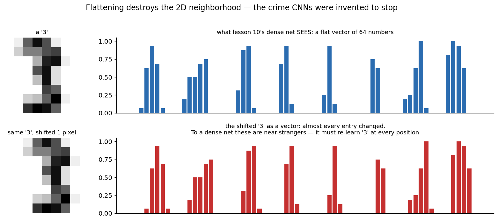
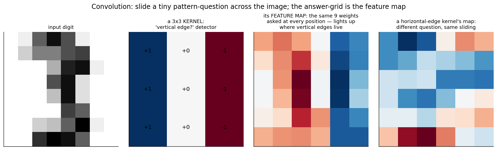
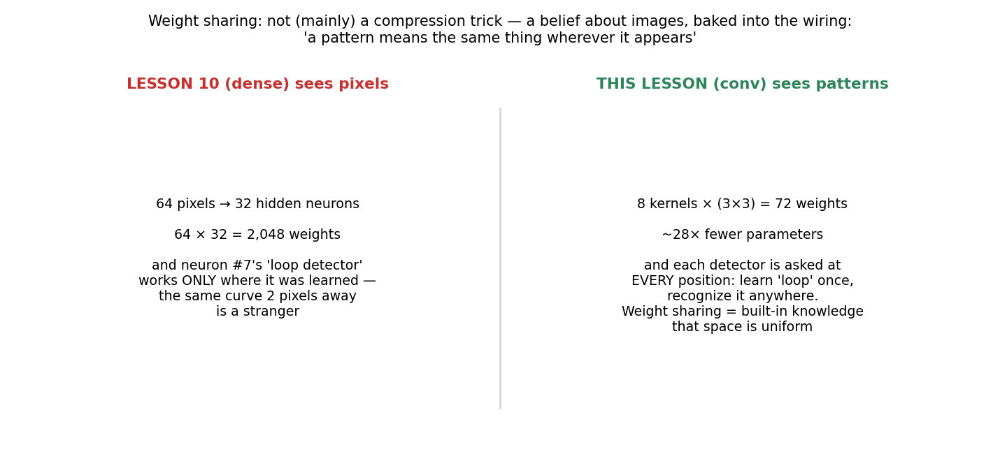
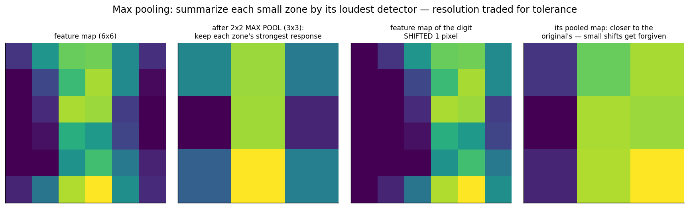
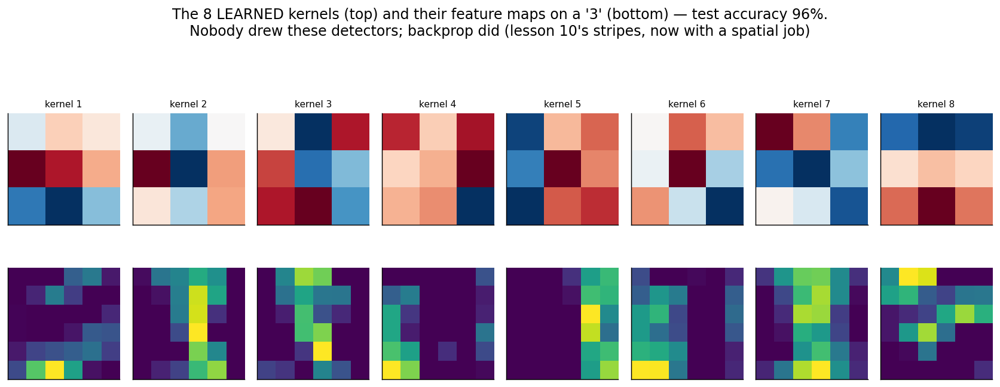

# 11 · Convolutional Neural Networks — Explained From Scratch

## In one sentence

> A CNN replaces "connect every neuron to every pixel" with tiny pattern-detectors that **slide across the image with shared weights** — learn a detector once, apply it everywhere — then pools the results for tolerance, so the network sees *patterns in space* instead of an arbitrary list of numbers.

## How to read this lesson (don't read it all at once)

| If you have… | Read | ~Time |
|---|---|---|
| 5 minutes | §0 glossary + §2 pictures | 5 min |
| 20 minutes | §0–§2, then **open the notebook** and run Blocks 1–6 | 20 min |
| The full sitting | Everything, notebook alongside | 55–70 min |
| An interview on Tuesday | §8 + §9, then §2 for the pictures | 10 min |

⏸ **Checkpoint** markers below mark natural places to stop reading and run code.

**Prerequisite:** lesson 10, fully — this lesson changes the *wiring*, not the engine. Forward pass, backprop, the loop: all inherited. The theme that starts here and runs to lesson 17: **architecture is a belief about the data, baked into the wiring.** A CNN's wiring says: "this data is an image; a pattern means the same thing wherever it appears."

This folder contains:

| File | What it is |
|---|---|
| `README.md` | You are here |
| `assets/` | Visual explanations referenced throughout |
| `cnn_from_scratch.ipynb` | Conv, ReLU, pooling, softmax — forward AND backward — in pure NumPy; every block cites a § here |
| `cnn_with_library.ipynb` | The core operation verified against SciPy, a dense baseline, and the PyTorch translation |
| `data/digits_data.csv` | Sample dataset: 1,797 handwritten digits as 8×8 grayscale images (the course's first image data) |

---

## §0 · Words before formulas

Inherited: everything from lesson 10 (neuron, hidden layer, activation, forward/backward, δ, epoch) plus **cross-entropy** (lesson 02). The new vocabulary:

| Term | Plain meaning | In our digits example |
|---|---|---|
| **Kernel / filter** | A tiny grid of weights (here 3×3) acting as ONE reusable pattern-question | "Is there a vertical edge right here?" — nine numbers |
| **Convolution** | Sliding that question across every position of the image, recording the answer at each stop | The 3×3 kernel visits all 36 positions of an 8×8 digit |
| **Feature map** | The grid of answers — where in the image the pattern lives | Bright where the digit has vertical strokes, dark elsewhere |
| **Weight sharing** | The SAME nine weights are used at every position — the lesson's central idea | Learn "loop detector" once; recognize loops anywhere |
| **Receptive field** | The patch of input a given output can see | One conv output sees 3×3 pixels; after pooling, more |
| **ReLU** | max(0, z) — the modern bend: cheap, and it never saturates on the positive side | Replaces tanh from lesson 10; its derivative is just 0-or-1 |
| **Max pooling** | Shrink each small zone to its single loudest response | 2×2 zones of the 6×6 map → a 3×3 summary; small shifts forgiven |
| **Channels** | Multiple kernels run in parallel, each producing its own feature map | Our layer has 8 kernels → 8 stacked maps |
| **Softmax** | Sigmoid's k-class sibling: turns k scores into k probabilities summing to 1 | Ten scores → "72% it's a 3, 21% an 8, …" |
| **Translation tolerance** | The property all this buys: the answer shouldn't change much when the digit shifts | The failure of lesson 10's net that motivates everything (§2.1) |

---

## §1 · What does this model assume about the world?

> "The input is **spatial**: nearby pixels form patterns, and **a pattern means the same thing wherever it appears** — so detectors should be local, and their weights should be shared across all positions."

This is the course's first *architectural* belief — a statement about the data written into the wiring rather than learned from it. Lesson 10's dense net makes the opposite non-assumption: every pixel independently connected to every neuron, no notion of "nearby," no notion of "same pattern elsewhere." That generality is a handicap on images: the dense net must re-learn every stroke at every position from data alone (§2.1), while the CNN gets spatial uniformity *for free, by construction*.

**When this belief fits:** images above all; also audio spectrograms, sensor grids, board games — anything where locality + translation-sameness hold.
**When this belief breaks:** data with no spatial arrangement (shuffle a tabular dataset's columns and nothing changes — a CNN's locality belief becomes noise), and patterns whose meaning DOES depend on absolute position (§6).

**Real-world examples:**
- Digit/character recognition — the application that proved CNNs (LeNet, reading checks in the 1990s)
- Every modern image classifier, detector, and segmenter's ancestry
- Medical imaging (tumor detection), satellite imagery, quality-control vision
- Audio: spectrograms are images; CNNs hear
- Game boards: AlphaGo's evaluators looked at Go positions convolutionally

---

## §2 · The intuition, in five pictures

### 2.1 The crime of flattening

Lesson 10's net eats vectors, so images get flattened — and flattening is a crime with two counts. Count one: pixels 7 and 8 might be neighbors on-screen but the vector doesn't know; pixel 8 and pixel 16 (vertically adjacent!) sit far apart. Count two, shown above: shift a "3" by ONE pixel and almost every vector entry changes — to a dense net, the two are near-strangers, so it must re-learn "3" separately at every possible position, from data alone. The CNN is the architecture that refuses to flatten.

### 2.2 Convolution: a question that slides

Take nine weights arranged 3×3 — a tiny *pattern-question* ("vertical edge here?"). Slide it to every position; at each stop, multiply-and-sum with the patch underneath (a 9-term dot product — lesson 01's w·x, miniaturized). The grid of answers is the **feature map**: bright exactly where the pattern lives. Two hand-made kernels above find vertical and horizontal strokes of a real digit. One question, asked everywhere — that's convolution, entirely.

### 2.3 Weight sharing: a belief, not a compression trick

The arithmetic is striking — 2,048 dense weights vs 72 shared ones for a comparable job — but the parameter count is the *lesser* point. The greater one: sharing weights across positions is the statement "space is uniform; a loop is a loop wherever it sits." The dense net could eventually approximate this from mountains of data; the CNN gets it on day one, by wiring. Architecture = prior knowledge you don't spend data learning.

### 2.4 Pooling: trade resolution for forgiveness

Max pooling summarizes each 2×2 zone by its loudest response: "was the pattern found *around here*?" replaces "at exactly which pixel?". The payoff is in the right panels: shift the digit one pixel and the raw feature map changes noticeably, but the *pooled* maps nearly agree — small displacements get forgiven. (The price is real too: you threw away "exactly where," which is why architectures that need precise localization pool carefully.)

### 2.5 The learned detectors — nobody drew these

After training: the 8 kernels our network invented, and their feature maps on a "3". Some resemble edge and stroke detectors — cousins of what we hand-made in §2.2, and of what biologists find in early visual cortex — except *backprop sculpted them from blame alone* (96% test accuracy, 8 kernels, 810 parameters total). Lesson 10's manufactured stripes, given a spatial job. In deep CNNs this stacks: edges → corners → parts → objects, each layer asking questions about the previous layer's answers.

> ⏸ **Checkpoint 1** — Open `cnn_from_scratch.ipynb`, run Blocks 1–4: you'll build convolution as "extract patches, then one matrix multiply" and watch hand-made kernels light up real digits. The math below is short; the backward pass has exactly two new moves.

---

## §3 · Now the math — every symbol already introduced

### 3.1 Convolution, honestly reduced

$$\text{FeatureMap}[i, j, f] = \sum_{a=0}^{2}\sum_{b=0}^{2} \text{Image}[i{+}a,\, j{+}b] \cdot K_f[a, b] \;+\; b_f$$

Read aloud: "the answer at position (i,j) for kernel f = the 3×3 patch there, dotted with the kernel." And the implementation insight the notebook exploits: extract all patches into a table (each row = one flattened 3×3 patch), and convolution for ALL positions and ALL kernels becomes **one matrix multiply** — patches @ K. Convolution is lesson 10's layer with two constraints bolted on: each output looks only at its patch (locality), and all positions share the K columns (weight sharing).

### 3.2 The new head: softmax + its loss

Ten digits need ten probabilities. Softmax is sigmoid's k-class sibling:

$$\hat{p}_c = \frac{e^{z_c}}{\sum_{k} e^{z_k}} \qquad\qquad L = -\log \hat{p}_{\text{true class}}$$

Read aloud: "exponentiate every class score (big score → big weight, all positive), normalize to sum to 1; the loss charges −log of the probability given to the truth" — lesson 02's cross-entropy, k-class edition. And the miracle makes its **third appearance**:

$$\delta_{\text{out}} = \hat{p} - \text{onehot}(y)$$

(guess − truth), yet again. Sigmoid+BCE (lesson 02), the boosting residual (lesson 08), now softmax+CE: the same clean error signal keeps falling out — by design, not coincidence: each pairing matches the loss to the squashing so the awkward derivatives cancel.

### 3.3 The backward pass: two new moves, both intuitive

Everything from lesson 10 §3.3 transfers (δ routed through weights × local slope). The two additions:

- **Through max pooling:** the forward pass kept only each zone's maximum — so the backward pass sends the zone's entire blame **to that argmax position** and zero to the rest. Read aloud: "only the neuron that spoke gets the feedback." (ReLU's derivative is the same idea for a single unit: 1 if it fired, 0 if it didn't.)
- **To the kernel:** the same nine weights served every position, so the kernel's gradient is the **sum of the patch×blame products over all positions** (and all images): ∂L/∂K = Σ patches ⊗ δ. Read aloud: "a shared weight collects blame from everywhere it was used." Weight sharing in the forward pass = gradient summing in the backward pass — one line of einsum in the notebook.

### 3.4 The parameter ledger

Our whole network: 8 kernels × 9 + 8 biases + dense (72→10) + 10 = **810 parameters** for 96% on ten classes — versus ~2,400 for a lesson-10 MLP of comparable accuracy. The ledger is the belief (§2.3), monetized.

> ⏸ **Checkpoint 2** — Run Blocks 5–8: pooling, the full forward, the two-move backward (with the numerical gradient check habit from lesson 10), and training with **mini-batches** — the first lesson where full-batch would be wasteful. Then Block 9's honest robustness measurement.

---

## §4 · Every knob, and what happens if you turn it wrong

| Knob | What it controls | Too low / wrong | Too high / wrong |
|---|---|---|---|
| **Kernel size** | How big a pattern one question can see | 1×1 sees single pixels — no spatial pattern at all | Huge kernels approach dense layers: more parameters, less sharing, the belief diluted. 3×3 stacked deep beats big-and-shallow (modern consensus) |
| **Number of kernels (channels)** | How many different questions per layer | Too few: not enough vocabulary of patterns — underfit | Too many on small data: the U-curve, spatial edition |
| **Pooling** | Resolution ↔ tolerance (§2.4) | None: shift-sensitive, huge activations flowing forward | Aggressive: "somewhere in the left half" — localization destroyed |
| **Stride / padding** | Step size of the slide; edge handling | (Ours: stride 1, no padding — output shrinks 8→6. Padding with zeros keeps sizes; stride 2 halves them — cheap downsampling) | — |
| **Learning rate / epochs / batch size** | Lesson 10's knobs, inherited | — | Mini-batches (new here): smaller = noisier but cheaper steps; the noise even helps. 32–256 is the usual comfort zone |
| **Input scaling** | — | Pixels to [0,1] (we divide by 16) — same saturation logic as lesson 10 §4 | — |

---

## §5 · Reading the results

Inherited: accuracy and the confusion matrix on the sealed test set (now 10×10 — read *which* digits get confused: 3↔8, 4↔9 are honest look-alikes). CNN-specific readings:

| Artifact | What it is | Gotcha |
|---|---|---|
| **The learned kernels (fig 05)** | Look at them. Edge-ish and stroke-ish detectors = healthy; all-noise or duplicates = wasted channels or under-training | 3×3 kernels are legible; deeper layers' kernels are not — inspect their *feature maps* instead |
| **Feature maps per layer** | WHERE each detector fires on a given input — the CNN's native explanation | The start of a real interpretability toolbox (saliency, activation atlases) that lesson 10's dense box never offered |
| **The misclassified gallery** | Actually look at the digits it gets wrong (Block 10) | On real data many are genuinely ambiguous to humans — calibrate your expectations before blaming the model |
| **Parameter count vs accuracy** | The ledger (§3.4) — efficiency is evidence the architectural belief fit | If a dense net matches the CNN at similar size, your data may not be as spatial as assumed (§6) |

---

## §6 · When NOT to use it (and how to notice)

- **Non-spatial data.** Tabular columns have no "nearby"; convolving over an arbitrary column order imposes a false belief. Symptom: the CNN needs column-order luck to work. Use lessons 01–08.
- **Meaning depends on absolute position.** Weight sharing says "the same everywhere" — but on, say, structured documents ("a signature matters only in the corner") pure sharing blurs position information. Symptom: errors that correlate with location. Mitigations: positional features, less pooling — or lesson 13's attention, which handles position explicitly.
- **Global relationships between distant parts.** A 3×3 kernel is myopic; long-range relations require many stacked layers before two distant pixels ever meet in one receptive field. Symptom: fails on tasks needing whole-image reasoning at shallow depth. This limitation is a direct setup for attention (lesson 13) and ViT (lesson 15).
- **Tiny datasets from scratch.** Even 810 parameters want hundreds of examples; a million-parameter CNN wants far more. Modern answer: transfer learning — start from kernels pretrained elsewhere (edges are universal).
- **Rotation/scale changes.** Translation tolerance is built in; rotation and scale tolerance are NOT. A "6" is a "9" upside down. Symptom: fails on rotated inputs. Fix: augmentation (train on rotated copies) or specialized architectures.

---

## §7 · Map: README → notebook

| Notebook block | Implements |
|---|---|
| Block 2 — load digits, look at IMAGES | §1 (first image data; the belief check is visual) |
| Block 3 — the flattening crime, measured | §2.1 (shift a digit; watch the vector scramble) |
| Block 4 — patches + conv as ONE matmul + hand kernels | §3.1 + §2.2 |
| Block 5 — ReLU + max pooling (+ the tolerance demo) | §2.4 |
| Block 6 — softmax head + the miracle's third appearance | §3.2 |
| Block 7 — backward: the two new moves + numerical check | §3.3 |
| Block 8 — mini-batch training + test accuracy + confusion | §4 + §5 |
| Block 9 — the ledger + the shift-robustness measurement | §3.4 + §2.3 (measured honestly, both models) |
| Block 10 — learned kernels + misclassified gallery | §5 |

---

## §8 · Interview prep

### The 30-second answer: "What is a CNN / convolution?"

> "A convolutional network encodes two assumptions about images directly in its wiring: patterns are local, and a pattern means the same thing anywhere — so instead of dense connections, it learns small kernels that slide across the input, sharing their weights at every position and producing feature maps of where each pattern occurs. Pooling then summarizes regions by their strongest response, buying translation tolerance and shrinking computation. Stacked, the layers build a hierarchy — edges to parts to objects. Training is standard backprop with two twists: pooling routes gradient only to the argmax, and a shared kernel's gradient sums over every position it was applied. The result is drastically fewer parameters than dense layers and built-in generalization across positions — the architecture that made computer vision work."

### Questions you should be able to answer

<b>Q1. Why convolution instead of dense layers for images?</b>

Dense layers ignore geometry: flattening discards neighborhoods, and a one-pixel shift produces a near-orthogonal input (§2.1), forcing the net to re-learn each pattern at each position. Convolution bakes in locality + translation-sameness (§2.3): fewer parameters (our 72 vs 2,048 for the comparable dense job), and generalization across positions by construction rather than by data.

<b>Q2. What exactly does weight sharing mean, and what does it do to backprop?</b>

The same kernel weights are applied at every spatial position (§3.1). Consequences: forward = one small filter reused everywhere; backward = that filter's gradient is the SUM of patch×blame contributions from every position it touched (§3.3). Sharing forward ⇔ summing backward.

<b>Q3. What does pooling buy, and what does it cost?</b>

Buys: small-shift tolerance ("found around here" instead of "at pixel (i,j)"), downsampling (cheaper later layers), and larger effective receptive fields. Costs: precise localization — the argmax's exact position is discarded (§2.4). Backprop consequence: the zone's gradient goes entirely to the argmax position.

<b>Q4. Softmax vs sigmoid — and what's the output gradient?</b>

Sigmoid squashes ONE score into a probability (binary); softmax normalizes K exponentiated scores into a distribution (§3.2). With cross-entropy, the output gradient is p − onehot(y) — the same (guess − truth) signal as sigmoid+BCE, because loss and squashing are matched so derivatives cancel. Third appearance of the pattern in this course; interviewers love the derivation sketch.

<b>Q5. What's a receptive field and why does depth matter for it?</b>

The input region one activation can see. One 3×3 layer: 3×3 pixels. Stack layers (and pool) and receptive fields compound — deep units see large areas built from small questions about smaller answers. This is why long-range relations need depth in CNNs (§6) — and why attention, which connects everything to everything in one step, became attractive (lesson 13).

<b>Q6. Is a CNN invariant to rotation? Scale? Translation?</b>

Translation: tolerant by construction (sharing + pooling) — approximately, not perfectly. Rotation and scale: NOT built in — a rotated kernel is a different kernel; a "6" is a "9" upside-down (§6). Standard fixes: data augmentation; specialized equivariant architectures exist but augmentation dominates practice.

---

## §9 · Common mistakes (the learner's failure modes, not the model's)

1. **Convolving non-spatial data** because "CNNs are powerful." The wiring is a belief; false beliefs are noise (§6).
2. **Forgetting that pooling gradient goes ONLY to the argmax** — the classic from-scratch backprop bug (silent: loss still falls, just wrongly). The numerical check (Block 7) exists for exactly this.
3. **Judging kernels by eyeball on deep layers.** Only first-layer kernels are legible; inspect feature maps beyond that (§5).
4. **Expecting rotation invariance for free** — then "discovering" the model fails on rotated inputs in production (§6).
5. **Claiming translation robustness without measuring it.** Block 9 measures both models under shift and reports what's found — architectures earn claims empirically, per dataset.
6. **Skipping the dense baseline.** If lesson 10's MLP matches your CNN, either the task isn't spatial or your CNN is misconfigured — both worth knowing before celebrating (§5).

---

**Next:** `12-rnns-lstm/` — the same trick pointed at a new axis: instead of sharing weights across *space*, share them across **time** — networks that read sequences one step at a time and carry a memory forward.
