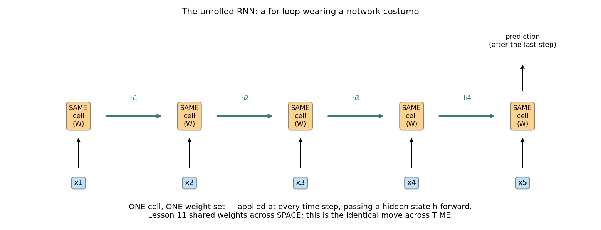
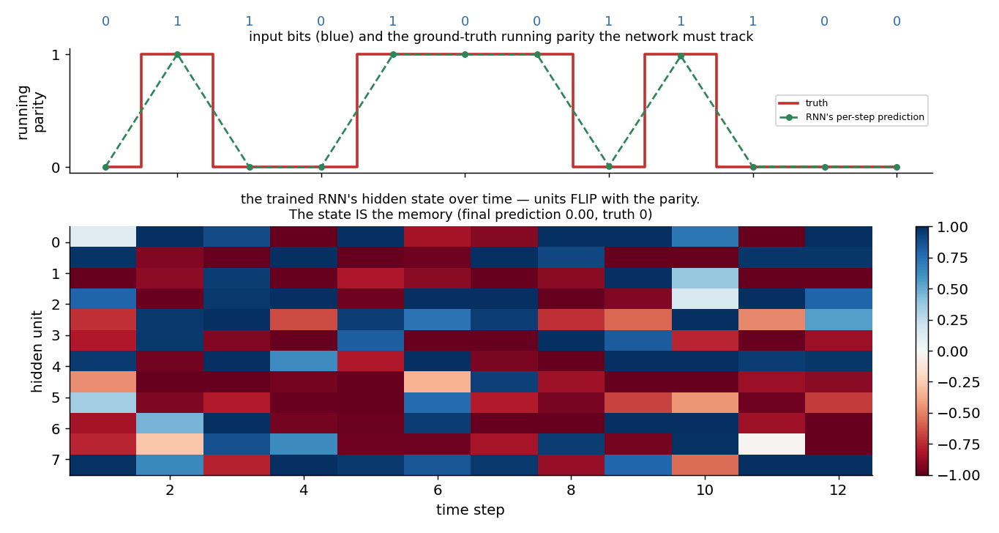
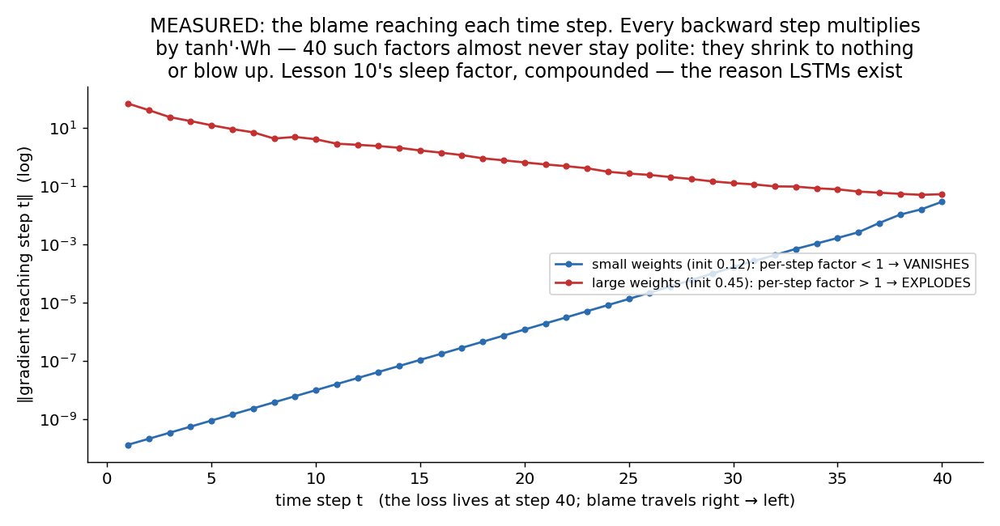
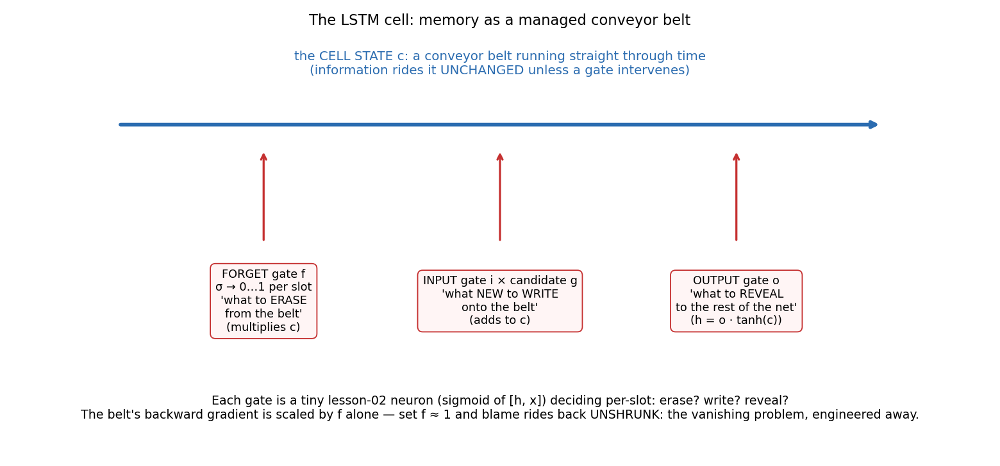
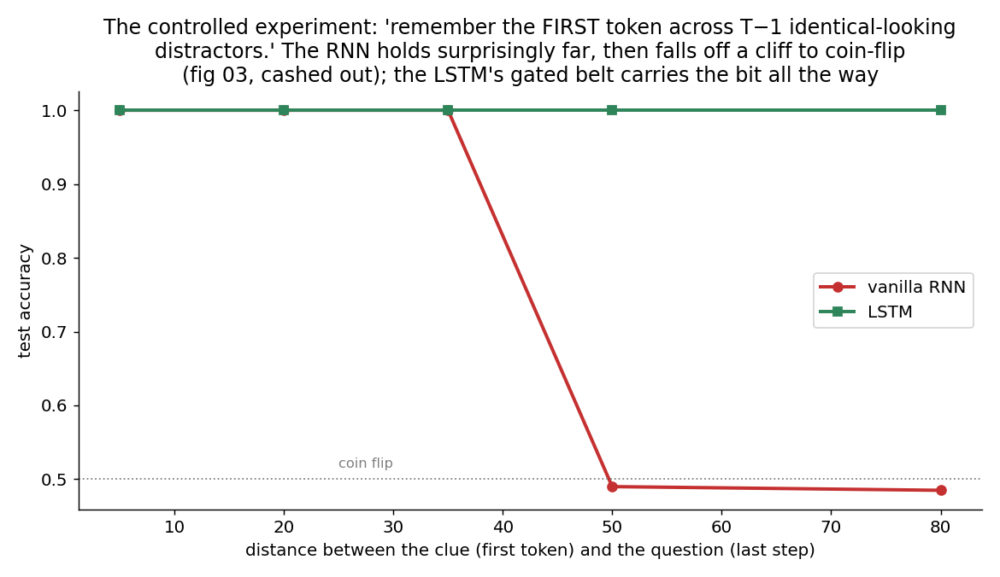

# 12 · RNNs & LSTM — Explained From Scratch

## In one sentence

> A recurrent network applies **one cell with one weight set at every time step** — lesson 11's sharing trick pointed at time — carrying a hidden state forward as memory; and because backprop through many steps multiplies many factors (gradients vanish or explode), the LSTM re-engineers the cell around a gated "conveyor belt" that lets both memories and blame travel long distances intact.

## How to read this lesson (don't read it all at once)

| If you have… | Read | ~Time |
|---|---|---|
| 5 minutes | §0 glossary + §2 pictures | 5 min |
| 25 minutes | §0–§2, then **open the notebook** and run Blocks 1–6 | 25 min |
| The full sitting | Everything, notebook alongside | 60–75 min |
| An interview on Tuesday | §8 + §9, then §2 for the pictures | 10 min |

⏸ **Checkpoint** markers below mark natural places to stop reading and run code.

**Fair warning, honestly given:** this is the **heaviest build of the course** — backprop through time, then a four-gate cell. Everything conceptual is inherited (lesson 10's engine, lesson 11's sharing-and-summing); the weight is in the bookkeeping. The two ⏸ checkpoints matter more than ever here.

**Prerequisites:** lesson 10 (the sleep factor — about to compound 50-fold) and lesson 11 (whose space-sharing this lesson mirrors move for move).

This folder contains:

| File | What it is |
|---|---|
| `README.md` | You are here |
| `assets/` | Visual explanations referenced throughout |
| `rnn_lstm_from_scratch.ipynb` | Vanilla RNN with full BPTT, then a complete LSTM — forward AND backward — in pure NumPy |
| `rnn_lstm_with_library.ipynb` | The PyTorch translation + a feedforward-vs-recurrent experiment sklearn *can* run |
| `data/parity_data.csv` | Task 1: bit strings (length 12) + their parity — the "state as memory" task |
| `data/recall_data.csv` | Task 2: length-50 strings of A/B; label = the FIRST token — the long-range memory stress test |

---

## §0 · Words before formulas

Inherited: everything from lessons 10–11 (forward/backward, δ, ReLU/tanh, weight sharing, mini-batches). The new vocabulary:

| Term | Plain meaning | In our tasks |
|---|---|---|
| **Sequence** | Data with an ORDER: step 1, step 2, … — and variable length | A 12-bit string; a 50-token message |
| **Hidden state (h)** | The network's running summary of everything read so far — its **memory**, rewritten at every step | After reading "0110", h encodes "parity so far: even" |
| **Recurrent cell** | ONE small network applied at every step: new state = f(old state, new input) | The same weights at step 3 and step 47 — sharing across time |
| **Unrolling** | Drawing the loop as a chain of copies, one per step — same cell repeated | Fig 01; it's a for-loop wearing a network costume |
| **BPTT** | Backpropagation Through Time: run the chain backward, step by step, summing each shared weight's blame across all steps | Lesson 11's "sharing forward = summing backward," time edition |
| **Vanishing / exploding gradients** | Blame crossing T steps gets multiplied by T factors; products of many numbers shrink to nothing or blow up | Measured in fig 03: 10⁻⁹ shrinkage over 40 steps |
| **Cell state (c)** | The LSTM's second memory track — a "conveyor belt" that information rides *unchanged* unless a gate acts | The protected slot where "first token was A" survives 49 distractors |
| **Gate** | A sigmoid-controlled valve (0…1 per memory slot): a tiny lesson-02 neuron deciding erase / write / reveal | Forget gate ≈ 1 → the belt keeps its cargo |
| **Length generalization** | Working on sequences LONGER than any seen in training — the superpower sharing buys | Our parity RNN: trained on 12 bits, 97% correct on 80 |

---

## §1 · What does this model assume about the world?

> "The data arrives **in order**, the same reading rule applies at every step, and everything worth remembering about the past can be compressed into a **fixed-size state** carried forward."

Mirror it against lesson 11: convolution said "a pattern means the same thing wherever it appears *in space*"; recurrence says "the same reading rule applies wherever you are *in time*." Same belief, new axis — and the same payoff: learn the rule once, apply it at any position, including positions (sequence lengths!) never seen in training.

The third clause is the honest tension: h is a *bottleneck*. Everything the future needs must survive being squeezed through it, step after step — which is where memory fades (§2.4) and where the LSTM intervenes (§2.5). (And where lesson 13 will eventually say: what if we didn't squeeze at all?)

**When this belief fits:** text, speech, sensor streams, logs, music, any time series — wherever order is meaning and length varies.
**When this belief breaks:** unordered data (recurrence over a shuffled set imposes a false story), very long-range dependencies even for LSTMs, and — the modern plot twist — when you can afford to look at all steps at once (lesson 13's attention; §6).

**Real-world examples:**
- The pre-transformer engines of translation, speech recognition, and autocomplete (LSTMs ran Google Translate and Siri-era speech)
- Time-series forecasting: demand, load, vitals monitoring
- Anomaly detection over event logs
- Music and handwriting generation
- Anywhere on-device/streaming constraints favor a model that reads one step at a time with O(1) memory

---

## §2 · The intuition, in five pictures

### 2.1 One cell, applied at every step

The whole architecture: a single cell — new state = tanh(Wx·input + Wh·old state + b) — applied at step 1, step 2, … step T, passing h along like a baton. Unrolled it looks like a deep network; really it's a **for-loop with learnable weights**. And because the weights are the *same* at every step (lesson 11's move, re-aimed), the reading rule learned at step 3 works at step 300 — variable length handled by construction, something no fixed-input feedforward net can even accept.

### 2.2 The state IS the memory

Watch a trained parity-tracker read 12 bits. Top: the true running parity, and the RNN's per-step prediction shadowing it. Bottom: the hidden units over time — several literally **flip when the parity flips**. Nobody told the network to build a flip-flop; the loss did. The state is not metaphorically the memory — you can watch it store the bit. And the payoff of §2.1: trained only on 12-bit strings, this machine scores **97–98% on 80-bit strings** — the rule generalizes across lengths because it was learned as *one step's rule*, not as a whole-sequence template.

### 2.3 BPTT: lesson 11's backward pass, on the time axis

Nothing new, and that's the point: unroll, then backprop the chain. Blame enters at the loss (last step), flows backward through each cell — routed through Wh, gated by tanh′ (lesson 10 §3.3, verbatim) — and each shared weight **sums its blame over every step it served**, exactly as lesson 11's kernels summed over every position. Sharing forward = summing backward: the rule now holds on both axes.

### 2.4 The toll: multiply 40 factors and see what survives

Measured, not asserted: the gradient reaching each time step of a 40-step vanilla RNN, at two weight scales. Small weights: each backward step multiplies by something < 1, and blame decays *geometrically* — by step 1 it's **10⁻⁹ of its size** (blue). Large weights: factors > 1, and it explodes (red). Products of many numbers almost never stay polite. Consequence: whatever happened early in a long sequence receives essentially zero teaching signal — the model *cannot learn* long-range dependencies, not because they're unrepresentable but because blame never arrives. Lesson 10's sleep factor, compounded 40×.

### 2.5 The LSTM: memory as a managed conveyor belt

The fix is architectural (the lesson 11 theme again: bake the need into the wiring). Add a second track — the **cell state c**, a conveyor belt running straight through time — and put three sigmoid **gates** (each a tiny lesson-02 neuron) in charge of it: *forget* (what to erase from the belt), *input* (what new to write), *output* (what to reveal to the rest of the network). The magic is in the belt's arithmetic: c_t = f·c_{t−1} + (new stuff). Going backward, the belt's gradient is scaled **by f alone** — no weight matrix, no tanh′ — so wherever the network learns f ≈ 1, blame rides back **unshrunk**. The vanishing problem isn't patched; it's engineered out of the main memory path.

### 2.6 The verdict, as an experiment

The controlled test: remember the FIRST token (A or B) across T−1 *identical-looking* distractors, answer at the end. The vanilla RNN holds impressively far — then reaches a **cliff edge around T = 50**: in this figure's sweep it drops to coin-flip there and stays down at T = 80 — and reruns with other seeds reveal what the edge really is: a *lottery*, scattering from coin-flip to lucky success draw by draw (the notebook reproduces this figure's protocol live, then discloses the scatter). A model whose memory depends on the draw is already unusable. The LSTM carries the bit through 80 distractors without dropping a point, on every seed: one belt slot, forget gate open, input gate shut after step one. This contrast is why LSTMs owned sequence modeling for two decades.

> ⏸ **Checkpoint 1** — Open `rnn_lstm_from_scratch.ipynb`, run Blocks 1–5: the RNN cell, BPTT with the numerical check, and the parity machine (watch its state flip). The math below is bookkeeping over ideas you now own.

---

## §3 · Now the math — every symbol already introduced

### 3.1 The RNN cell and its unrolled forward pass

$$h_t = \tanh\!\big(W_x\, x_t + W_h\, h_{t-1} + b\big) \qquad t = 1 \ldots T, \quad h_0 = 0$$

Read aloud: "new memory = a bend applied to (a look at the new input) plus (a look at the old memory)." One equation, looped. Predictions: either from the last state only (recall task) or from every state (running parity) — same cell, different heads.

### 3.2 BPTT: two lines you've already met

Walking backward from step T to 1, with δ_t the blame arriving at h_t:

$$\delta_t^{z} = \delta_t \odot (1 - h_t^2) \qquad\qquad \delta_{t-1} \mathrel{+}= \delta_t^{z}\, W_h^\top$$

$$\frac{\partial L}{\partial W_x} = \sum_{t=1}^{T} x_t^\top \delta_t^{z} \qquad \frac{\partial L}{\partial W_h} = \sum_{t=1}^{T} h_{t-1}^\top \delta_t^{z}$$

Read aloud: "gate the blame by the bend's slope (lesson 10), route it to the previous step through Wh (lesson 10), and — because the weights are shared across time — **sum each weight's blame over all T steps** (lesson 11's rule, time edition)." That is all of BPTT.

### 3.3 Why long distances die: the product

Blame crossing from step T back to step 1 gets multiplied T−1 times:

$$\delta_1 \;\sim\; \delta_T \prod_{t=2}^{T} \Big( \text{diag}(1 - h_t^2)\; W_h^\top \Big)$$

Read aloud: "T−1 factors, each roughly 'slope × weight matrix'. If their typical size is 0.9, fifty of them leave 0.5% of the blame; if 1.1, they leave 100×." Fig 03 is this equation, measured. Nothing about the *task* is unlearnable — the *teaching signal* just doesn't survive the trip. (Exploding has a crude but effective patch — clip the gradient's norm; vanishing has no such patch, which is why it needed an architecture.)

### 3.4 The LSTM, gate by gate

Per step, with z = [h_{t−1}, x_t] (old memory and new input, concatenated):

$$f = \sigma(W_f z + b_f) \quad i = \sigma(W_i z + b_i) \quad g = \tanh(W_g z + b_g) \quad o = \sigma(W_o z + b_o)$$

$$c_t = f \odot c_{t-1} \;+\; i \odot g \qquad\qquad h_t = o \odot \tanh(c_t)$$

Read aloud, one line each: "f — per-slot, how much of the belt's old cargo to KEEP (σ gives 0…1); i and g — what new content (g, a candidate memory) to WRITE, and how much (i); the belt update — old cargo scaled by f, plus the new deposit; o — how much of the belt to REVEAL as this step's working memory h." Four small lesson-02 neurons managing one belt. (We initialize b_f = 1 — "remember by default" — a small famous trick that matters in practice.)

### 3.5 Why the belt saves the gradient

Differentiate the belt update with respect to yesterday's belt:

$$\frac{\partial c_t}{\partial c_{t-1}} = \text{diag}(f)$$

Read aloud: "the belt's backward factor is the forget gate itself — no W_h, no tanh′. Where the network sets f ≈ 1, the factor is ≈ 1, and fifty steps multiply to… still ≈ 1." Compare §3.3's product and the whole design clicks: the LSTM gives blame a toll-free highway back through time. That's the entire theorem of the lesson, and it's one derivative.

> ⏸ **Checkpoint 2** — Run Blocks 6–9: the full LSTM (every gate commented against §3.4), its numerical gradient check, and the cliff experiment at T = 50, live. Then the knobs.

---

## §4 · Every knob, and what happens if you turn it wrong

| Knob | What it controls | Too low / wrong | Too high / wrong |
|---|---|---|---|
| **Hidden size (H)** | The memory's capacity — how much summary fits through the bottleneck | Can't hold what the task needs | The U-curve, sequence edition; also slower (everything is H×H) |
| **Weight init scale** | The §3.3 factors' starting size | Vanishes from step one (fig 03, blue) | Explodes (red). This knob is *live* here in a way it wasn't before — and it's the reason gradient CLIPPING (cap the update norm) is standard practice for recurrent nets |
| **Forget-gate bias** | The belt's default | b_f ≈ 0: gates start half-shut, memories leak while learning begins | (b_f = 1, "remember by default", is the near-universal good default — we use it) |
| **Sequence length in training (T)** | How far BPTT reaches | — | Cost grows linearly with T, and vanilla-RNN learning degrades with it (fig 05); long corpora get **truncated BPTT** — backprop through windows, carry h across |
| **Optimizer** | New here: we use **Adam** (momentum + per-weight step sizes, ~10 lines in Block 4) | Plain SGD on gated cells is slow and fussy — honest engineering note, not a concept | — |
| **Supervision placement** | Last-step-only vs every-step heads | Last-only on hard tasks: one drop of blame must survive the whole trip | Per-step supervision (our parity task) feeds blame in everywhere — when the task allows it, use it |

---

## §5 · Reading the results

Inherited: accuracy on the sealed test set; the loss curve. Sequence-specific readings:

| Artifact | What it is | Gotcha |
|---|---|---|
| **Accuracy vs distance (fig 05)** | THE plot of the lesson: performance as a function of how far memory must reach | A single-T score hides the cliff; sweep the distance |
| **Length generalization** | Test on sequences LONGER than training (§2.2: 12-trained, 80-tested) | The honest proof that the model learned a *rule*, not a template — feedforward baselines can't even accept the longer input |
| **Hidden-state trajectories (fig 02)** | Watch the memory work — flips, latches, counters | The recurrent world's version of lesson 11's feature maps; units are legible on small tasks, less so at scale |
| **Gate activations** | For LSTMs: is the forget gate actually ≈ 1 where memory must persist? | The direct check that the belt is being used as designed |
| **Gradient norms per step (fig 03)** | The teaching-signal audit | If blame never reaches early steps, no amount of epochs fixes the task |

---

## §6 · When NOT to use it (and how to notice)

- **Unordered data.** Recurrence over a shuffled set narrates a story that isn't there. Symptom: accuracy depends on the (arbitrary) order you fed things in.
- **Very long dependencies, even for LSTMs.** The belt helps enormously but isn't infinite — thousands of steps still strain it. Symptom: fig-05-style curves that eventually sag even for the LSTM. This is the door lesson 13 walks through: *stop squeezing history through a bottleneck; let every step look at every other step directly* (attention).
- **The sequential tax.** Step t needs h_{t−1}: recurrent computation is inherently serial — no parallelizing across time on modern hardware. Symptom: GPUs idling. The *other* half of why transformers happened (lesson 14).
- **When the whole sequence is available and short.** A CNN over the sequence (lesson 11 on the time axis!) or even engineered features + lesson 08 can match RNNs on many fixed-window tasks at a fraction of the fuss.
- **Tiny data + big cells.** Four gates = 4× the parameters of a vanilla cell; the U-curve arrives early.

---

## §7 · Map: README → notebook

| Notebook block | Implements |
|---|---|
| Block 2 — load parity data + the task | §1 (order is meaning; variable length looms) |
| Block 3 — the RNN cell + unrolled forward | §3.1 (a for-loop wearing a network costume) |
| Block 4 — BPTT + numerical check (+ 10-line Adam) | §3.2, §4 (sharing = summing, time edition) |
| Block 5 — the parity machine: state flips + length generalization | §2.2 (trained on 12, tested on 80) |
| Block 6 — measure vanish-or-explode | §2.4 + §3.3 (fig 03, reproduced live) |
| Block 7 — the LSTM, gate by gate + numerical check | §3.4 + §3.5 (every line commented) |
| Block 8 — accuracy vs distance, live | §2.6 (fig 05's protocol reproduced at T = 35/50/80, plus the variance disclosure) |
| Block 9 — read the learned gates | §5 (measured honestly: the σ(1) ≈ 0.73 default, the carrier units, the belt's gradient factor vs the RNN's) |
| Block 10 — where does it fail? | §6 (the sequential tax + the door to lesson 13) |

---

## §8 · Interview prep

### The 30-second answer: "What is an RNN / an LSTM?"

> "An RNN processes a sequence one step at a time with a single shared cell: new hidden state = a nonlinearity of the current input and the previous state — weight sharing across time, so it handles variable lengths and learns per-step rules. Training is backprop through time: unroll, backprop the chain, sum each shared weight's gradient over all steps. The failure mode is that blame crossing T steps is multiplied by T Jacobian factors, so gradients vanish or explode — long-range dependencies become unlearnable. The LSTM fixes this architecturally: a separate cell state acts as a conveyor belt whose backward factor is just the forget gate, so with f ≈ 1 both memories and gradients cross long spans intact; input and output gates control writing and revealing. LSTMs dominated sequence modeling until attention removed the bottleneck and the sequential compute constraint."

### Questions you should be able to answer

<b>Q1. What does the hidden state do, and what's its fundamental limitation?</b>

It's a fixed-size running summary — the memory — rewritten every step (§2.2; you can watch units flip with parity). Limitation: it's a bottleneck. Everything the future needs must survive repeated compression through it, which is where long-range information fades and why attention (lesson 13) eventually bypassed it.

<b>Q2. Derive, in words, why vanilla RNN gradients vanish or explode.</b>

BPTT sends blame backward through one Jacobian per step — roughly diag(tanh′)·Whᵀ (§3.3). Crossing T steps multiplies T such factors: typical size below 1 → geometric decay (measured: 10⁻⁹ over 40 steps); above 1 → geometric growth. So early steps get no teaching signal, or training destabilizes. Exploding has a patch (gradient clipping); vanishing needed an architecture.

<b>Q3. Explain the LSTM's gates and the one derivative that justifies the design.</b>

Cell state c is a conveyor belt; forget gate f (what to erase), input gate i with candidate g (what to write), output gate o (what to reveal): c_t = f·c_{t−1} + i·g, h_t = o·tanh(c_t) — each gate a sigmoid of [h, x] (§3.4). The justifying derivative: ∂c_t/∂c_{t−1} = diag(f) — no weight matrix, no saturation term — so with f ≈ 1 gradients cross time unshrunk (§3.5). Bonus points: initializing b_f = 1 so remembering is the default.

<b>Q4. How is weight sharing across time related to sharing across space?</b>

Same principle, different axis (§2.1, §3.2): CNNs assume a pattern means the same thing at any position; RNNs assume the reading rule is the same at any moment. Both yield the identical backprop rule — shared parameters SUM their gradients over every place/step they were applied — and the same generalization gift: positions (or lengths) never seen in training.

<b>Q5. Why did transformers displace LSTMs? Two distinct reasons.</b>

(1) The bottleneck: even a gated belt compresses history into fixed-size state; attention lets every step consult every other step directly — no squeeze (§6). (2) The sequential tax: recurrence computes h_t after h_{t−1}, serially; attention's computation parallelizes across the whole sequence, which is what modern hardware wants. Memory quality AND throughput.

<b>Q6. What is truncated BPTT and why is it used?</b>

Backprop only through the last k steps of a long sequence while still carrying the hidden state forward across chunks (§4). Full BPTT over a 10,000-step corpus is memory/compute-prohibitive and mostly delivers vanished gradients anyway; truncation trades away long-range credit assignment for tractable training — a stated compromise, not a free lunch.

---

## §9 · Common mistakes (the learner's failure modes, not the model's)

1. **Judging memory at one distance — or one seed.** T=35 said "the RNN is fine"; T=50 is a seed lottery; T=80 said coin-flip (fig 05, Block 8). Sweep the distance, and rerun the draw, before concluding anything.
2. **Forgetting the gradient sum across steps** in hand-rolled BPTT — the exact sibling of lesson 11's kernel-sum bug, and just as silent. The numerical check exists for this.
3. **Ignoring exploding gradients** until loss goes NaN. Watch update norms; clip. (Vanishing hides; exploding detonates.)
4. **Zero forget-gate bias** — the belt leaks by default and the LSTM spends its early epochs learning to remember at all. b_f = 1.
5. **Claiming length generalization without testing longer sequences** — the one honest proof the model learned a rule (§5), and it costs one extra evaluation.
6. **Reaching for recurrence on unordered data** (or on short fixed windows where lesson 08/11 tools suffice) — order-as-belief, falsely imposed (§6).

---

**Next:** `13-attention/` — the move that ended the bottleneck: instead of squeezing history through a fixed-size state, let every position **look directly at every other position** and decide, with learned weights, what's relevant. The mechanism inside everything from lesson 14 onward.
