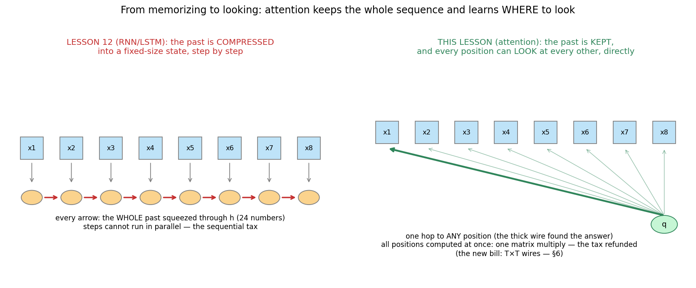
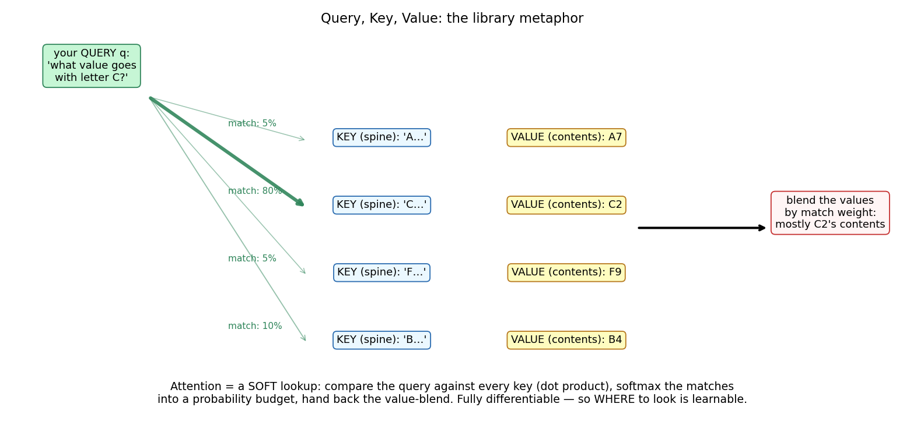
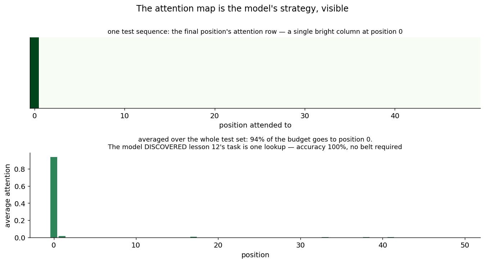
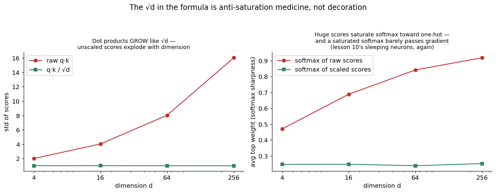
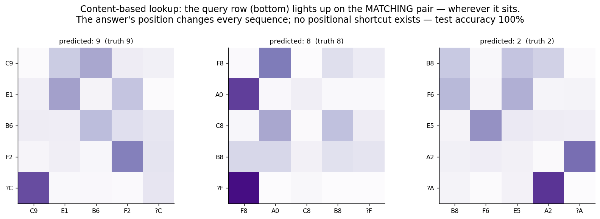

# 13 · Attention — Explained From Scratch

## In one sentence

> Attention replaces "compress the past into a fixed-size memory" with "keep every position and *look*": each position asks a learned question (query), every position advertises what it holds (key) and what it will hand over (value), and a softmax over query–key matches blends the values — a fully differentiable lookup, so *where to look* is learned by the same gradient descent as everything else.

## How to read this lesson (don't read it all at once)

| If you have… | Read | ~Time |
|---|---|---|
| 5 minutes | §0 glossary + §2 pictures | 5 min |
| 20 minutes | §0–§2, then **open the notebook** and run Blocks 1–5 | 20 min |
| The full sitting | Everything, notebook alongside | 50–65 min |
| An interview on Tuesday | §8 + §9, then §2 for the pictures | 10 min |

⏸ **Checkpoint** markers below mark natural places to stop reading and run code.

**Prerequisite:** lesson 12's two closing complaints are this lesson's premise: (1) **the bottleneck** — an RNN's entire past lives in one fixed-size h; (2) **the sequential tax** — step t+1 can't start before step t. Attention answers both, and sends a new bill (§6). The controlled-experiment tradition continues: task 1 is *lesson 12's recall task, verbatim* — same protocol, same T = 50 — so the two architectures meet on identical ground (lessons 05/06 shared the mushrooms; 12/13 share the recall).

This folder contains:

| File | What it is |
|---|---|
| `README.md` | You are here |
| `assets/` | Visual explanations referenced throughout |
| `attention_from_scratch.ipynb` | Single-head scaled dot-product attention, forward AND backward, pure NumPy; every block cites a § here |
| `attention_with_library.ipynb` | Internal verification, a baseline that cannot do content lookup, and the PyTorch translation |
| `data/recall_data.csv` | Task 1: lesson 12's first-token recall (T = 50) — the controlled experiment |
| `data/kv_data.csv` | Task 2: key–value retrieval — four (letter, digit) pairs, then a query letter; answer = its digit |

---

## §0 · Words before formulas

Inherited: **embedding-as-vector ideas from lesson 11–12 (tokens become learned vectors), softmax + its (guess − truth) gradient, sigmoid, dot product (lesson 01's w·x), saturation (lesson 10's sleep factor)**. The new vocabulary:

| Term | Plain meaning | In our tasks |
|---|---|---|
| **Query (q)** | The question a position asks: "what am I looking for?" | The final position asks "who was first?" (task 1) or "who matches my letter?" (task 2) |
| **Key (k)** | What a position *advertises* — its searchable label, like a book's spine | Pair token "C2" advertises "I'm a C-pair" |
| **Value (v)** | What a position *hands over* if selected — the contents behind the spine | "C2" hands over information containing the digit 2 |
| **Attention weights** | The softmax of query–key matches: a probability *budget* over positions, summing to 1 | Task 1's trained model spends 94% of the final position's budget on position 0 |
| **Context vector** | The value-blend a query walks away with — attention's output for that position | What the classifier head actually reads |
| **Scaled dot-product** | match(q, k) = q·k / √d — the similarity ruler, with anti-saturation medicine (§3.3) | The √d is measured, not decreed, in fig 04 |
| **Self-attention** | Queries, keys, AND values all come from the same sequence — positions attending to each other | Everything in this lesson (cross-attention: q from one sequence, k/v from another — §8 Q6) |
| **Permutation invariance** | Attention treats its input as a **set**: shuffle the positions and (without position info) nothing changes | The trap Block 3 springs — task 1 is *unsolvable* without positions |
| **Positional encoding** | Position information *added into* each embedding so order exists again | We learn one vector per position (sinusoidal variants exist — §4) |
| **O(T²)** | Every position scoring every position: T×T comparisons — attention's new bill | The price of killing the bottleneck (§6) |

---

## §1 · What does this model assume about the world?

> "What matters about the past is not a running summary of it, but a few *relevant* pieces — and **relevance is computable from content and position**, so the model can learn to look them up directly."

Contrast lesson 12's belief: "the past can be compressed, step by step, into a fixed-size state." That belief made the belt necessary (protecting information through 49 rewrites). Attention refuses the premise: nothing is rewritten, nothing must survive — the first token is *still right there*, one lookup away. The lesson 11 theme completes its arc: CNNs wired in "patterns repeat across space," RNNs wired in "process in order," attention wires in "relevance is learnable" — the least committed belief of the three, which is why it needed the most data and the biggest positional crutch, and why it ate the other two architectures anyway (lessons 14–15).

**When this belief fits:** language above all (a pronoun's referent is *content-findable*, not position-fixed); retrieval-flavored problems; long-range dependencies; anything where "which past matters" varies per input.
**When this belief breaks:** very long sequences on a budget (the T² bill, §6); tiny datasets (the least-committed belief has the most to learn); tasks that are genuinely sequential summaries (running totals) where an RNN's inductive bias is a gift.

**Real-world examples:**
- Every modern language model — lesson 14 stacks exactly this block
- Machine translation, where attention was born (aligning source and target words, 2014–2017)
- Retrieval and RAG-style systems: query–key–value is literally their vocabulary
- Vision transformers (lesson 15): patches attending to patches
- Recommendation ("attend over the user's history"), protein folding (residues attending to residues)

---

## §2 · The intuition, in five pictures

### 2.1 From memorizing to looking

Left: lesson 12's world — the whole past squeezed through a 24-number state, step after step, no parallelism, information surviving only by not being overwritten. Right: this lesson — the sequence is *kept*; the final position has a direct wire to every other; the thick wire is a learned choice. Path length from any clue to any question: **one hop** (the RNN's was T hops, each a multiplication that shrank the gradient — lesson 12 fig 03). And all wires compute at once: one matrix multiply, the sequential tax refunded. The fine print — T×T wires — is §6's bill.

### 2.2 The library: query, key, value

You (the query) walk into a library with a question. Every book advertises a spine (its key) and contains contents (its value). You compare your question against every spine — dot products, lesson 01's oldest tool — softmax the match scores into a probability budget, and walk out with a *blend of contents, weighted by match*. Soft lookup. The entire trick is that this is differentiable end-to-end: wrong answer → blame flows back through the blend → the queries, keys, and values all *reshape themselves* so next time the budget lands better. Where to look is not programmed; it is learned.

### 2.3 The strategy, visible

Task 1 is lesson 12's recall — remember the first token past 49 identical-looking distractors. The trained attention map shows the model's entire strategy in one row: the final position spends **94% of its budget on position 0** (100% accuracy, no belt, no gates, no lottery). Where lesson 12's LSTM *protected* the bit through 49 rewrites, attention just… doesn't lose it. And unlike lesson 10's dark box, the map is a built-in explanation: you can *see* the model found the right strategy — interpretability as an architectural side effect.

### 2.4 The √d: anti-saturation medicine

Why "scaled" dot-product? Left: dot products of random d-vectors grow like √d — at d = 256, raw scores have std ≈ 16. Right: softmax of huge scores saturates toward one-hot, and a saturated softmax barely passes gradient — lesson 10's sleeping neurons, wearing attention's clothes. Divide by √d and scores keep std ≈ 1 at every dimension: the softmax stays awake, the gradients flow. One symbol in the formula; measured, not decreed.

### 2.5 Content-based lookup: no positional shortcut

Task 1 could be solved by position alone ("look at slot 0"). Task 2 cannot: four (letter, digit) pairs in random order, then a query letter — the answer's position *changes every sequence*. The maps show the query row lighting up on the matching pair **wherever it sits** (100% accuracy). This is the capability that separates attention from everything before it: the lookup address is computed from *content*. A pronoun finding its referent, a question finding its evidence — same mechanism, scaled up.

> ⏸ **Checkpoint 1** — Open `attention_from_scratch.ipynb`, run Blocks 1–4: embeddings, the permutation-invariance trap (springs before your eyes), and the forward pass in six lines. The math below is mostly shapes and one important division.

---

## §3 · Now the math — every symbol already introduced

### 3.1 Three projections: the same vectors, three costumes

$$Q = XW_q \qquad K = XW_k \qquad V = XW_v$$

Read aloud: "each position's vector x (embedding + position) is linearly projected three ways — into the question it asks (Q), the label it advertises (K), and the content it would hand over (V)." Three lesson-01 lines. Why not use x for all three? Because *asking*, *advertising*, and *delivering* are different jobs — the projections let one token play all three roles differently, and they are where most of attention's learning lives.

### 3.2 The lookup

$$S = \frac{QK^\top}{\sqrt{d}} \qquad A = \text{softmax}(S, \text{ per row}) \qquad O = AV$$

Read aloud: "score every query against every key (a T×T table of dot products), turn each query's row of scores into a probability budget (softmax), and pay out: each position's output is the value-blend its budget buys." Three matrix multiplies and a softmax — the whole mechanism. Every position attends *simultaneously*: nothing waits for anything, which is the parallelism the RNN never had.

### 3.3 The division that keeps softmax awake

Dot products of d-dimensional vectors have variance ≈ d (each of the d terms contributes; variances add — the same additivity that powered lesson 06's √B). So scores grow like √d, softmax saturates toward one-hot, and its gradient — which is proportional to A(1−A) per weight — dies. Divide by √d and score variance stays ≈ 1 regardless of dimension. Fig 04 measures both halves. Lesson 10's lesson, third costume: **keep your nonlinearities in their awake zone.**

### 3.4 Permutation invariance, and the positional cure

Nothing in §3.1–3.2 mentions order: shuffle the input positions and Q, K, V shuffle identically, the softmax budget follows its keys, and each position's output is *exactly the same vector*. Attention is a **set** operation. For task 1 — "which token came FIRST?" — that's fatal: without order information the task is not hard but *impossible* (Block 3 stages this: shuffled and unshuffled inputs produce byte-identical outputs). The cure is almost embarrassingly direct: **add a learned position vector into each embedding** — x_t = E[token_t] + Pos[t] — so "I am position 0" becomes part of the content that keys advertise and queries can seek. Order isn't in the mechanism; it's in the data we feed it.

### 3.5 The backward pass: nothing new under the sun

Every gradient is machinery you own: matmul gradients (lesson 10), softmax's row-wise Jacobian (the same algebra as lesson 11's softmax head: dS = A ⊙ (dA − Σ(dA ⊙ A))), ReLU's gate, and embedding gradients as scatter-adds (a shared embedding collects blame from everywhere it was used — lesson 11's sharing↔summing rule, vocabulary edition). The notebook derives each line and then runs the numerical check. This is the last hand-built backward pass of the course — after this block, you have personally differentiated every operation inside a transformer.

> ⏸ **Checkpoint 2** — Run Blocks 5–8: the √d experiment live, the backward pass + check, training on task 1, and the attention-map strategy read. Then task 2, where the positional shortcut is taken away.

---

## §4 · Every knob, and what happens if you turn it wrong

| Knob | What it controls | Too low / wrong | Too high / wrong |
|---|---|---|---|
| **d (model width)** | Vector size for embeddings/Q/K/V | Too small: queries can't express fine distinctions | Cost grows; and without the √d, saturation grows with it (§3.3) |
| **Positional encoding choice** | How order enters | **None: set-blindness — positional tasks become impossible (§3.4)** | Learned-per-position (ours) can't address positions beyond training length — a real limit we hit honestly in Block 7; sinusoidal/relative encodings extrapolate better and are the production answer |
| **Heads** | (Preview — lesson 14) several attentions in parallel, each with its own Q/K/V | One head = one lookup per position per layer; our tasks need exactly one, which is why single-head suffices here | — |
| **Layers** | (Preview — lesson 14) stacked attention = multi-hop reasoning | One layer = one hop; "find X then look left of X" wants two | — |
| **The softmax temperature (√d)** | Score scale (§3.3) | Over-scaled: budgets go uniform — attends to everything, learns nothing specific | Under-scaled: saturation, dead gradients (fig 04) |
| **Optimizer / lr** | Lesson 12's Adam, inherited | — | — |

---

## §5 · Reading the results

Inherited: accuracy on the sealed test set; the loss curve. Attention-specific readings — the richest interpretability toolkit of any model in this course:

| Artifact | What it is | Gotcha |
|---|---|---|
| **The attention map (figs 03, 05)** | Each row: one position's spending budget — the model's retrieval strategy, visible | Legible for 1 layer / 1 head; deep multi-head stacks braid many maps, and "attention = explanation" becomes contested. Enjoy the clarity at this scale; don't over-promise it at scale 96 |
| **Budget concentration** | Sharp rows (94% on one position) = confident lookup; uniform rows = the model attends everywhere, i.e., hasn't found a strategy | Uniform attention EARLY in training is normal; uniform at convergence on a lookup task means something's wrong (often: missing positional signal) |
| **The permutation test** | Shuffle inputs; if outputs don't change, your model is order-blind (Block 3's demo, usable as a diagnostic forever) | — |
| **Head/probe reads at scale** | (Preview) in real transformers, some heads become nameable (previous-token heads, induction heads) | Lesson 17 territory |

---

## §6 · When NOT to use it (and how to notice)

- **The T² bill.** Every position scores every position: a 50-token sequence is 2,500 scores; 100k tokens is 10 billion — per layer. Attention killed the bottleneck and the sequential tax, then sent this invoice. Symptom: memory/latency exploding with context length. The fix industry runs on: efficient/sparse/linear attention variants, chunking, and caching — all engineering around this exact table.
- **Tiny data.** The least-committed inductive bias (§1) has the most to learn from scratch — including things a CNN or RNN gets free (locality, order). Symptom: attention losing to lesson 11/12 architectures on small datasets. Fix: pretraining (lesson 14's other half) or the more opinionated architecture.
- **Genuinely sequential computations.** A running total, a state machine: an RNN computes it in T steps with H numbers; one attention layer must approximate it as lookups. Symptom: shallow attention failing where a tiny RNN cruises (our lesson 12 parity task is exactly this — a point of honest respect for the belt).
- **Length extrapolation with learned positions.** Our Pos table has exactly 50 rows; position 51 does not exist (Block 7 demonstrates the refusal honestly). Sinusoidal/relative encodings are the standard answer.
- **"Attention = explanation" at scale.** One head, one layer: the map is the strategy (§5). Ninety-six heads, ninety-six layers: maps braid, and faithfulness becomes a research question, not a freebie.

---

## §7 · Map: README → notebook

| Notebook block | Implements |
|---|---|
| Block 2 — both tasks loaded + the continuity table | §1 (lesson 12's task, verbatim; the new task's twist) |
| Block 3 — embeddings + the permutation trap | §3.4 (shuffled vs not: byte-identical outputs, then the positional cure) |
| Block 4 — the forward pass in six lines | §3.1–3.2 (Q, K, V, scores, budget, blend) |
| Block 5 — the √d experiment, measured | §3.3 (fig 04 live) |
| Block 6 — the backward pass + numerical check | §3.5 (the course's last hand-built backward) |
| Block 7 — train on recall + the strategy read + the length-50 confession | §2.3 + §6 (the learned-Pos limit, demonstrated) |
| Block 8 — attention entropy during training | §5 (watch uniform budgets sharpen into strategy) |
| Block 9 — task 2: content lookup, no shortcut | §2.5 |
| Block 10 — the tax refunded, the new bill | §6 (wall-clock vs lesson 12's loop; the T² table, priced) |

---

## §8 · Interview prep

### The 30-second answer: "Explain attention"

> "Self-attention lets every position in a sequence gather information from every other position directly. Each position's vector is projected three ways — a query (what it's looking for), a key (what it advertises), a value (what it hands over). Each query is dotted with every key, scaled by 1/√d to keep softmax out of saturation, and softmaxed into weights that sum to one; the position's output is the weighted sum of values. It solves the RNN's two problems: no fixed-size bottleneck (the whole sequence stays accessible — path length between any two positions is 1, not T) and no sequential dependency (all positions compute in parallel as matrix multiplies). Attention alone is permutation-invariant, so positional encodings are added to the inputs. The costs: O(T²) compute/memory in sequence length, and a weak inductive bias that wants lots of data. Stack it with MLPs and multiple heads and you have a transformer."

### Questions you should be able to answer

<b>Q1. Why three projections (Q, K, V) instead of raw vectors?</b>

Asking, advertising, and delivering are different roles (§3.1): the aspects of a token that make it *findable* (key) differ from what it should *contribute* once found (value), and from what it *seeks* (query). Separate learned projections let one representation serve all three; with raw x for all three, "similar" and "useful" would be forced to coincide.

<b>Q2. Why divide by √d? What breaks without it?</b>

Dot-product variance grows linearly with d (variances add across the d terms), so scores' std grows like √d; large scores push softmax into near-one-hot saturation, whose gradients (∝ A(1−A)) vanish — early training freezes (§3.3, measured in fig 04). Dividing by √d keeps score variance ≈ 1 at any width.

<b>Q3. Why do transformers need positional encodings?</b>

Because self-attention is a set operation: permuting inputs permutes outputs identically — order is invisible (§3.4; our Block 3 shows byte-identical outputs under shuffle). Position must be injected into the inputs (learned, sinusoidal, or relative/rotary) so keys can advertise it and queries can seek it. Learned-per-position tables can't extrapolate past training length; sinusoidal/relative variants handle that.

<b>Q4. Compare attention and RNNs on complexity and path length.</b>

Per layer: attention costs O(T²·d) compute but is fully parallel across positions, with path length 1 between any pair. An RNN costs O(T·d²), strictly sequential, path length up to T — and each of those T steps multiplies the gradient (lesson 12's vanishing). Attention trades compute (quadratic) for parallelism and short paths; RNNs trade the reverse. That trade is the entire hardware story of the transformer era.

<b>Q5. What is attention's inductive bias, versus a CNN's or RNN's?</b>

CNN: locality + translation sharing (space). RNN: sequential processing + fixed-size state (time). Attention: almost nothing — "relevance is learnable from content and position" (§1). Weakest bias = most flexible = most data-hungry; with enough data it subsumed the other two (lessons 14–15), and with too little it loses to them.

<b>Q6. Self-attention vs cross-attention?</b>

Self: Q, K, V all from one sequence — positions inform each other (this lesson). Cross: queries from one sequence, keys/values from another — e.g., a translation's target words querying the source sentence, or a decoder querying an encoder. Same formula, different plumbing; the original 2014 attention was cross-attention.

---

## §9 · Common mistakes (the learner's failure modes, not the model's)

1. **Forgetting positional encodings** — the model silently becomes a set processor and positional tasks become impossible (not hard: impossible). Block 3's shuffle test is the 30-second diagnostic.
2. **Dropping the √d** ("it's just a constant") — fine at d = 4, slow death at d = 256; saturation grows with width (fig 04).
3. **Softmax-ing over the wrong axis.** Each *query's row* must sum to 1 (a spending budget per question). Column-wise softmax trains, badly — the classic silent shape bug; the numerical check catches it.
4. **Reading deep multi-head maps like our single-head map.** One layer: map = strategy. Many layers: maps braid; treat "attention as explanation" with care (§5).
5. **Expecting learned positions to extrapolate.** Row 51 of a 50-row table doesn't exist (Block 7). Choose encodings with your length distribution in mind.
6. **Using attention where a summary is the task.** Running totals and state machines are the RNN's home turf (§6) — the belt earned its two decades; know what it's still good at.

---

**Next:** `14-transformers/` — the assembly: multiple heads (several lookups at once), attention + MLP blocks stacked with residual connections and normalization, masking for next-token prediction — the architecture that is, at time of writing, most of AI.
