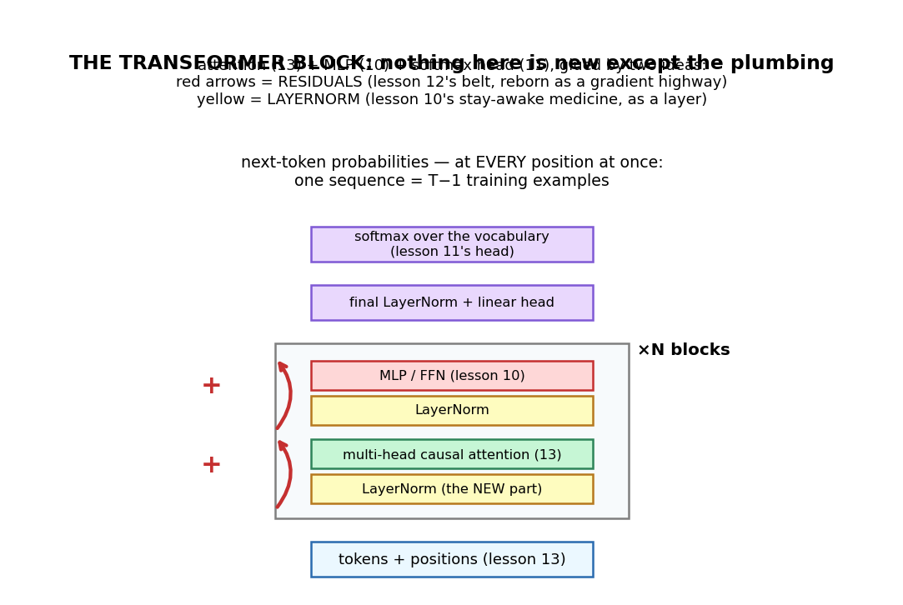
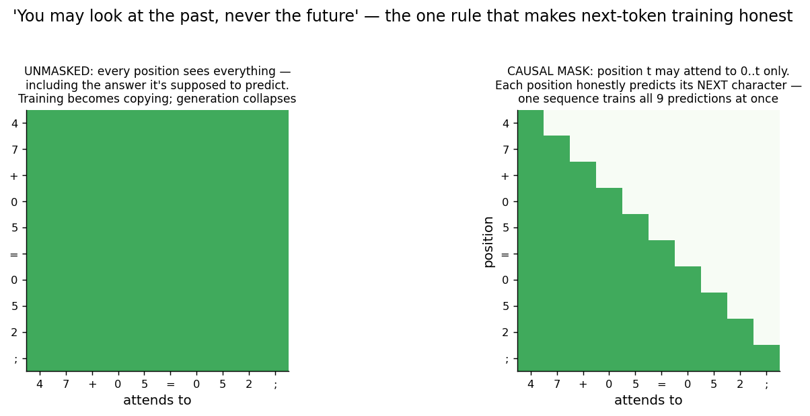
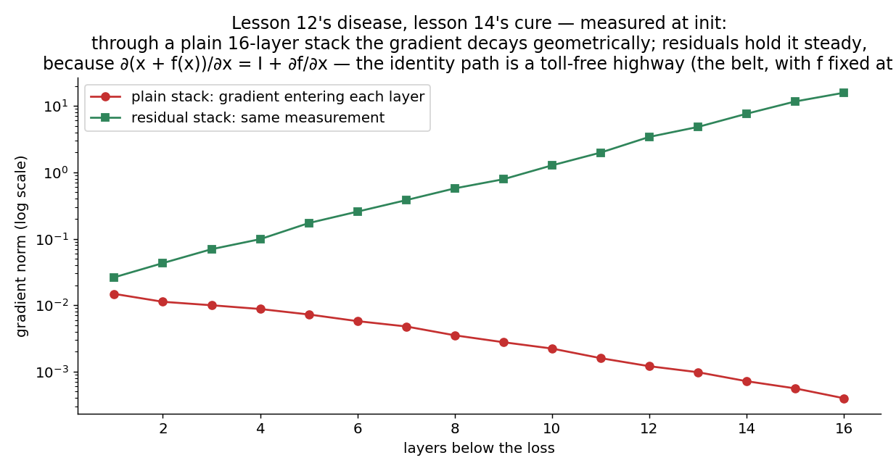
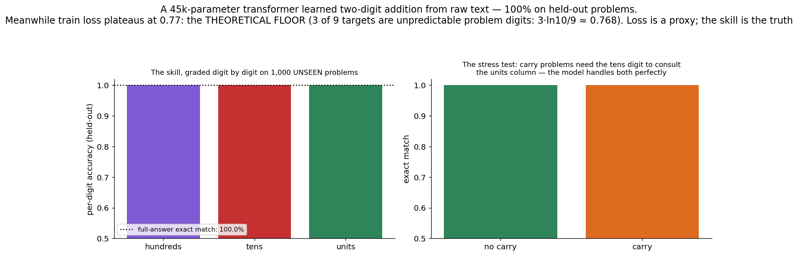
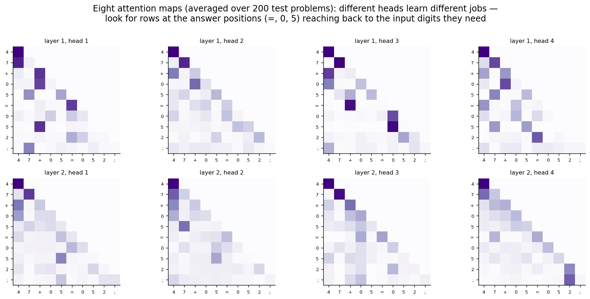

# 14 · Transformers — Explained From Scratch

## In one sentence

> A transformer is an assembly of parts you already own — attention (lesson 13), an MLP (lesson 10), a softmax head (lesson 11) — glued by two new pieces of plumbing (residual connections: a gradient highway; LayerNorm: stay-awake medicine as a layer), trained on the simplest objective imaginable: predict the next token, at every position, all at once.

## How to read this lesson (don't read it all at once)

| If you have… | Read | ~Time |
|---|---|---|
| 5 minutes | §0 glossary + §2 pictures | 5 min |
| 25 minutes | §0–§2, then **open the notebook** and run Blocks 1–6 | 25 min |
| The full sitting | Everything, notebook alongside | 60–75 min |
| An interview on Tuesday | §8 + §9, then §2 for the pictures | 12 min |

⏸ **Checkpoint** markers below mark natural places to stop reading and run code.

**Prerequisite:** lesson 13 completely (attention IS the engine), lesson 12's vanishing-gradient story (residuals are its final cure), lesson 10's saturation lesson (LayerNorm is it, industrialized). This is the second assembly-heavy build of the course (after lesson 12) — and the payoff is a complete, working, 45,568-parameter language model in pure NumPy that **learns two-digit addition from raw text and scores 100% on 1,000 unseen problems.**

This folder contains:

| File | What it is |
|---|---|
| `README.md` | You are here |
| `assets/` | Visual explanations referenced throughout |
| `transformer_from_scratch.ipynb` | The full decoder-only transformer — forward, backward, training, generation — pure NumPy; every block cites a § here |
| `transformer_with_library.ipynb` | Internal verifications, a baseline contrast, and the PyTorch translation |
| `data/addition_train.csv` / `data/addition_test.csv` | The corpus: 8,000 / 2,000 two-digit addition problems as raw text (`"47+05=052;"`) — a language whose grammar is arithmetic |

**Why addition as the corpus?** Because next-token prediction on it produces a *checkable skill*. Real language models are graded by fuzzy vibes; ours can be graded exactly: prompt `"47+05="` and either the completion is `052;` or it isn't. Held-out generalization, carry-handling, and confidently-wrong outputs all become measurable — the course's honesty discipline, applied to the architecture that runs the world.

---

## §0 · Words before formulas

Inherited: **everything in lesson 13 (Q/K/V, budgets, √d, positional encodings), softmax + cross-entropy, ReLU, embeddings, mini-batches, Adam**. The new vocabulary:

| Term | Plain meaning | In our addition model |
|---|---|---|
| **Next-token prediction** | The training objective: at every position, predict the following token | Position 5 (`=`) must predict `0`; position 7 must predict `5` — computing the sum is just… predicting well |
| **Causal mask** | The rule "attend to the past only" — scores to future positions set to −∞ before softmax | The triangle in fig 02; without it, training is copying (§2.2) |
| **Autoregressive generation** | Generate one token, append it, repeat | How the model *answers*: `47+05=` → `0` → `05` → `052;` |
| **Multi-head attention** | Several attentions in parallel, each with its own Q/K/V over a slice of the vector | 4 heads = 4 simultaneous lookups per position (one can track digits while another tracks format) |
| **Residual connection** | out = x + f(x): the block *adds a correction* to a through-flowing stream | The red arrows in fig 01 — and the gradient's toll-free highway (§3.3) |
| **Residual stream** | The running vector that every block reads from and writes into | The transformer's "working memory" per position |
| **LayerNorm** | Per-position renormalization (mean 0, var 1, then learned scale/shift) | Keeps every block's inputs in the awake zone, at any depth (§3.2) |
| **FFN / MLP block** | Lesson 10's two-layer net, applied to each position independently | Where per-position computation (like digit arithmetic) happens |
| **Logits** | Raw pre-softmax scores over the vocabulary | One 13-way score list per position |
| **Temperature** | Divide logits by τ before softmax: τ→0 greedy, τ large → random | Our sampler's honesty knob (Block 9) |
| **Decoder-only** | This architecture: causal self-attention throughout — the GPT family's shape | (Encoders drop the mask; encoder-decoders bolt both together — §8 Q6) |

---

## §1 · What does this model assume about the world?

> "Anything expressible as a sequence of tokens can be learned by one objective — **predict the next token** — because predicting well *forces* whatever computation the sequence's structure demands."

Our corpus makes the claim concrete: nobody told the model that characters 0–9 are numbers, that `+` means addition, or that a carry exists. The only signal, ever, was "you predicted the wrong next character." To push that loss to its floor, the model had no choice but to *become* an adder — the skill precipitated out of prediction. That is the entire thesis of modern language models, demonstrated at 45k parameters: scale the corpus from arithmetic to the internet and the same objective forces grammar, facts, translation, code (lesson 17's territory — with all the caveats that come due at that scale).

**When this belief fits:** language, code, music, protein sequences, any structured stream; whenever you have far more raw sequence data than labels.
**When this belief breaks:** when data is scarce (the transformer inherits attention's weak inductive bias, §6); when the sequence doesn't contain what you need to predict it (no amount of loss-pushing conjures missing information — it conjures *confident guesses* instead, §6's most important warning).

**Real-world examples:**
- Every GPT-family model: this architecture, this objective, breathtaking scale
- Code completion, translation, summarization — all "just" next-token prediction after enough corpus
- Music and protein generation (sequences are sequences)
- And ours: a language whose grammar is arithmetic, learned to perfection

---

## §2 · The intuition, in five pictures

### 2.1 The assembly: nothing new but the plumbing

Read the diagram with your course map open: attention is lesson 13, the FFN is lesson 10, the softmax head is lesson 11, tokens+positions are lesson 13's Block 3. The two genuinely new parts are *plumbing*: red residual arrows (§2.3) and yellow LayerNorms (§3.2). A transformer "block" is: normalize → attend → add; normalize → MLP → add. Stack N of them, put a head on top. That's GPT. The division of labor to internalize: **attention moves information between positions; the MLP computes with it at each position** — the lookup and the calculator, alternating.

### 2.2 The causal mask: honesty enforced by triangle

Next-token training has a cheating problem: position 6's target (`5`) is sitting right there at position 7, and unmasked attention would happily read it. The causal mask sets every score to the future to −∞: position t sees 0…t, full stop. Two consequences. First, honesty: predicting the answer now requires *computing* it from the digits. Second, efficiency: with the triangle in place, **one sequence trains T−1 predictions simultaneously** — every position is a training example, one forward pass grades them all. Block 4 stages the crime: train unmasked, watch train loss collapse to ~0… and generation produce garbage, because the model learned to copy a token it won't have at generation time.

### 2.3 Residuals: lesson 12's belt, reborn as a highway

Lesson 12's disease: gradients crossing many layers get multiplied by many Jacobians and vanish. The LSTM's cure was a gated belt (∂c_t/∂c_{t−1} = f). The transformer's cure is more radical: **out = x + f(x)**, so ∂out/∂x = **I** + ∂f/∂x — an identity path with *no toll at all* (the belt with f nailed to 1). Measured above at initialization: through a plain 16-layer stack the gradient decays geometrically; through the residual stack it arrives intact. This is why hundred-layer transformers train at all — and why the "residual stream" picture (blocks as readers/writers of a through-flowing memory) is how practitioners actually think.

### 2.4 The skill precipitates out of prediction

The headline: **100% exact-match on 1,000 held-out problems — carries included.** The model never saw these sums; it *computes* them, because computing was the only way to predict. And the subtle teaching moment: train loss plateaus at 0.771 — not because learning stalled, but because **that is the theoretical floor**: 3 of the 9 predicted characters (the problem's own random digits) are genuinely unpredictable, contributing 3·ln(10)/9 ≈ 0.768 of irreducible entropy. The model is *perfect* and the loss is *nonzero*. Burn this into memory: **loss is a proxy; the skill is the truth** — the gap between the two only widens at scale.

### 2.5 Reading the heads: division of labor, visible

Eight attention maps (2 layers × 4 heads, averaged over 200 test problems). They are not interchangeable: some heads lock onto local/previous-token structure, others reach from the answer positions back to the input digits they need. This is lesson 13's single legible map, at the first rung of the ladder toward real interpretability work (where heads get *names*: previous-token heads, induction heads — lesson 17). Honest caveat from lesson 13 §5 still applies: with depth, maps braid.

> ⏸ **Checkpoint 1** — Open `transformer_from_scratch.ipynb`, run Blocks 1–5: the corpus, LayerNorm (with the one new derivative of the lesson), the mask crime, and multi-head's reshape trick. The math below is mostly bookkeeping plus two short, satisfying derivations.

---

## §3 · Now the math — every symbol already introduced

### 3.1 The block, in equations

$$X \leftarrow X + \text{MHA}(\text{LN}_1(X)) \qquad\qquad X \leftarrow X + \text{FFN}(\text{LN}_2(X))$$

Read aloud: "normalize, attend, add the correction; normalize, compute, add the correction." (This is *pre-LN* — normalize before each sub-block — the modern default because it keeps the residual highway completely clean; the original paper's post-LN put LN on the highway itself and was famously harder to train.) MHA is lesson 13's attention run h times in parallel on d/h-sized slices, concatenated, then mixed by one output matrix W_o. FFN is lesson 10's two-layer MLP applied to each position independently. The head: logits = LN(X) W_out, softmax per position, cross-entropy against the next token — the miracle gradient (guess − truth) now arriving at *every position at once*.

### 3.2 LayerNorm — and the lesson's one new derivative

$$\text{LN}(x) = g \odot \frac{x - \mu}{\sqrt{\sigma^2 + \epsilon}} + b \qquad \text{(μ, σ² over the feature dimension, per position)}$$

Read aloud: "recenter and rescale each position's vector to mean 0, variance 1, then let learned gain g and bias b restore whatever scale the network actually wants." Why: after many residual additions the stream's scale drifts; drifted scale means saturated activations and skewed attention scores — lesson 10's sleep problem and lesson 13's √d problem, both recurring at depth. LN resets the scale at every block's doorstep. Its backward pass is the lesson's one genuinely new derivative (the notebook derives it; the compact form is dx = (dx̂ − mean(dx̂) − x̂·mean(dx̂⊙x̂))/σ — three terms because μ and σ each depend on every coordinate), and the numerical check validates it alongside everything else.

### 3.3 The residual derivative — one line, load-bearing

$$\frac{\partial\, (x + f(x))}{\partial x} = I + \frac{\partial f}{\partial x}$$

Read aloud: "the gradient reaching a deep layer is the identity's untouched copy *plus* whatever the branch contributes." The I is the entire story: no product of Jacobians on the main path, no vanishing (§2.3, measured). In the backward code this is literally `dX = dX + dBranch` — the humblest line in the file, holding up the deepest models on earth.

### 3.4 Training and generation

Training: every position predicts its next token; loss = mean cross-entropy over positions; one forward+backward per batch updates all 45,568 parameters (Adam, lesson 12's ten lines). Generation: autoregressive — feed the prompt, take the last position's distribution, sample or argmax, append, repeat. Note what returned: **generation is sequential** (token t+1 needs token t). The training-time parallelism that beat the RNN does not apply to *writing* — the autoregressive tax, and the reason inference engineering (KV caches, which store each position's K,V so old tokens aren't recomputed) is an industry (Block 10).

> ⏸ **Checkpoint 2** — Run Blocks 6–8: the assembled model, the triple numerical check, and training — watch exact-match climb while loss lands on its theoretical floor. Then Block 9's sampler and the unmasked crime scene.

---

## §4 · Every knob, and what happens if you turn it wrong

| Knob | What it controls | Too low / wrong | Too high / wrong |
|---|---|---|---|
| **Layers (N)** | Rounds of "look, then compute" — multi-hop reasoning depth | 1 layer struggled with carries in our sweeps (a carry is a two-hop fact: tens digit needs the units *sum*) | Cost; diminishing returns at fixed data; deep post-LN stacks destabilize (use pre-LN) |
| **Heads (h)** | Parallel lookups per position | 1 head must time-share jobs (digits AND format) | d/h shrinks per-head expressiveness; heads compete for the same slice budget |
| **Width (d) / FFN size** | Stream capacity / per-position compute | Can't represent the needed features | Parameters and the T²·d bill grow |
| **Context length (T)** | How much the model can see at once | Task doesn't fit | The T² invoice (lesson 13 §6), now multiplied by N layers |
| **Temperature (τ)** | Sampling entropy at generation | τ→0: deterministic; fine for arithmetic, repetitive for prose | High τ on our model: watch it *misspell sums* — randomness applied to facts manufactures errors (Block 9's honest demo) |
| **Masking** | Training honesty (§2.2) | **Forgetting it: the silent catastrophe — great loss, useless model** | — |
| **LR / warmup** | Adam's aggression | — | Transformers like gentle starts; our scale forgives, real scale doesn't (warmup exists for a reason) |

---

## §5 · Reading the results

The lesson's evaluation theme, in one line: **the loss curve tells you training works; only task-grading tells you what was learned.**

| Artifact | What it is | Gotcha |
|---|---|---|
| **Loss vs its floor** | Ours plateaus at 0.771 against a computable floor of 0.768 (§2.4) | A plateau can mean "stuck" OR "perfect against irreducible noise" — know which by knowing the floor |
| **Exact-match on held-out prompts** | The skill, graded with no partial credit | The metric that actually corresponds to "can it add" — per-token accuracy would flatter (format characters are free points) |
| **Sliced evaluation (carry vs no-carry)** | Error analysis by *mechanism*: which computations does it really do? | The habit that scales: real LM evals slice by skill precisely because aggregate scores hide mechanism-level failure |
| **Confidently wrong completions** | Sample at high temperature or probe edge cases: outputs remain fluent, formatted… and false | Your first hallucination: the model NEVER abstains — softmax must spend its budget somewhere. Fluency ≠ correctness, at 45k parameters or 400B |
| **Attention maps (fig 05)** | Division of labor across heads | Lesson 13 §5's caveats compound with depth |

---

## §6 · When NOT to use it (and how to notice)

- **Scarce data.** The weakest inductive bias in the course (§1, inherited from attention) — our model needed 8,000 examples for a task a hand-coded adder does in one line. Below transformer-scale data, lessons 01–12 architectures (or pretraining) win. Symptom: a tiny CNN/RNN/GBM matching your transformer at a fraction of the cost.
- **The T²·N bill.** Every layer pays lesson 13's quadratic invoice. Long-context engineering is its own field for a reason.
- **The autoregressive tax at inference.** Generation is one token at a time, each requiring a full forward pass (KV caches amortize, not eliminate). Latency-critical, long-output settings feel this hard.
- **When the sequence can't contain the answer.** Next-token prediction *will* produce a next token — trained on prediction, the model guesses fluently rather than abstaining (§5). At our scale it's a misspelled sum; at internet scale it's a fabricated citation. Same mechanism, same lesson: **prediction ≠ knowledge of limits.**
- **Interpretability requirements.** Heads are more legible than lesson 10's dark box (fig 05), but "we can read some maps" is not an audit trail.

---

## §7 · Map: README → notebook

| Notebook block | Implements |
|---|---|
| Block 2 — the corpus + "everything is next-token prediction" | §1 (the loss floor computed in advance) |
| Block 3 — LayerNorm forward + the one new derivative | §3.2 |
| Block 4 — the causal mask + the unmasked crime, staged | §2.2 |
| Block 5 — multi-head: the reshape trick | §3.1 (h parallel lesson-13s on slices) |
| Block 6 — the block assembled: residuals as one humble line | §3.1 + §3.3 (+ the highway measurement, live) |
| Block 7 — full model + triple numerical check | §3.1–3.3 (attention weight, LN gain, FFN weight) |
| Block 8 — training: loss to its floor, exact-match to 100% | §2.4 + §5 (carry slicing included) |
| Block 9 — generation: greedy, temperature, and the crime scene | §3.4 + §4 (unmasked model: great loss, garbage answers) |
| Block 10 — the autoregressive tax + KV-cache idea + the door | §3.4 + §6 |

---

## §8 · Interview prep

### The 30-second answer: "Explain the transformer architecture"

> "A transformer stacks identical blocks, each doing two things: multi-head self-attention moves information between positions — several parallel scaled-dot-product attentions on subspaces, concatenated — and a position-wise MLP computes with that information. Two pieces of plumbing make depth trainable: residual connections around each sub-block, so the gradient's main path is an identity with no Jacobian products to vanish, and LayerNorm (pre-LN in modern practice) keeping activations well-scaled at every block. Decoder-only models add a causal mask so each position attends only to the past, which makes next-token prediction honest and turns every position of every sequence into a training example in parallel. Generation is autoregressive — sample, append, repeat — with KV caching to avoid recomputing past keys and values. Trained at scale on this one objective, the architecture is the basis of essentially all modern language models."

### Questions you should be able to answer

<b>Q1. Why residual connections? What exactly do they fix?</b>

Depth multiplies Jacobians; products of factors < 1 vanish (lesson 12's disease, lesson 10's sleep factor compounded). With out = x + f(x), ∂out/∂x = I + ∂f/∂x — an untolled identity path, so gradient magnitude survives any depth (§3.3; fig 03 measures a 16-layer stack with/without). Bonus framing: blocks become *editors of a through-flowing stream* rather than replacers of it — each learns a correction, echoing lesson 08's additive philosophy.

<b>Q2. What does LayerNorm do, and why per-position?</b>

Recenters/rescales each position's feature vector to mean 0, var 1, with learned gain/shift (§3.2) — resetting scale drift from repeated residual additions so activations stay awake and attention scores stay calibrated at depth. Per-position (not per-batch like BatchNorm) because sequence models want no dependence on batch composition and identical behavior at batch size 1 — e.g., generation.

<b>Q3. Why the causal mask? What happens without it?</b>

Next-token training with unmasked self-attention lets position t read its target at position t+1: loss collapses via copying, and generation — where the future genuinely doesn't exist — produces garbage (§2.2; Block 9 stages it: train loss near zero, exact-match near zero). The mask also enables the great efficiency: one sequence = T−1 honest training examples, graded in one forward pass.

<b>Q4. Why multiple heads rather than one big attention?</b>

One head produces ONE budget per position per layer — one lookup. Real prediction needs several simultaneous relations (our model: track the units digits AND the format; language: syntax AND coreference). Heads run parallel attentions on d/h-sized slices at the same total cost as one full-width attention, and fig 05 shows the division of labor actually emerging. (Sharp follow-up: heads also give redundancy — at scale, many can be pruned after training.)

<b>Q5. Your model's loss stopped falling at 0.77. Is it broken?</b>

Compute the floor first: 3 of 9 predicted characters are irreducibly random (the problem's own digits), giving 3·ln(10)/9 ≈ 0.768 of unavoidable entropy — the model sits ON the floor while scoring 100% exact-match (§2.4). The general skill: decompose loss into reducible vs irreducible before diagnosing; and always grade the *task*, not just the proxy (§5).

<b>Q6. Decoder-only vs encoder-only vs encoder-decoder?</b>

Decoder-only (GPT family, this lesson): causal mask everywhere; built for generation. Encoder-only (BERT family): no mask — every position sees all others; built for understanding/embedding tasks, trained with masked-token objectives instead. Encoder-decoder (original 2017 paper, T5): an unmasked encoder reads the input; a causal decoder writes the output, connecting via cross-attention (lesson 13 §8 Q6). Same block, three plumbing arrangements.

---

## §9 · Common mistakes (the learner's failure modes, not the model's)

1. **Forgetting the causal mask** — the silent catastrophe: beautiful loss, useless model (Block 9's crime scene). Any suspiciously easy LM loss: check the mask first.
2. **Masking with 0 instead of −∞.** Zeroing scores *before* softmax still gives future positions weight (softmax(0) ≠ 0). The mask must be −∞ (or −1e9) so softmax assigns them nothing.
3. **Judging by loss alone.** Our loss "stalled" at 0.77 while the model reached perfection (§2.4); at scale the reverse also happens — loss falls while the skill you care about doesn't move. Grade tasks.
4. **Putting LN on the highway (post-LN) and wondering why deep stacks won't train.** Pre-LN keeps the residual path clean (§3.1); it's the modern default for a reason.
5. **Trusting fluent output.** The unmasked model, the high-temperature sampler, and every hallucinating LLM share one property: formatted, confident, wrong (§5). Fluency is the *format* being learned; verify the *content*.
6. **Reaching for a transformer at lesson-03 data sizes.** 8,000 examples for two-digit addition is the weak-bias tax at miniature scale (§6); below that, use an architecture that already believes something true about your data.

---

**Next:** `15-vision-transformers/` — the takeover begins: chop an image into patches, call each patch a token, and hand lesson 11's entire job to this lesson's architecture. What survives of convolution's beliefs, what gets re-learned from data, and what it costs.
