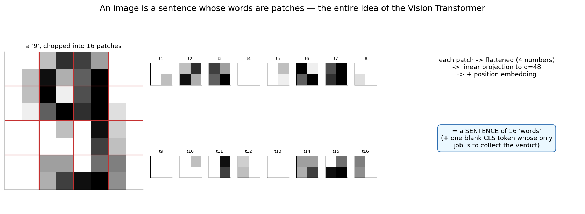
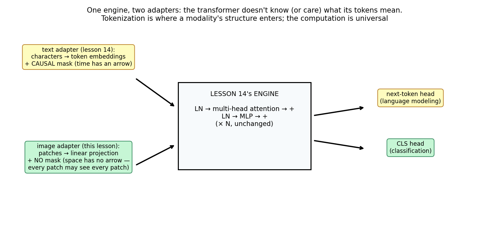
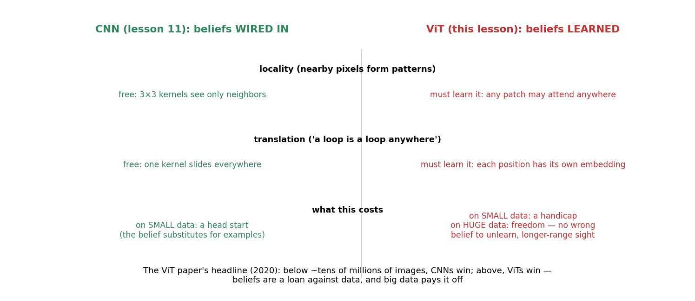
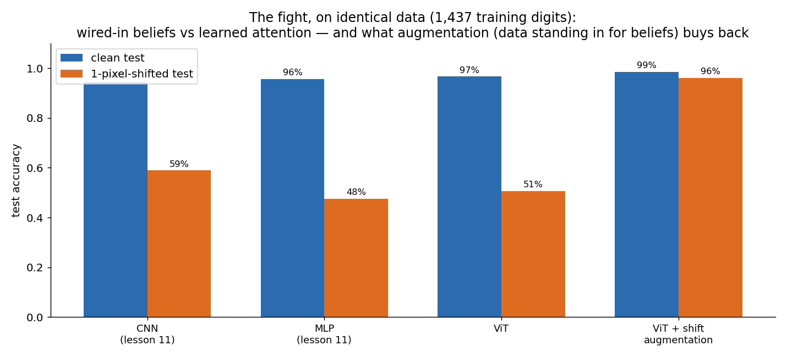
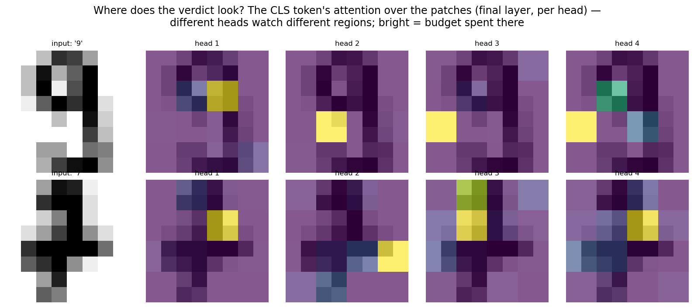

# 15 · Vision Transformers — Explained From Scratch

## In one sentence

> A Vision Transformer chops an image into patches, calls each patch a token, and hands lesson 11's entire job to lesson 14's unchanged engine — betting that the beliefs a CNN wires in (locality, translation-sameness) can instead be *learned from data*, and demonstrating the era's biggest idea: tokenization is the adapter; the transformer is universal.

## How to read this lesson (don't read it all at once)

| If you have… | Read | ~Time |
|---|---|---|
| 5 minutes | §0 glossary + §2 pictures | 5 min |
| 20 minutes | §0–§2, then **open the notebook** and run Blocks 1–6 | 20 min |
| The full sitting | Everything, notebook alongside | 50–65 min |
| An interview on Tuesday | §8 + §9, then §2 for the pictures | 10 min |

⏸ **Checkpoint** markers below mark natural places to stop reading and run code.

**Prerequisite:** lesson 14 (the engine, reused verbatim minus one line — the mask) and lesson 11 (the opponent). The controlled-experiment tradition reaches its third pairing: lessons 05/06 shared the mushrooms, 12/13 shared the recall task, and now **11/15 share the same 8×8 digits, the same split, the same shift test** — so the fight between wired-in beliefs and learned attention happens on identical ground, and every number is comparable.

This folder contains:

| File | What it is |
|---|---|
| `README.md` | You are here |
| `assets/` | Visual explanations referenced throughout |
| `vit_from_scratch.ipynb` | The full ViT — patch embedding, CLS token, unmasked encoder blocks, training, the fight — pure NumPy; every block cites a § here |
| `vit_with_library.ipynb` | Internal verification, the scoreboard in context, and the PyTorch translation |
| `data/digits_data.csv` | Lesson 11's digits, byte-identical — the controlled experiment |

---

## §0 · Words before formulas

Inherited: **the entire lesson 14 vocabulary** (blocks, heads, residuals, LayerNorm, positional embeddings, logits) **and lesson 11's** (kernel, feature map, translation tolerance, receptive field). The new vocabulary is remarkably short — which is the lesson's point:

| Term | Plain meaning | In our digits |
|---|---|---|
| **Patch** | A small square of the image, treated as one unit | 8×8 digit → sixteen 2×2 patches |
| **Patch embedding** | Flatten each patch and linearly project it to the model width — the image's "tokenizer" | 4 pixels → a 48-dim vector; one matrix, the only new weights in the front end |
| **CLS token** | A learnable *blank* token prepended to the sequence, whose only job is to collect the verdict — the head reads its output alone | Seat 0: arrives knowing nothing, leaves knowing the digit |
| **Encoder (unmasked) attention** | Lesson 14's attention with the causal mask deleted: every patch may see every patch | Space has no arrow of time — the one-line diff from lesson 14 |
| **Inductive bias (revisited)** | What the architecture believes before seeing data (lesson 11 §1, lesson 13 §8 Q5 — now the lesson's protagonist) | CNN: wired-in locality+translation. ViT: nearly none — beliefs must be learned |
| **Data augmentation** | Manufacturing training examples that *teach* a belief instead of wiring it | Shifted copies of each digit teach translation-sameness by example |
| **Global receptive field** | Every patch reaches every patch in ONE layer | The CNN needed stacked layers for distant pixels to meet (lesson 11 §8 Q5); the ViT starts there |

---

## §1 · What does this model assume about the world?

> "An image is just another token sequence. Don't wire beliefs about space into the architecture — **let attention learn which patches matter to which**, and pay for that freedom with data."

This inverts lesson 11's creed. The CNN's wiring *is* a theory of images (patterns are local; a loop is a loop anywhere); the ViT's wiring is lesson 14's engine, which believes almost nothing (lesson 13 §1's "least-committed belief," now pointed at pixels). What the CNN gets free, the ViT must learn: locality, translation-sameness, even "adjacent patches are related" — all of it recoverable from data, none of it given. The historical bet (ViT, 2020): at small scale the CNN's head start wins; at internet scale the ViT's freedom wins — no wrong belief to unlearn, global sight from layer one, and one architecture shared with language (which lesson 16 will cash spectacularly).

**When this belief fits:** large datasets or pretrained starting points; tasks needing long-range/global reasoning over the image; multimodal systems where sharing one architecture with text is the whole game.
**When this belief breaks:** small data trained from scratch (though our own fight adds an honest asterisk — §2.4); tight robustness requirements without augmentation; edge budgets (the T² bill now counts patches).

**Real-world examples:**
- ViT and descendants: the backbone of modern image classification at scale
- CLIP's image tower (lesson 16) — a ViT, because sharing the engine with text is the point
- Segmentation/detection transformers; medical and satellite imagery at global context
- Diffusion models' backbones increasingly transformer-based — same takeover, generative edition

---

## §2 · The intuition, in five pictures

### 2.1 An image is a sentence whose words are patches

The entire idea in one pipeline: chop the 8×8 digit into sixteen 2×2 patches, flatten each (4 numbers), project to d=48 (one matrix — the image's "tokenizer"), add a position embedding, prepend a blank CLS token. From that point on, *nothing knows this was an image.* Sixteen "words" plus a summary seat enter lesson 14's machine.

### 2.2 One engine, two adapters

Lay lesson 14 and lesson 15 side by side: the engine box is identical — LN → attention → +, LN → MLP → +, stacked. Only the adapters differ: text tokenizer + causal mask + next-token head, versus patch projector + **no mask** + CLS head. The deleted mask is a one-line diff carrying a real idea: text has an arrow of time (predicting the future forbids peeking); space has no arrow (a digit's top may consult its bottom freely). This "one engine, many adapters" picture is the architecture of the current era — and lesson 16 will plug two adapters in *at once*.

### 2.3 The beliefs ledger

What lesson 11 purchased with wiring, this lesson must purchase with data. Locality: the kernel sees only neighbors, free — versus any patch attending anywhere, learnable. Translation: one kernel slides everywhere, free — versus sixteen independent position embeddings, learnable. **Beliefs are a loan against data.** On small data the loan is a head start; on huge data it's a constraint you never needed. The ViT paper's headline made it quantitative: below ~tens of millions of images CNNs won; above, ViTs did.

### 2.4 The fight — with an honest twist

Same 1,437 training digits, same split, same shift test as lesson 11. The measured scoreboard:

| | clean | 1-px shifted |
|---|---|---|
| CNN (lesson 11) | 94% | 59% |
| MLP (lesson 11) | 96% | 48% |
| **ViT** | **96.7%** | **50.6%** |
| **ViT + shift augmentation** | **98.6%** | **96.1%** |

Two honest findings. First, the twist: on *clean* accuracy the ViT beats the CNN even at this tiny scale — 8×8 digits are easy enough that raw capacity covers what the beliefs would have bought; the paper's "CNNs win small" describes harder regimes than this one, and our data won't pretend otherwise. Second, the confirmation: under **shift**, the ledger bites exactly as predicted — the ViT (50.6%) is the most fragile model on the board, *worse than the CNN* (59%), because nothing in it believes "a shifted 3 is the same 3"; sixteen per-position embeddings actively believe otherwise. Then the punchline: teach that belief by *example* — four shifted copies per digit — and the augmented ViT posts the best numbers in the course's vision track: 98.6% clean, 96.1% shifted, a 45-point robustness purchase. **Data really can stand in for beliefs.** That's the whole modern playbook, measured on a laptop-sized problem.

### 2.5 Where does the verdict look?

The CLS token's attention over the sixteen patches, per head, final layer: different heads watch different regions of the digit — stroke areas, the loop, the frame. Lesson 11 asked "which kernels fired?"; the ViT's native question is "where did the verdict *look*?" — attention-as-sight, the visualization that made ViT papers famous, at 8×8 scale.

> ⏸ **Checkpoint 1** — Open `vit_from_scratch.ipynb`, run Blocks 1–5: patchify, the two-line tokenizer, the CLS seat, and the one-line diff from lesson 14. The math section is the shortest in the course — by design.

---

## §3 · Now the math — the shortest §3 in the course, and that's the lesson

### 3.1 The tokenizer — the only new equations

$$x_i = \text{flatten}(\text{patch}_i)\,W_p + b_p \qquad X = [\,\text{CLS};\; x_1; \dots; x_{16}\,] + \text{Pos}$$

Read aloud: "each patch, flattened, through one linear map; prepend the learnable blank; add positions." W_p is a 4×48 matrix — note it *is* a convolution in disguise: one shared projection applied to every non-overlapping 2×2 patch is exactly a stride-2, 2×2 conv (lesson 11's machinery, reappearing at the door it was supposedly evicted from). Everything after this line is lesson 14 §3.1–§3.3, verbatim, minus the mask.

### 3.2 The one-line diff

$$S = QK^\top/\sqrt{d_h} \quad (+\; \text{MASK} \;\; \text{← deleted})$$

Read aloud: "no future to protect — every patch may consult every patch." That single deletion converts a decoder (lesson 14, GPT-shaped) into an **encoder** (BERT/ViT-shaped) — lesson 14 §8 Q6's taxonomy, now touched with your own hands.

### 3.3 The head

$$\text{logits} = \text{LN}(X)_{\,\text{CLS}}\, W_{out} + b_{out}$$

Read aloud: "read seat 0 only." The CLS token starts as the same learned blank for every image; two rounds of attention later, it has *pulled in* whatever the patches offered (its attention rows in fig 05 are the receipts). Cross-entropy, the (guess − truth) miracle, Adam — all inherited, nothing new. The backward pass is lesson 14's with three tiny edits (no mask; gradient enters at seat 0 only; patch-projector and CLS gradients at the bottom), and the numerical check certifies all three.

> ⏸ **Checkpoint 2** — Run Blocks 6–8: the fight on identical ground, the shift test, and the augmentation purchase. Watch the honest twist and the confirmation land as numbers.

---

## §4 · Every knob, and what happens if you turn it wrong

| Knob | What it controls | Too low / wrong | Too high / wrong |
|---|---|---|---|
| **Patch size** | The token vocabulary's granularity | Tiny patches: long sequences — the T² bill explodes (14×14 on a 224px image is 256 tokens; 2×2 would be 12,544) | Huge patches: within-patch structure is crushed into one projection — the tokenizer eats detail the attention never sees |
| **Augmentation** | Which beliefs data will stand in for | None: fragile exactly where the missing belief predicts (our unaugmented ViT under shift — §2.4) | (More is usually better for ViTs; the aggressive-augmentation recipes exist precisely to feed belief-hungry architectures) |
| **Depth / heads / width** | Lesson 14's knobs, inherited | — | — |
| **Pretraining** | The industrial answer to the data loan | From-scratch small-data ViT: you're betting against the ledger (our clean result got lucky on an easy task; don't generalize it) | — |
| **CLS vs mean-pool** | How the verdict is collected | (Both work; CLS is the paper's choice and gives fig 05's legible receipts; mean-pooling is equally common) | — |

---

## §5 · Reading the results

| Artifact | What it is | Gotcha |
|---|---|---|
| **The paired scoreboard (fig 04)** | Clean AND shifted, all models, identical protocol — the only honest way to compare architectures | A single clean number would have crowned the wrong story (§2.4's twist): always test where the beliefs differ |
| **CLS attention maps (fig 05)** | Where the verdict looked, per head | Lesson 13 §5's caveats stand; at 2 layers these are legible, at 24 they braid |
| **Position-embedding similarity** | (Classic ViT diagnostic) do learned position embeddings discover 2D structure — nearby patches getting similar embeddings? | Block 9 checks ours: geometry emerging from flat data is the "beliefs are learnable" thesis in miniature |
| **Robustness deltas, not levels** | The CNN *dropped* 36 points under shift, the ViT 46, the augmented ViT 2.5 | Levels flatter easy tasks; deltas expose beliefs |

---

## §6 · When NOT to use it (and how to notice)

- **Small data, from scratch, on a real task.** Our clean-accuracy twist (§2.4) is an easy-task artifact, not a license: on genuinely hard small datasets, the ledger collects. Symptom: a modest CNN outperforming your from-scratch ViT. Fix: pretrain, augment aggressively, or use the CNN.
- **No augmentation budget.** An unaugmented ViT is fragile *exactly along its missing beliefs* (shift: 50.6%). If you can't manufacture the beliefs from data, wire them in (CNN) or hybridize.
- **The T² bill, image edition.** Sequence length = (image/patch)² — high-resolution inputs at small patches are quadratically brutal. Windowed/hierarchical attention variants exist for this exact reason.
- **Edge/latency budgets.** Lesson 11's 810-parameter CNN and this 45k ViT do the same digits; efficiency still favors baked beliefs at small scale.
- **When you needed equivariance guarantees.** Augmentation teaches translation-sameness *statistically*; a CNN's sharing guarantees it *structurally*. Safety-critical shift-invariance claims prefer structure to statistics.

---

## §7 · Map: README → notebook

| Notebook block | Implements |
|---|---|
| Block 2 — lesson 11's digits, byte-identical; patchify | §2.1 (the controlled experiment declared) |
| Block 3 — the tokenizer + CLS + positions | §3.1 (the only new equations; the conv-in-disguise note) |
| Block 4 — the one-line diff: mask deleted | §3.2 (decoder → encoder with your own hands) |
| Block 5 — forward + backward + triple grad check | §3.3 (attention weight, CLS, patch projector) |
| Block 6 — train; the clean scoreboard + the honest twist | §2.4 |
| Block 7 — the shift test: the ledger bites | §2.4 (fragility exactly along the missing belief) |
| Block 8 — augmentation: data stands in for beliefs | §2.4 (the 45-point purchase, measured) |
| Block 9 — where the verdict looks + do positions discover 2D? | §2.5 + §5 |
| Block 10 — the scale story, honestly + the door | §6 (+ lesson 16: two adapters at once) |

---

## §8 · Interview prep

### The 30-second answer: "What is a Vision Transformer?"

> "A ViT treats an image as a sequence: split it into fixed-size patches, flatten and linearly project each to the model dimension — equivalent to one strided convolution — add position embeddings, prepend a learnable CLS token, and run a standard transformer *encoder* (self-attention without a causal mask, since images have no temporal order); classification reads the CLS output. The trade against CNNs is inductive bias: convolution wires in locality and translation-sharing, which is a head start on small data; ViTs learn those from data, which historically loses small and wins large — with augmentation and pretraining as the standard ways to pay the data cost. The strategic win is architectural unification: vision and language on one engine, which is what makes modern multimodal systems possible."

### Questions you should be able to answer

<b>Q1. How exactly does an image become transformer input?</b>

Non-overlapping P×P patches, each flattened and mapped by one shared linear projection to d (identically: a stride-P, P×P convolution — §3.1), plus a position embedding per patch; a learnable CLS token is prepended and the head reads its final representation (mean-pooling the patches is the common alternative). Sequence length = (H/P)·(W/P) — which is why patch size is the T² lever (§4).

<b>Q2. Why no causal mask?</b>

The mask exists to keep next-token prediction honest — the future must be invisible (lesson 14 §2.2). Classification has no future to protect and no generation order; every patch legitimately informs every other (a digit's top consults its bottom). Deleting the mask is precisely the decoder→encoder switch (lesson 14 §8 Q6).

<b>Q3. State the CNN-vs-ViT inductive bias trade, with evidence.</b>

CNN wires in locality + translation weight-sharing — free generalization across positions, a data head start. ViT learns both — a handicap small, freedom large (no belief to unlearn, global receptive field at layer 1, engine shared with language). Evidence at course scale (§2.4): identical data, the unaugmented ViT was the most shift-fragile model measured (50.6% vs CNN 59%) — fragility exactly along the missing belief — while shift augmentation (beliefs by example) took it to 96% shifted. The original paper showed the same crossover in the large: CNNs ahead below ~10⁷–10⁸ images, ViTs ahead above.

<b>Q4. What does the CLS token do, mechanically?</b>

It's a learned constant vector prepended as position 0 — identical for every image at input. Through attention it *queries* the patches, accumulating a global summary (fig 05 shows its budgets); the classification head reads only its final state. It works because attention lets any token gather from all others; the blank seat just gives the gathering a dedicated, readable home.

<b>Q5. Your from-scratch ViT beat the CNN on clean accuracy at 1,437 images. Does that refute the data-hunger story?</b>

No — and knowing why is the point (§2.4). The task is easy enough that capacity substitutes for beliefs on the *clean* metric; the beliefs story showed up where beliefs differ: under shift, the ViT was worst-in-class until augmentation. Evaluate along the axis the inductive bias governs, and mind task difficulty before generalizing small-scale results — in either direction.

<b>Q6. Why did unifying vision and language on one architecture matter strategically?</b>

Shared engine ⇒ shared scaling recipes, shared infrastructure, and — decisively — joint training across modalities: one model can attend over text tokens and patch tokens in the same space. CLIP (lesson 16) and every modern multimodal model exist because the adapter, not the engine, is modality-specific (§2.2).

---

## §9 · Common mistakes (the learner's failure modes, not the model's)

1. **Concluding architecture quality from one metric.** Clean accuracy crowned the ViT; the shift test told the real beliefs story (§2.4). Compare along the axes the biases govern.
2. **From-scratch ViT on small hard data** because "transformers are better." The ledger collects (§6); pretrain or augment or use the CNN.
3. **Forgetting that patch embedding IS a convolution.** Claiming ViT "removes convolution entirely" flubs §3.1's disguise note — interviewers enjoy this one.
4. **Skipping augmentation** and then reading the resulting fragility as a mystery. An unaugmented ViT fails exactly where its missing beliefs predict — that's a diagnosis, not bad luck (§4).
5. **Leaving the causal mask in** when porting lesson 14 code. Half your patches go blind (each sees only "earlier" patches — a meaningless notion in space); accuracy quietly sags. The one-line diff matters in both directions.
6. **Treating structural guarantees and statistical habits as interchangeable.** Augmentation *teaches* invariance; sharing *enforces* it (§6). Know which your application requires.

---

**Next:** `16-multimodal-clip/` — two adapters, one space: train an image tower and a text tower *together* so that a photo and its caption land on the same point — the contrastive trick behind CLIP, zero-shot classification, and every "describe this image" system you've used.
