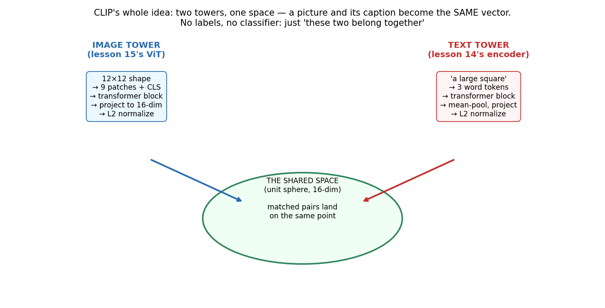
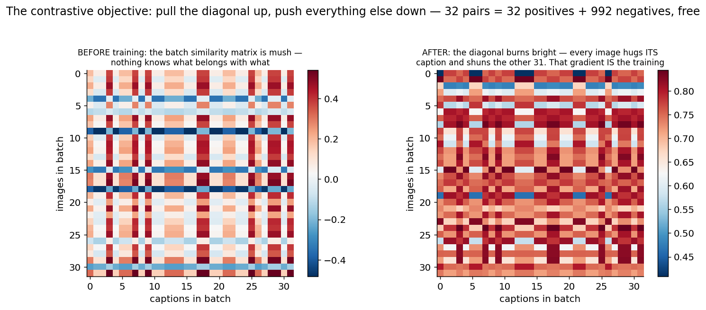
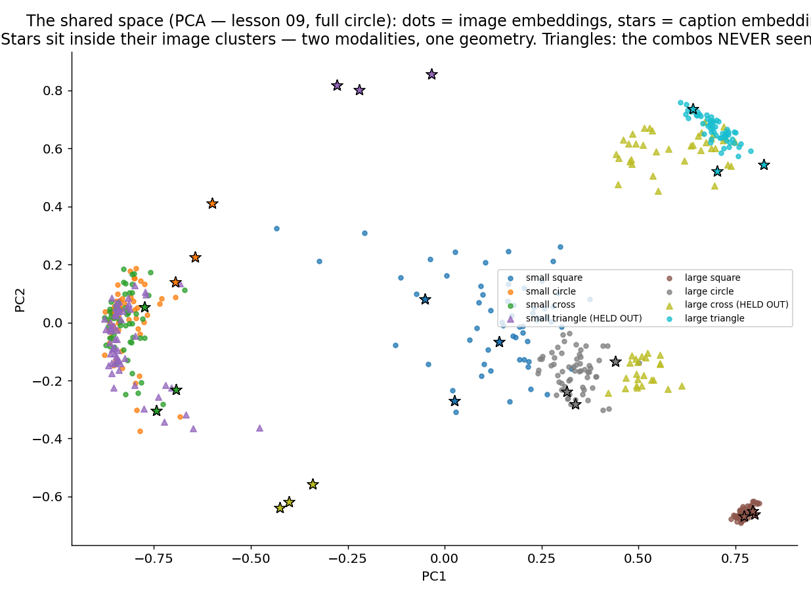
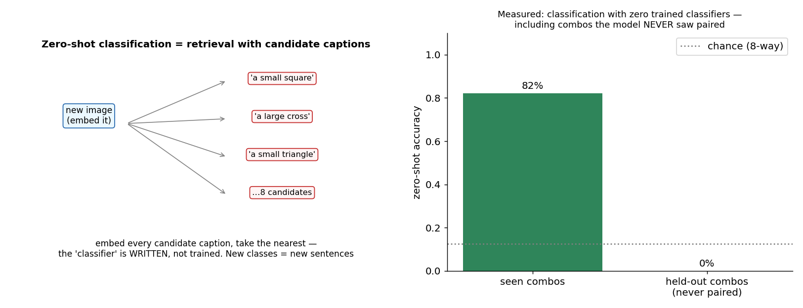
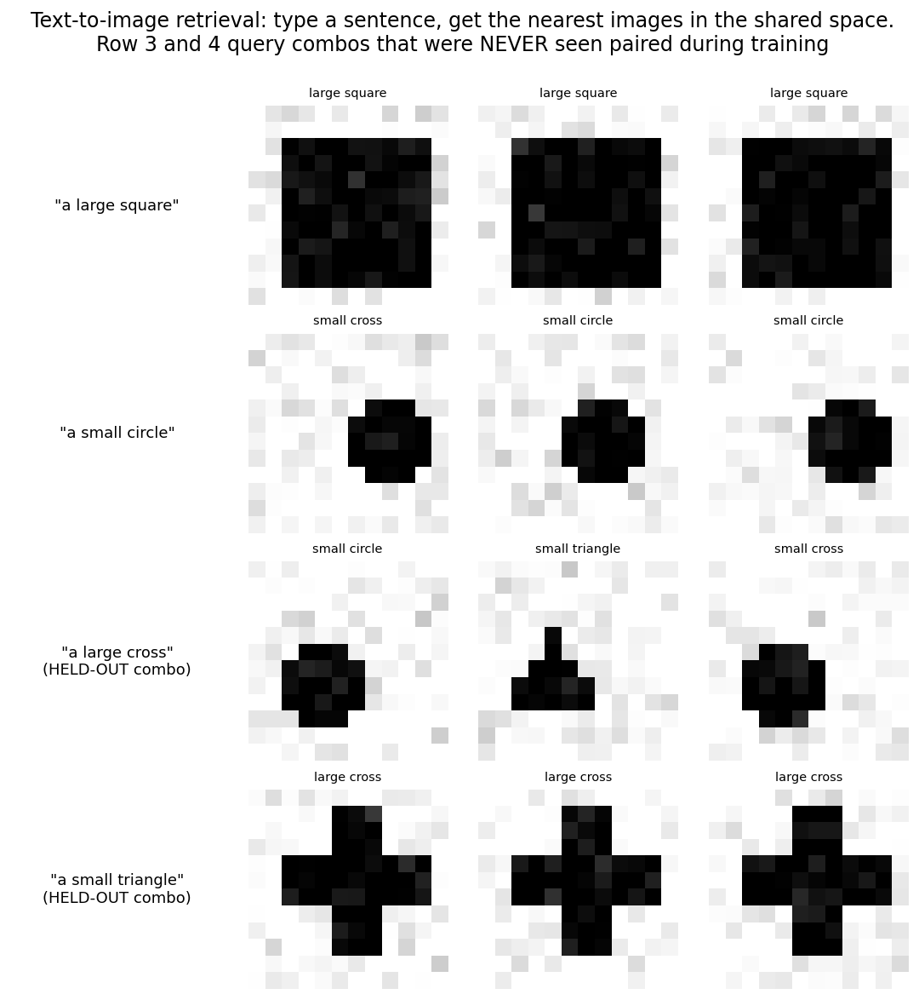

# 16 · Multimodal Learning (CLIP) — Explained From Scratch

## In one sentence

> CLIP trains two towers — an image encoder and a text encoder — with one contrastive rule ("a picture and its caption must land on the same point of a shared space"), and out falls something no classifier ever had: classification by *writing sentences*, retrieval by *typing*, and a bridge between seeing and saying that every modern multimodal system stands on.

## How to read this lesson (don't read it all at once)

| If you have… | Read | ~Time |
|---|---|---|
| 5 minutes | §0 glossary + §2 pictures | 5 min |
| 20 minutes | §0–§2, then **open the notebook** and run Blocks 1–5 | 20 min |
| The full sitting | Everything, notebook alongside | 55–70 min |
| An interview on Tuesday | §8 + §9, then §2 for the pictures | 10 min |

⏸ **Checkpoint** markers below mark natural places to stop reading and run code.

**Prerequisite:** lessons 14 and 15 — because the two towers *are* those lessons: the image tower is lesson 15's ViT, the text tower is lesson 14's encoder. This lesson adds no new architecture at all; it adds a new **objective**, and the objective does the magic. It is also the course's most honest experiment: we hold out entire (size, shape) combinations and *measure* whether compositional zero-shot emerges at miniature scale — and the answer (§2.4) is the most instructive result in the course: **it half-emerges.**

This folder contains:

| File | What it is |
|---|---|
| `README.md` | You are here |
| `assets/` | Visual explanations referenced throughout |
| `clip_from_scratch.ipynb` | Both towers + contrastive loss + zero-shot evaluation, pure NumPy; every block cites a § here |
| `clip_with_library.ipynb` | Internal verification, the result in context, and the real-CLIP translation |
| `data/pairs_train.csv` / `data/pairs_test.csv` | 2,700 training (image, caption) pairs over 6 combos; test pairs for seen combos AND the two held-out combos |

**The dataset:** 12×12 images of {square, circle, cross, triangle} × {small, large}, each paired with a templated caption ("a large square", "the small circle", …). Two combos — **large cross** and **small triangle** — are *never paired during training*: every word appears (large squares exist; small crosses exist), but the combinations don't. They are the compositional exam.

---

## §0 · Words before formulas

Inherited: **both towers' entire vocabularies (lessons 14–15), cosine similarity (lesson 01's dot product on unit vectors), softmax + the (guess − truth) miracle, PCA (lesson 09 — it returns for the finale)**. The new vocabulary:

| Term | Plain meaning | In our shapes |
|---|---|---|
| **Modality** | A kind of data with its own adapter: pixels, words, audio… | Two here: 12×12 images and 3-word captions |
| **Shared embedding space** | One vector space both towers map into — the lesson's protagonist | A 16-dim unit sphere where "a large square" and *pictures of* large squares coincide |
| **Contrastive learning** | Train on "these belong together / those don't" — no labels, no classifier | Each batch: 128 true pairs + 16,256 wrong pairings, free |
| **InfoNCE loss** | The contrastive loss: softmax over similarities, cross-entropy toward the true partner, both directions | The diagonal of the similarity matrix vs everything else (§2.2) |
| **Temperature (learnable)** | A learned sharpness for the similarity softmax (CLIP's `logit_scale`) | Ours trains itself from 14.3 to 13.4 |
| **Zero-shot classification** | Classify by embedding candidate *captions* and taking the nearest — the classifier is *written*, not trained | 8 sentences = an 8-way classifier, instantly |
| **Compositional generalization** | Handling combinations never seen, from parts that were | The held-out exam: "large" seen, "cross" seen, "large cross" never |
| **Alignment (of modalities)** | The degree to which the two towers' outputs share geometry | Fig 03: caption stars sitting inside image dot-clusters |

---

## §1 · What does this model assume about the world?

> "Seeing and saying can share one geometry: if two encoders are forced to agree on *what goes with what*, the meaning common to a picture and its description will precipitate into a **shared space** — and that space, not any classifier, becomes the product."

Note what's absent: labels. Nobody defines classes; the supervision is co-occurrence — this caption came with this image. That's why the recipe scaled to 400 million internet pairs (CLIP, 2021): captioned images are lying around, labeled datasets are not. The bet is that *pairing pressure alone* organizes both modalities — and once it does, everything downstream is geometry: classification is nearest-caption, retrieval is nearest-neighbor, and (one lesson later) generation is conditioning on the shared space.

**When this belief fits:** abundant naturally-paired data; open-vocabulary tasks (the class list isn't fixed in advance); building blocks for multimodal systems.
**When this belief breaks:** when pairs are scarce or noisy-beyond-signal; when fine-grained distinctions never vary *within* the pairing data (§6); and — our own measured finding — when you expect full compositionality without the scale that buys it (§2.4).

**Real-world examples:**
- CLIP itself: zero-shot ImageNet classification from captions alone — the result that reset computer vision
- Text-to-image search everywhere ("photos of my dog at the beach")
- The conditioning backbone of image *generation* (diffusion models steer by CLIP-style text embeddings)
- Modern multimodal LLMs: an image tower aligned to a language model's space — this lesson's diagram with a bigger right tower (lesson 17)

---

## §2 · The intuition, in five pictures

### 2.1 Two towers, one space

Left tower: lesson 15's ViT, reading pixels. Right tower: lesson 14's encoder, reading words. Each ends by projecting to 16 dimensions and **L2-normalizing** — every embedding lives on a unit sphere, so similarity is a plain dot product (lesson 01's oldest tool, closing the loop). The training rule is one sentence: *matched pairs must coincide; mismatched pairs must not.* No architecture is new; the objective is the entire lesson.

### 2.2 The contrastive matrix: one diagonal against the world

Take a batch of 32 pairs. Embed all images, all captions; the 32×32 dot-product matrix scores every image against every caption. The true pairs are the **diagonal**. The loss (InfoNCE): softmax each row and column, cross-entropy toward the diagonal — "your caption must beat the other 31," in both directions. Before training: mush. After: the diagonal burns. And notice the economics that made CLIP scale: a batch of N pairs supplies N positives and N²−N negatives *for free* — no negative mining, just the batch arguing with itself.

### 2.3 The shared space, seen with lesson 09's eyes

PCA — the course's own tool from lesson 09, returning for the finale — projects both modalities' embeddings to 2D. Dots are images, stars are captions: **the stars sit inside their image clusters.** Two encoders that share no weights, reading data types that share no format, have agreed on one geometry, because agreement was the only way to satisfy the diagonal. The triangles are the held-out combos — where the exam (§2.4) happens.

### 2.4 Zero-shot — and the most instructive result in the course

Zero-shot classification = retrieval with written candidates: embed eight sentences, classify each image by its nearest. On **seen** combos (fresh images): **82%**, eight-way, with *zero trained classifiers* — the class list is prose, editable at will. Then the compositional exam, and the honest headline:

**Held-out combos score 0% — and the failure is half a success.** The confusion table is the finding: 'large cross' images are predicted as "large *triangle*" (37/60) or "large *circle*" (23/60); 'small triangle' as "small *cross*" (38/60) or "small *circle*" (22/60). Read it as two attributes: **size transferred perfectly — 120/120 — to combinations never seen; shape transferred not at all** (novel-shape-at-novel-size images get absorbed into the nearest seen shape cluster, and since the model confidently picks right-size-wrong-shape captions, it lands *below* chance). Composition **half-emerged**: the simple, near-linear attribute factorized; the complex one didn't. That is the honest miniature of the CLIP story — compositional magic is real, and it is *purchased with scale*; at 2,700 pairs the space learned "large" as a direction but not "cross-ness independent of size." We report the 0%, the 100%, and the mechanism, because that's what the data said.

### 2.5 Type a sentence, get pictures

The other gift of the shared space: text-to-image retrieval. Type "a small circle," take the nearest image embeddings — search with no index, no tags, no engineering beyond the space itself. Rows 3–4 query the held-out combos and retrieve right-size, wrong-shape neighbors: §2.4's finding, visible as pictures.

> ⏸ **Checkpoint 1** — Open `clip_from_scratch.ipynb`, run Blocks 1–5: the pairs, the two towers (watch how little code they take — they're imports from your own past), and the loss whose gradient you can guess before deriving it.

---

## §3 · Now the math — one objective, and geometry does the rest

### 3.1 Two encoders, one sphere

$$e_I = \frac{f_{\text{ViT}}(\text{image})\,W_I}{\lVert \cdot \rVert} \qquad e_T = \frac{f_{\text{enc}}(\text{caption})\,W_T}{\lVert \cdot \rVert} \qquad \text{sim}(I, T) = e_I \cdot e_T$$

Read aloud: "each tower's output, projected and normalized to unit length; similarity is the dot product" — which on unit vectors *is* cosine similarity, bounded in [−1, 1]. The normalization's backward pass is the last derivative variation of the course, and it's family: d(x/‖x‖) = (d − (d·x̂)x̂)/‖x‖ — the same subtract-the-projection shape as LayerNorm's (lesson 14 §3.2), for the same reason (the norm depends on every coordinate).

### 3.2 The InfoNCE loss

$$\text{logits} = e^{\tau} \cdot E_I E_T^\top \qquad L = \tfrac{1}{2}\Big[\text{CE}(\text{rows} \to \text{diag}) + \text{CE}(\text{cols} \to \text{diag})\Big]$$

Read aloud: "scale the batch similarity matrix by a *learned* temperature, then demand — via ordinary softmax cross-entropy, both directions — that every image ranks its own caption first and every caption ranks its own image first." And the gradient at the logits? **(softmax − identity)** — the (guess − truth) miracle's **fifth and final appearance**, now in matrix form: pull the diagonal, push the rest, weighted by how wrong each cell is. You could have derived it before reading.

### 3.3 The temperature, learned

CLIP makes τ a parameter (initialized to ln(1/0.07)). Too cold: all similarities look alike, gradients mush. Too hot: softmax saturates on the current best guess — lesson 13 §3.3's disease, tunable. Making it learnable lets the model anneal its own contrast; ours drifts 14.3 → 13.4 and the gradient check covers it like any other weight.

### 3.4 What we did NOT add

No classifier head. No class list. No new blocks. The entire lesson's parameters: two towers you already built, two projection matrices, one scalar — 19,297 parameters total. The objective did the rest. That economy is the point.

> ⏸ **Checkpoint 2** — Run Blocks 6–9: training (watch the diagonal emerge), class-level retrieval, and the zero-shot exam with the half-emerged composition finding. Block 9's confusion analysis is the lesson's crown jewel — read it slowly.

---

## §4 · Every knob, and what happens if you turn it wrong

| Knob | What it controls | Too low / wrong | Too high / wrong |
|---|---|---|---|
| **Batch size** | How many negatives each pair argues against | Small batches: few negatives, weak pressure, sloppy space (real CLIP used 32,768 for this reason) | Memory; the N×N matrix grows quadratically |
| **Temperature (τ)** | Contrast sharpness (§3.3) | Frozen-cold: mushy gradients | Frozen-hot: saturation. Learnable (ours) sidesteps the guess |
| **Shared dim (E)** | The space's capacity | Too small: classes forced to overlap | Wasteful; and similarity concentration in high-dim needs the normalization even more |
| **Caption diversity** | What the text tower must generalize over | One fixed template: the tower memorizes strings, not words | (More templates/synonyms = better; real CLIP's prompt-ensembling exists for this) |
| **Pair coverage** | Which combinations the space ever sees co-varying | **Our measured lesson: attributes that never vary independently in the data don't factorize** — shape didn't survive a size change (§2.4) | — |
| **Tower capacity/training** | Lessons 14–15's knobs | — | — |

---

## §5 · Reading the results

| Artifact | What it is | Gotcha |
|---|---|---|
| **The loss vs ITS floor** | Contrastive loss can't reach 0 when same-class pairs are interchangeable: with ~21 same-combo pairs per 128-batch, the floor is ≈ ln(21) ≈ 3.0; ours lands at 3.2 | Lesson 14's floor discipline, contrastive edition: know what your loss *can't* go below before calling training stuck |
| **Class-level retrieval** | Whether the retrieved caption *describes* the image (84% / 67%) | Pair-level top-1 is meaningless here BY DESIGN — captions describe combos, not instances; grading exact pairs punishes the model for the data's own interchangeability. Choose metrics the data can support |
| **Zero-shot, sliced** | Seen: 82%. Held-out: 0% overall — but 100% on size, 0% on shape (§2.4) | An aggregate 0% hid a perfect 100%; slice by attribute before writing the headline (the course's oldest evaluation lesson, sharpest instance) |
| **The confusion table** | WHERE wrong predictions land — the mechanism, not just the rate | Below-chance ≠ random: it means *systematic* misassignment, which is information |
| **The PCA picture (fig 03)** | Cross-modal alignment, visible | Two towers, disjoint weights, one geometry — the qualitative check that the objective worked |

---

## §6 · When NOT to use it (and how to notice)

- **Attributes that never vary independently in your pairs.** Our shape didn't survive a size it was never paired with (§2.4). If your data never shows X varying while Y holds, the space will not factorize them — at any scale, though scale buys a lot. Symptom: zero-shot failing precisely on novel combinations. Fix: coverage, augmentation, or accept the limit.
- **Fine-grained distinctions the captions don't make.** Contrastive pressure only separates what the pairing distinguishes; if no caption ever says which of two similar species is which, the space won't know. (Real CLIP is famously weaker on fine-grained and counting tasks for exactly this reason.)
- **Small pair budgets with big expectations.** 2,700 pairs bought us 82% seen zero-shot and half a composition; the magic headlines needed 400M. Symptom: our Block 9.
- **Instance-level tasks graded pair-level.** §5's metric trap: if captions are class-level, pair-level retrieval is unanswerable by design.
- **Anything requiring calibrated "none of the above."** Nearest-caption always answers (softmax's old habit, lesson 14 §5); open-set rejection needs additions the objective doesn't provide.

---

## §7 · Map: README → notebook

| Notebook block | Implements |
|---|---|
| Block 2 — pairs + the held-out exam declared | §1 (the compositional stakes, upfront) |
| Block 3 — the two towers (imports from your past) | §3.1 (and §3.4's economy) |
| Block 4 — the sphere: projection + normalization (+ its LN-family backward) | §3.1 |
| Block 5 — InfoNCE + the miracle's fifth appearance | §3.2–3.3 |
| Block 6 — grad checks (tower, embedding, temperature) + training | §3.2 (watch the diagonal emerge) |
| Block 7 — the loss floor computed + class-level retrieval | §5 (metrics the data can support) |
| Block 8 — zero-shot on seen combos: classifiers written, not trained | §2.4 first half |
| Block 9 — the compositional exam + confusion analysis | §2.4 second half (the crown jewel: 0% that's 100%+0%) |
| Block 10 — the space as an artifact + the door | §2.5 + lesson 17 |

---

## §8 · Interview prep

### The 30-second answer: "How does CLIP work?"

> "CLIP jointly trains an image encoder and a text encoder to map matched image–caption pairs to nearby points on a shared, L2-normalized embedding space, using a symmetric contrastive (InfoNCE) loss: within each batch, the N×N cosine-similarity matrix is softmaxed — with a learned temperature — and cross-entropy pulls the true pairs on the diagonal above the N²−N mismatches, in both directions. Trained on hundreds of millions of web pairs, the space enables zero-shot classification (embed candidate captions like 'a photo of a dog' and take the nearest — the classifier is written, not trained), text↔image retrieval, and conditioning for generative models. Key sensitivities: batch size supplies the negatives, prompt wording matters, and the space only distinguishes what the pairing data made co-vary — fine-grained and compositional gaps at small scale are the known costs."

### Questions you should be able to answer

<b>Q1. Why contrastive rather than a classifier or caption-prediction loss?</b>

Classifiers need a fixed label set and can't open the vocabulary; captioning (predicting exact words) spends capacity on phrasing. Contrastive pairing needs only "these co-occurred" — the supervision the internet gives away — scales with batch-supplied negatives at no labeling cost, and directly optimizes the retrieval geometry you'll actually use (§1, §2.2). (CLIP's paper tried captioning first; contrastive trained far more efficiently.)

<b>Q2. Walk through InfoNCE and its gradient.</b>

Batch of N pairs → N×N similarity logits (cosine × e^τ). Row-wise softmax + CE toward the diagonal (each image must rank its caption first), same column-wise, average both (§3.2). Gradient at the logits: (softmax − I)/N per direction — the (guess − truth) form, matrix edition: diagonal pulled up, off-diagonal pushed down in proportion to how tempting each wrong pairing currently is.

<b>Q3. Why L2-normalize the embeddings? Why a learnable temperature?</b>

Normalization makes similarity pure direction (cosine), preventing the towers from cheating the softmax with magnitude and keeping both modalities on one comparable sphere (§3.1). The temperature sets softmax contrast: too soft, no gradient signal; too sharp, saturation (lesson 13's √d disease, tunable) — learning it lets the model anneal its own sharpness (§3.3).

<b>Q4. What does zero-shot classification actually do at inference?</b>

Embed K candidate captions ("a photo of a {class}", often ensembled over prompts), embed the image, take the argmax cosine (§2.4). No training, no head — edit the sentence list and you've edited the classifier. Its accuracy inherits everything about the space: prompt wording sensitivity, and blindness to distinctions the pairing data never made (§6).

<b>Q5. Your held-out combos scored 0% — worse than chance. Interpret.</b>

Below-chance means *systematic*, not random, error — and slicing found it: size transferred 120/120 while shape transferred 0 (§2.4). The space factorized one attribute and not the other, so the model confidently chose right-size-wrong-shape captions. Two portable lessons: (a) aggregate scores can hide a perfect sub-skill — slice by attribute; (b) compositional generalization isn't free — it emerges with coverage and scale, and our 2,700 pairs bought exactly half of it.

<b>Q6. How does CLIP connect to image generation and multimodal LLMs?</b>

The shared space is an *interface*: diffusion models condition generation on CLIP-style text embeddings ("make an image whose embedding matches this sentence"), and multimodal LLMs bolt an image tower onto a language model — project the image embedding into the LM's token space and the text engine can attend to sight (lesson 17). Alignment first; everything else plugs into it.

---

## §9 · Common mistakes (the learner's failure modes, not the model's)

1. **Grading pair-level when captions are class-level.** Our first retrieval numbers looked broken (1–2%) until the metric matched the data (§5). Ask what the labels *can* distinguish before scoring.
2. **Calling loss 3.2 a failure** without computing the ln(same-class-per-batch) floor (§5). Lesson 14's discipline transfers to every loss you'll ever read.
3. **Reporting the aggregate 0% without the slice.** The size/shape split was the entire finding (§2.4); headline metrics hide mechanisms.
4. **Tiny batches** "to iterate faster" — you're deleting the negatives, which are the supervision (§4).
5. **One caption template.** The text tower memorizes the string; synonyms and paraphrases are what force *word*-level meaning (§4).
6. **Expecting composition your pairs never demonstrated.** If X never varied while Y held, the space won't factorize them — plan coverage, or plan scale, or plan disappointment (§6).

---

**Next:** `17-modern-llm-concepts/` — the finale: everything after pretraining. Instruction tuning, RLHF's core idea, sampling strategies, scaling laws, in-context learning, and honest words about hallucination — the concepts, built on seventeen lessons of machinery you now own.
