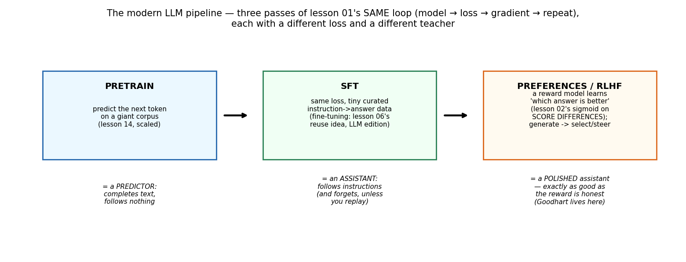
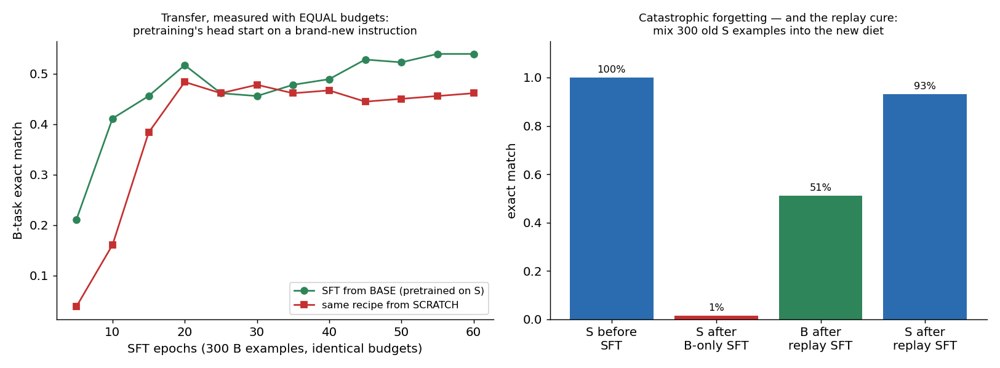
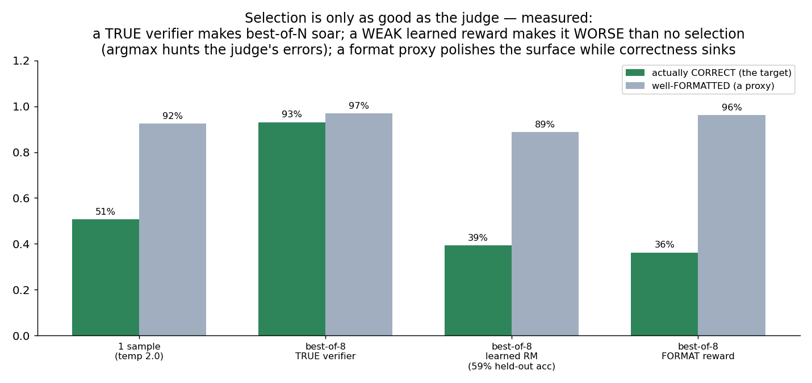
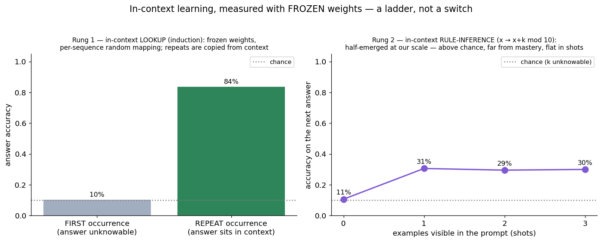
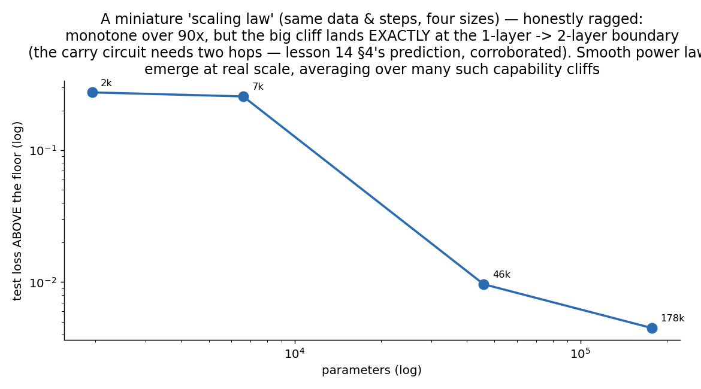

# 17 · Modern LLM Concepts — Explained From Scratch (The Finale)

## In one sentence

> Everything between lesson 14's pretrained predictor and the assistant you talk to — instruction tuning, preference learning, reward optimization, sampling, in-context learning, scaling — is lesson 01's same loop (model → loss → gradient → repeat) run again with different losses and different teachers; this finale builds a miniature of every stage and **measures** what each one actually buys, including the ways it goes wrong.

## How to read this lesson (don't read it all at once)

| If you have… | Read | ~Time |
|---|---|---|
| 5 minutes | §0 glossary + §2 pictures | 6 min |
| 25 minutes | §0–§2, then **open the notebook** and run Blocks 1–5 | 25 min |
| The full sitting | Everything, notebook alongside | 70–90 min |
| An interview on Tuesday | §8 + §9, then §2 for the pictures | 12 min |

⏸ **Checkpoint** markers below mark natural places to stop reading and run code.

**Prerequisite:** lesson 14 (the engine — reused here to spawn *nine different models*), and honestly, the whole course: this lesson spends seventeen folders of accumulated machinery. Its method is the course's method at maximum intensity: **every concept that is usually hand-waved gets a miniature you can run, and every claim is a measurement.**

This folder contains:

| File | What it is |
|---|---|
| `README.md` | You are here |
| `assets/` | Visual explanations referenced throughout |
| `llm_concepts_from_scratch.ipynb` | The pipeline, built live: pretrain → SFT (+forgetting, +replay) → reward model → best-of-N (+Goodhart) → sampling → ICL → calibration — pure NumPy |
| `llm_concepts_with_library.ipynb` | Verifications, the scale ledger, and the real-pipeline translation |
| `data/pretrain_S.csv`, `data/sft_B.csv` | The two-instruction world: 8,000 pretraining sequences, 300 instruction-tuning sequences |
| `data/icl_sequences.csv`, `data/icl_results.csv`, `data/scale_results.csv` | ICL corpus sample + results of the two long-running experiments (generating code included; budgets noted) |

**The vehicle:** a two-instruction language. `"S47+05=052;"` means *sum* (lesson 14's task, with a task-prefix token); `"B47+05=047;"` means *bigger* (output max(a,b)). Pretraining sees only S. The B instruction then plays the role of "a new thing we ask the model to do" — so instruction tuning, forgetting, transfer, and reward optimization all become exactly gradeable, in the course's oldest tradition.

---

## §0 · Words before formulas

Inherited: **everything in lesson 14** (next-token loss, temperature, autoregressive sampling, loss floors) plus lesson 02's sigmoid, lesson 06's fine-tuning idea. The new vocabulary:

| Term | Plain meaning | In our miniature |
|---|---|---|
| **Base model** | The raw next-token predictor after pretraining — completes text, follows nothing | Trained on S only: 100% at sums, 2.8% when shown the unfamiliar B instruction |
| **SFT (supervised fine-tuning)** | Same next-token loss, tiny curated instruction→answer data | 300 B examples turn the predictor toward a new instruction |
| **Catastrophic forgetting** | New-task gradients overwrite old skills | S: 100% → **1.5%** after B-only SFT |
| **Replay / data mixing** | Keep old data in the new diet | 300 S examples mixed back in: S recovers to 93% |
| **Reward model (RM)** | A network scoring "how good is this answer," trained on *preferences* (pairs: chosen vs rejected) | A small encoder → scalar; Bradley-Terry loss = lesson 02's sigmoid on score *differences* |
| **Best-of-N (BoN)** | Sample N answers, keep the RM's favorite — reward optimization in its simplest form | N=8; the lesson's biggest honest result lives here (§2.3) |
| **Goodhart's law** | Optimize a proxy hard enough and it stops tracking the target | Measured three ways in fig 03 |
| **RLHF (concept)** | Push the *generator's weights* toward high reward (BoN selects; RLHF internalizes) — with a KL leash to the base model to limit reward-hacking | Discussed honestly; BoN is our measurable stand-in |
| **Top-k / top-p (nucleus)** | Sampling restricted to the k most probable / the smallest set covering probability p | Implemented and measured against greedy and temperature |
| **In-context learning (ICL)** | Behavior adapting to prompt examples with **frozen weights** | Two rungs, both measured (§2.4) |
| **Induction head** | The attention circuit that finds "last time this token appeared, what followed?" | The mechanism behind our rung-1 result |
| **Scaling law** | Loss falls predictably as a power of size/data/compute | Our four-model miniature — with an honest cliff (§2.5) |
| **Hallucination** | Fluent, confident, wrong — the failure mode softmax guarantees when asked beyond its knowledge | Lesson 14's demo, now with calibration measured |
| **Calibration** | Does stated confidence track actual correctness? | The model's own probability, split by right/wrong answers |

---

## §1 · What does this stage of the world assume?

> "A pretrained predictor already *contains* most of what an assistant needs; the pipeline's later stages don't add knowledge so much as **select and steer** — with small data, learned judges, and sampling-time choices. Each stage is only as good as its teacher."

That belief has three measurable corollaries, and the notebook tests all of them. (1) *Transfer*: if pretraining built reusable machinery, SFT from the base should beat SFT from scratch at equal budgets — it does, at every checkpoint (§2.2). (2) *Fragility*: if SFT merely steers, it can also overwrite — it does: 100% → 1.5% (§2.2). (3) *Judge-dependence*: if later stages select rather than know, then a flawed judge doesn't just cap the gains, it can make things **worse than no optimization at all** — it does, and this is the finale's crown jewel (§2.3).

**Real-world examples:**
- Every chat assistant: pretrain → SFT → preference optimization (RLHF/DPO variants) — fig 01's three boxes at planetary scale
- Replay/data-mixing in every serious fine-tune, for exactly our forgetting reason
- Best-of-N with verifiers and reward models in production reasoning systems
- Few-shot prompting as deployed ICL; scaling laws as the industry's planning tool

---

## §2 · The intuition, in five pictures

### 2.1 The pipeline is one loop, three times

Pretraining (lesson 14, scaled): next-token loss on a giant corpus → a *predictor*. SFT: **the identical loss** on a tiny curated set → an *assistant* (that forgets unless you replay). Preferences: a reward model — lesson 02's sigmoid, reborn on score differences — then generate-and-select (BoN) or generate-and-steer (RLHF) → a *polished* assistant, exactly as good as the reward is honest. Nothing in the pipeline is architecturally new; every box is a loss you have already derived. The base model's own numbers set the stage: trained only on S it scores **100%** at sums while the B instruction — three tokens different — gets **2.8%**: a predictor completes what it knows; it does not "follow."

### 2.2 SFT: transfer measured fairly, forgetting measured honestly

The transfer claim demands equal budgets (an earlier draft of this experiment gave the two runs different epochs and got the story *backwards* — the fix is the lesson): identical data, epochs, learning rate, batch, seed; only the starting point differs. Measured: from **base** reaches 21% after 5 epochs and 54% at 60; from **scratch**: 4% and 46%. Pretraining's machinery (digit embeddings, format circuits, the answer template) transfers to an instruction it never saw — faster at every checkpoint, higher at the end. Then the other edge: after B-only SFT, the S skill collapses **100% → 1.5%** — catastrophic forgetting, live. The cure is almost embarrassingly simple: mix 300 old S examples into the new diet → **B 51% / S 93%**. Every production fine-tune you'll ever run wants this slide.

### 2.3 The crown jewel: selection is only as good as the judge

Sample 8 answers per prompt (τ=2.0, deliberately noisy: one sample alone is 51% correct) and let a judge pick. Four judges, measured:

| Judge | Correct | Well-formatted |
|---|---|---|
| No selection (1 sample) | 51% | 92% |
| Best-of-8, **true verifier** | **93%** | 97% |
| Best-of-8, **learned RM** (59% held-out accuracy on the policy's own samples) | **39%** | 89% |
| Best-of-8, **format-only reward** | 36% | **96%** |

Three lessons in one figure. The *oracle* row: the potential is real — correct answers exist among the samples, and a true verifier harvests them (this is why verifiable domains like code and math respond so well to reward optimization). The *learned-RM* row is the shock: its pairwise accuracy is above chance, yet best-of-8 under it scores **worse than picking blindly** — because argmax-of-8 doesn't sample the judge's average opinion, it hunts the judge's most-confident opinion, and a weak judge's most-confident opinions are where its errors concentrate. Optimization pressure *amplifies* proxy error. The *format-reward* row is Goodhart classic: the proxy (formatting) improves to 96% while the target (correctness) sinks. Now scale the intuition: RLHF pushes weights, not just samples, toward the judge — which is why the KL leash to the base model exists, and why reward-model quality, not RL machinery, is the binding constraint in the real pipeline.

### 2.4 In-context learning: a ladder, not a switch

The weights are **frozen** in both panels; only the prompt teaches. Rung 1 — *lookup*: each sequence carries its own random digit→digit mapping; when a query repeats, the answer sits in the context. Measured: first occurrences 10.2% (chance — the mapping is unknowable, and an honest model can do no better), repeats **83.5%** — the induction-head mechanism (find the previous occurrence, copy what followed), formed by ordinary pretraining, no gradient at test time. It emerged *late* in training (57% → 62% → 84% across resumed runs) — miniature echo of the famous phase-change. Rung 2 — *rule-inference*: sequences follow x → x+k (mod 10) with k fixed per sequence; the model must infer k from examples and apply it. Measured: 10.6% at zero shots (chance, correctly), ~30% with examples — **half-emerged**: above chance, far from mastery, flat in shot count. The honest summary: ICL is a ladder — copying what the context showed arrives early; inferring latent rules is a scale-bought skill our 46k parameters only begin to climb.

### 2.5 A miniature scaling law — honestly ragged

Four model sizes, same data and steps; excess test loss above the computed floor (0.921 — four unpredictable problem digits): **0.275 → 0.256 → 0.0096 → 0.0045** across 1,952 → 177,632 parameters. Monotone over 90× — and *not* a textbook straight line: the cliff between 6.6k and 46k lands exactly at the 1-layer → 2-layer boundary, where the carry circuit's two-hop requirement (lesson 14 §4's prediction) is first satisfiable. That raggedness is the honest point: at miniature scale, individual capability cliffs dominate; the smooth power laws that guide industrial planning emerge from *averaging over thousands of such cliffs* across a giant task mixture — and the cliffs are also why "emergent abilities" headlines exist: zoom into any one skill and the curve was never smooth.

> ⏸ **Checkpoint 1** — Open `llm_concepts_from_scratch.ipynb`, run Blocks 1–5: the base model's predictor-not-assistant demo, the equal-budget SFT race, forgetting and the replay cure, and the sampling toolbox. All of it retrains live in minutes.

---

## §3 · Now the math — three small additions to everything you own

### 3.1 SFT is lesson 14's loss with a curator

$$L_{\text{SFT}} = -\tfrac{1}{|\mathcal{D}_{\text{inst}}|}\sum \log p_\theta(\text{next token})$$

Read aloud: "the same next-token loss, on data someone chose on purpose." That's the entire equation — which is the insight: the *data*, not the loss, is the teacher. (Real pipelines often mask the loss to the answer tokens only; our sequences are short enough to skip that refinement, and the notebook says so.)

### 3.2 Bradley–Terry: lesson 02's sigmoid, reborn on differences

$$P(\text{A preferred over B}) = \sigma\big(r_\theta(A) - r_\theta(B)\big) \qquad L_{\text{RM}} = -\log \sigma\big(r_\theta(\text{chosen}) - r_\theta(\text{rejected})\big)$$

Read aloud: "the probability the judge prefers A is the sigmoid of the score *gap*; train by making chosen answers outscore rejected ones." The gradient is (guess − truth) on the preference — the miracle's spirit, one last time — pushed through both scores with opposite signs. Ranking supervision, not absolute grades, because humans are far more reliable at "which is better?" than "rate this 0–100."

### 3.3 Sampling: one distribution, four spigots

Greedy: argmax (deterministic; right answer for arithmetic, repetitive for prose). Temperature: divide logits by τ (lesson 14 §4, now measured against alternatives). Top-k: renormalize over the k most probable. Top-p: renormalize over the smallest set with cumulative probability ≥ p — adaptive, the production favorite (narrow when the model is sure, wide when it isn't). Best-of-N adds an outer loop: sample N, keep the judge's favorite — at which point §2.3's economics take over. Nothing here trains; sampling is *policy at inference time*, and the notebook measures each spigot's correctness/diversity trade on the same model.

> ⏸ **Checkpoint 2** — Run Blocks 6–9: Bradley-Terry training (watch chosen scores pull above rejected), the four-judge BoN table assembling live, and the ICL ladder. Block 9 loads the two long experiments from `data/` with their generating code and budgets printed — the honest way to ship a 40-minute experiment inside a 20-minute notebook.

---

## §4 · Every knob, and what happens if you turn it wrong

| Knob | What it controls | Too low / wrong | Too high / wrong |
|---|---|---|---|
| **SFT data mix** | What's learned vs what's overwritten | No replay: catastrophic forgetting (100%→1.5%, measured) | Too much replay: the new instruction starves |
| **SFT epochs on tiny data** | Steering strength | Under-tuned instruction | Overfitting 300 examples; more forgetting |
| **RM training distribution** | Where the judge is competent | Judged only easy negatives: 89% on its diet, lost on the policy's real outputs (59%) | — |
| **N in best-of-N** | Optimization pressure on the judge | N=1: no selection benefit | Large N with a weak judge: *actively worse* (§2.3) — pressure amplifies proxy error |
| **Temperature / top-k / top-p** | Exploration vs fidelity | τ→0 everywhere: no diversity, BoN has nothing to select from | High τ unfiltered: manufactured errors (lesson 14, remeasured here) |
| **KL leash (RLHF)** | How far reward can drag the policy from the base | Too tight: nothing improves | Too loose: reward hacking — §2.3's dynamics, internalized into weights |
| **Model scale** | Which capabilities are affordable | Below a circuit's requirement: cliffs, not gradients (our 1-layer models and carries) | Cost; and scale without eval discipline hides §2.3-style failures |

---

## §5 · Reading the results

| Artifact | What it is | Gotcha |
|---|---|---|
| **Equal-budget comparisons** | The *only* fair transfer claim (§2.2) | Our own first draft got the story backwards on unequal budgets — the fix is the standard |
| **Held-out RM accuracy on the policy's own samples** | The judge's competence where it will actually be used | 89% on constructed negatives coexisted with 59% on real ones — evaluate the judge on the distribution it will judge |
| **Oracle/verifier ceilings** | What selection *could* harvest | The gap between oracle (93%) and learned-RM (39%) is the reward-modeling problem, quantified |
| **Chance-level entries that SHOULD be chance** | First occurrences 10.2%, zero-shot k 10.6% | These are correctness checks, not failures — an honest model can't know the unknowable |
| **Loss floors, everywhere** | Base 0.9235 vs floor 0.9210; induction 0.996 vs ≈0.988 | The discipline from lessons 14/16, now habitual: compute what loss *can't* go below, then judge |
| **Calibration split (Block 10)** | The model's own confidence, right vs wrong answers | Overlap means confidence ≠ truth — the mechanical seed of hallucination at every scale |

---

## §6 · When NOT to trust each stage (and how to notice)

- **SFT without replay** whenever the old capabilities matter. Symptom: the new skill arrives and support tickets about old skills spike. Our numbers: 1.5% remaining.
- **Reward optimization without judge validation on-policy.** Symptom: reward goes up, human evaluations don't — §2.3's 39% row, scaled. Validate the RM on the model's own outputs, and re-validate as the policy shifts.
- **Best-of-N (or RL) cranked against any unverified proxy** — format, length, style, benchmark idiosyncrasies. The proxy will improve; check the target independently.
- **Prompt-taught behavior assumed robust.** ICL is a ladder (§2.4): lookup is reliable; latent-rule inference degrades quietly with task complexity and our measurements show the middle rungs are shaky at small scale.
- **Scaling extrapolation across capability cliffs.** Smooth aggregate curves coexist with per-skill jumps (§2.5); plan with laws, verify with skill-level evals.
- **Any fluent output treated as knowledge.** Calibration (Block 10) is the tell: when confidence-when-wrong overlaps confidence-when-right, fluency is format, not truth — lesson 14's warning, now with a measurement attached.

---

## §7 · Map: README → notebook

| Notebook block | Implements |
|---|---|
| Block 2 — the two-instruction world + base model: predictor, not assistant | §1, §2.1 |
| Block 3 — SFT: the equal-budget race | §2.2, §3.1 |
| Block 4 — forgetting + the replay cure | §2.2 |
| Block 5 — the sampling toolbox (greedy/τ/top-k/top-p), measured | §3.3 |
| Block 6 — the reward model: Bradley-Terry live | §3.2 |
| Block 7 — best-of-N, four judges: the Goodhart table assembles | §2.3 |
| Block 8 — ICL rung 1 live (induction eval) | §2.4 |
| Block 9 — ICL rung 2 + the scaling curve (from `data/`, code + budgets shown) | §2.4–2.5 |
| Block 10 — calibration & hallucination + the course's closing block | §5, §6 |

---

## §8 · Interview prep

### The 30-second answer: "How does a raw language model become an assistant like ChatGPT?"

> "Three stages. Pretraining: a decoder-only transformer learns next-token prediction on a huge corpus — that builds the capabilities but yields a text-completer, not an instruction-follower. Supervised fine-tuning: the same loss on a small curated set of instruction–response pairs steers it into assistant behavior — cheaply, because pretraining transfers, but with catastrophic forgetting as the standard risk, managed by mixing in replay data. Preference optimization: humans rank candidate responses; a reward model learns those rankings via a Bradley–Terry loss (sigmoid of score differences); then the policy is optimized against that reward — RLHF with a KL penalty keeping it near the base model, or direct methods like DPO — and the binding constraint is reward-model quality: optimization pressure amplifies any gap between the learned reward and what you actually want (Goodhart), which is why over-optimization degrades real quality even as measured reward climbs. Inference-time choices — temperature, nucleus sampling, best-of-N with verifiers — then trade fidelity, diversity, and compute."

### Questions you should be able to answer

<b>Q1. Why does SFT work with so little data, and what's its failure mode?</b>

Because it steers rather than teaches: pretraining already built the machinery (our measurement: from-base beats from-scratch at every equal-budget checkpoint, 21% vs 4% at five epochs), so SFT mostly redirects existing circuits at a new format/instruction. The failure mode is the same fact's dark side: gradients on the new data overwrite old behavior — catastrophic forgetting (100%→1.5% measured) — mitigated by replay/mixing, lower LRs, or parameter-efficient methods (LoRA-style adapters) that touch fewer weights.

<b>Q2. Walk through the reward model's loss and why preferences beat ratings.</b>

Bradley–Terry: P(chosen ≻ rejected) = σ(r(chosen) − r(rejected)); minimize −log of that (§3.2) — logistic regression on score *gaps*, so only differences matter and the scale is free. Preferences because human absolute ratings are noisy and drift across raters/sessions, while "which of these two is better" is comparatively stable — and pairwise data is exactly what the loss consumes.

<b>Q3. Explain Goodhart's law in the RLHF context, with a concrete mechanism.</b>

The reward model is a proxy for human intent; optimization (BoN's argmax, RL's gradient) doesn't sample the proxy's average opinion — it seeks the proxy's *extremes*, where its errors concentrate. Our measurement: an RM with 59% held-out accuracy on-policy turned best-of-8 into 39% correct — below the 51% no-selection baseline — while a true verifier reached 93%; a format-only reward pushed format up and correctness down (§2.3). Real-pipeline mitigations: KL penalty to the base, early stopping on *human* eval not reward, RM ensembles/re-training as the policy shifts, and preferring verifiable rewards where they exist.

<b>Q4. What is in-context learning, mechanically?</b>

Behavior conditioning on prompt examples with frozen weights — the forward pass itself implements a small learning algorithm. The best-understood circuit is the induction head: attention that locates the previous occurrence of the current token and copies its successor (our rung 1: repeats 83.5% vs first-occurrences at chance, with the mechanism's characteristic late emergence during training). Beyond lookup, models infer latent rules from examples — a capability that strengthens with scale (our rung 2: half-emerged at 46k parameters).

<b>Q5. Compare greedy, temperature, top-k, top-p, and best-of-N.</b>

Greedy: argmax — deterministic, ideal for single-answer tasks, degenerate/repetitive for open text. Temperature: rescales the whole distribution — global entropy knob; high τ manufactures errors on factual content (measured in lesson 14 and re-measured here). Top-k: fixed-size truncation — simple, but k is wrong somewhere (too wide when confident, too narrow when uncertain). Top-p: probability-mass truncation — adapts set size to the model's certainty; the production default. Best-of-N: sample with diversity, select with a judge — inherits §2.3's economics entirely: superb with verifiers, dangerous with weak proxies.

<b>Q6. What do scaling laws say, and what do they hide?</b>

Aggregate loss falls as a power law in parameters/data/compute (with compute-optimal ratios between them — the Chinchilla insight), reliably enough to plan billion-dollar training runs by extrapolation. What the smooth line hides: per-capability cliffs — individual skills arrive abruptly when the required circuit first fits (our miniature: excess loss 0.256 → 0.0096 exactly at the 1→2-layer boundary, where carries become computable). Aggregate-smooth, skill-jumpy — both true, and the second is why "emergence" debates exist.

---

## §9 · Common mistakes (the learner's failure modes, not the model's)

1. **Comparing fine-tuning strategies on unequal budgets.** Our own first draft did, and concluded the *opposite* of the truth (§5). Fix budgets first; only then read curves.
2. **Validating a reward model on constructed negatives.** 89% there meant 59% where it counted (§2.3). Judge the judge on-policy.
3. **Assuming more selection pressure is monotonically good.** Best-of-N below the no-selection baseline is not a paradox; it's what weak judges do under argmax (§2.3).
4. **Fine-tuning without replay** and discovering forgetting in production (§2.2).
5. **Reading a chance-level score as failure** when the quantity is unknowable (first occurrences, zero-shot k). Compute what's knowable before grading (§5).
6. **Extrapolating one skill from the aggregate scaling curve** — or one model's cliff to another's (§2.5).
7. **Treating confidence as evidence.** Block 10's calibration split is the two-minute check that should precede trusting any generative output.

---

## The course, closed

Seventeen lessons ago, this repository opened with a straight line: w·x + b, a loss, a gradient, a loop. That loop never changed. It fit spirals (02), grew trees (04–08), found clusters and directions with no labels at all (09), bent through hidden layers (10), looked at images (11), remembered (12), attended (13), assembled into the transformer (14), took over vision (15), bridged seeing and saying (16), and — today — was run three times over with three different teachers to make a predictor into something you can instruct, judge, and steer (17). Along the way, five losses turned out to hide the same gradient (guess − truth), and one habit turned out to matter more than any architecture: **compute what the numbers can and cannot say before believing them** — floors before loss curves, slices before headlines, equal budgets before comparisons, on-policy validation before trusting judges.

Where to go next, with everything here as foundation: implement your own autodiff and rebuild lesson 14 on it; read the original papers with running code beside them (you now speak their language natively); scale one of these miniatures on a real GPU with PyTorch (each library notebook hands you the translation); or go deeper into the questions this finale opened — mechanistic interpretability (name the heads), preference optimization beyond BoN (DPO's loss is one page away from §3.2), and evaluation science, the discipline this course practiced on every README.

The machinery is yours now. Measure honestly.
